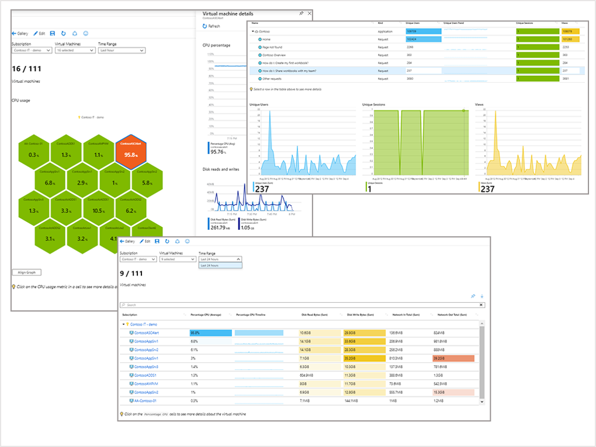

# 👥 Azure workbooks and Insights

<figure><figcaption></figcaption></figure>

Azure Workbooks, Microsoft Azure'un bir özelliği olarak, farklı veri kaynaklarından gelen verileri tek bir görselleştirme ve izleme tuvalinde birleştirmeyi sağlayan bir araçtır. Bu çalışma kitapları, kullanıcıların karmaşık verileri görselleştirmelerine, analiz etmelerine ve bunları kolayca paylaşabilir raporlar halinde sunmalarına olanak tanır. Veri kaynakları arasında metin, parametreler, bağlantılar, sekme ve sorgular gibi çeşitli bileşenleri ekleyebilirsiniz. Bu sayede, bulut kaynaklarınızdan gelen metrik ve verileri esnek ve dinamik bir şekilde görselleştirebilirsiniz. Azure Workbooks, Azure Log Analytics, Azure Resource Graph, Azure Resource Manager ve Data Explorer gibi hizmetlerden gelen sorguları destekler.

Paylaşım açısından ise, bu çalışma kitapları kaynak gruplarına kolayca yerleştirilebilir ve takım üyelerine erişim izni verilebilir. Ekip içinde veya farklı ekipler arasında kolaborasyonu ve bilgi paylaşımını teşvik eden bir platformdur.

### Insights,

Azure Monitor'da "Insights" özelliği, Azure'daki çeşitli hizmetler ve uygulamalar için özelleştirilmiş izleme çözümleri sunar. Bu, kullanıcıların belirli Azure kaynaklarının performansını, sağlığını ve kullanılabilirliğini daha derinlemesine anlamalarını sağlayan genişletilmiş izleme yetenekleridir. Bu özellikler sayesinde kullanıcılar, sorunları daha hızlı teşhis edebilir ve çözümleyebilirler.

Azure Monitor'daki bazı popüler Insights şunlardır:

1. **VM Insights**: Sanal makinelerin performansını izlemek için kullanılır. CPU kullanımı, bellek, disk I/O ve ağ trafiği gibi metrikleri görselleştirir ve sanal makinelerinizin sağlık durumunu detaylı bir şekilde gösterir.
2. **Container Insights**: Kubernetes ve diğer konteyner hizmetlerinin performansını izlemek için kullanılır. Konteyner örneklerinin, node'ların ve controller'ların metriklerini toplar, bunları görselleştirir ve konteyner tabanlı uygulamalarınızın sağlık durumunu analiz etmenize yardımcı olur.
3. **Application Insights**: Önceden bahsettiğim gibi, web uygulamalarının performansını ve kullanımını izlemek için kullanılır. Tepki süreleri, hata oranları ve kullanıcı etkileşimleri gibi önemli metrikleri izler.

