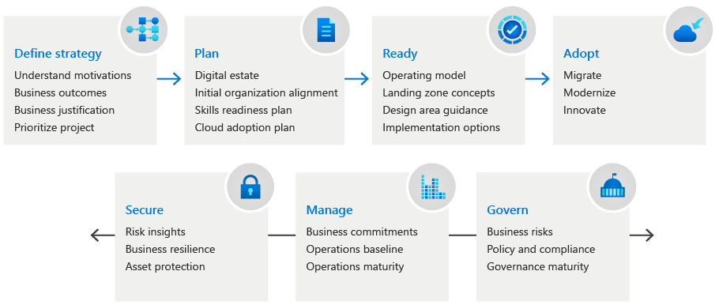

# 🍥 Cloud Adoption Framework

Cloud Adoption Framework (CAF), Microsoft Azure tarafından geliştirilmiş olan ancak diğer bulut sağlayıcıları tarafından da benzer biçimlerde sunulan, kuruluşların bulut hizmetlerine geçişini planlamalarına, hazırlanmalarına ve uygulamalarına yardımcı olan bir rehber veya metodolojidir. Temel amacı, bulut bilişim teknolojilerini benimserken en iyi uygulamaları ve süreçleri kullanarak kuruluşların riskleri azaltmasını, maliyetleri optimize etmesini ve bulut yatırımlarından en yüksek değeri elde etmelerini sağlamaktır.

<figure><figcaption></figcaption></figure>

Microsoft Azure Cloud Adoption Framework, özellikle Azure üzerinde çalışacak şekilde tasarlanmış olsa da, benzer prensipler ve yapılar Amazon Web Services (AWS), Google Cloud Platform (GCP) ve diğer büyük bulut sağlayıcıları tarafından da kullanılmaktadır. Her platform kendi özel araçları ve kaynakları ile bu süreci destekler.

#### Cloud Adoption Framework şu ana bileşenlerden oluşur:

1. **Stratejiyi Belirle**:
   * **Neden**: Bulut teknolojilerine geçmek istememizin sebeplerini anlayalım.
   * **Amaç**: Bulut kullanarak hangi iş hedeflerimize ulaşmayı hedefliyoruz, ona bakalım.
   * **Sıralama**: Önce hangi projelere odaklanacağımıza karar verelim.
2. **Planlama**:
   * **Teknolojiyi Anlama**: Elimizde ne var, neye ihtiyacımız olacak, onu listeleyelim.
   * **Becerileri Geliştirme**: Bulut teknolojileri için gerekli becerileri kazanalım.
   * **Detaylı Plan**: Bulut yolculuğumuzun her adımını planlayalım.
3. **Hazırlık**:
   * **Altyapı Kurulumu**: Bulut için gerekli sistemleri ve yapıları hazırlayalım.
   * **En İyi Uygulamalar**: İyi sonuçlar almak için en iyi yöntemleri uygulayalım.
4. **Benimseme**:
   * **Taşıma**: Var olan sistemlerimizi buluta nasıl taşıyacağımıza bakalım.
   * **Yenilik**: Bulut sayesinde hangi yeni şeyleri yapabileceğimize bakalım.
5. **Govern**:
   * **Kurallar**: Bulut kaynaklarımızı etkili ve güvenli bir şekilde kullanmak için kurallar ve süreçler oluşturalım.
6. **Yönetim**:
   * **Operasyonları Yönetme**: Günlük işleri yönetelim ve işlerin düzgün yürüdüğünden emin olalım.
   * **Sürekli İyileştirme**: İşleri daha da iyi yapmak için geliştirmeler yapalım.

