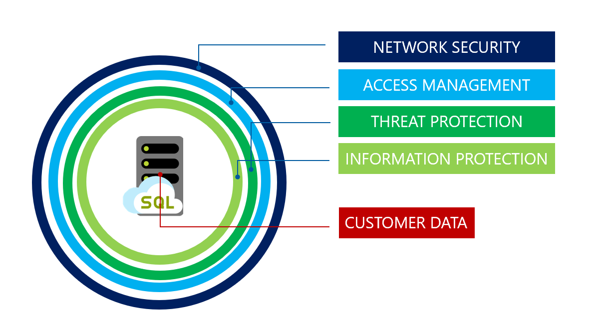

# 📜 Data security strategy

<figure><figcaption></figcaption></figure>

**Ağ Güvenliği:**

* **Firewall:** Azure'un firewall kuralları, belirli IP adreslerinden veya IP aralıklarından gelen trafiği kontrol eder. Böylece yalnızca izin verilen trafik veritabanınıza ulaşabilir.
* **Private Link:** Azure Private Link, veritabanınıza özel bir ağdan güvenli bir şekilde bağlanmanızı sağlar, böylece veri trafiğiniz her zaman Azure'un ağ altyapısı içinde kalır ve internet üzerinden geçmez.

**Kimlik ve Erişim Yönetimi (IAM):**

* **Authentication:** Kimlik doğrulama, kullanıcıların ve uygulamaların veritabanına erişmeden önce kimliklerini doğrulamasını gerektirir. Örneğin, Azure Active Directory ile entegre çalışabilirsiniz.
* **Roles:** Önceden tanımlı roller, kullanıcılara veritabanı üzerinde hangi işlemleri yapabileceklerini belirler. Mesela, bir kullanıcıya 'reader' rolü atandığında, o kullanıcı verileri görebilir ama değiştiremez.
* **Row level security:** Satır düzeyinde güvenlik, kullanıcılara sadece belirli veri satırlarını görme yetkisi vererek veritabanı içindeki veri erişimini daha da detaylı düzeyde kontrol etmenizi sağlar.

**Güvenlik Yönetimi:**

* **Advanced Threat Protection (ATP):** Potansiyel güvenlik tehditlerini algılar ve uyarılar gönderir. Örneğin, şüpheli veritabanı aktiviteleri algılandığında sizi uyarır.
* **SQL Audit:** Veritabanı etkinliklerinin izlenmesini ve denetim raporlarının tutulmasını sağlar. Örneğin, hangi kullanıcıların hangi verilere ne zaman eriştiğini izleyebilirsiniz.
* **Vulnerability Assessment:** Veritabanınızı güvenlik açıkları için tarar ve iyileştirme önerilerinde bulunur.
* **Data Discovery and Classification:** Verilerinizi sınıflandırmanıza ve hangi verilerin hassas olduğunu belirlemenize yardımcı olur, böylece uygun güvenlik kontrollerini uygulayabilirsiniz.

