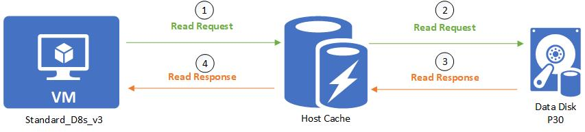
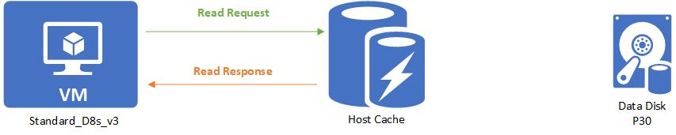

# Design Azure disks

Azure Disk, Azure üzerinde depolama sağlayan bir hizmettir. Azure Disk, sanal makinelerin diskleri için depolama alanı sağlar ve çeşitli performans seçenekleri sunar. Bu disklere veri depolamak, sanal makinelerde işletim sistemi ve uygulama verilerini saklamak gibi çeşitli kullanım senaryoları bulunur.

Azure sanal makineleri çalıştırmak için depolama gerekir ve Azure Disk hizmeti bu gereksinimi karşılar. Sanal makinelerin işletim sistemleri, uygulamaları ve veri dosyaları gibi verileri depolamak için kullanılır.

#### Disk Tipleri,

<figure><figcaption></figcaption></figure>

* **Ultra Disk**: Performans açısından en üst düzeyde olan ve en fazla IOPS ve veri aktarım hızını sunan disk tipidir. Yüksek performanslı veritabanı sistemleri ve işlem yükü çok ağır uygulamalar için idealdir. Ancak işletim sistemi disk olarak kullanılamaz.
* **Premium SSD v2 ve Premium SSD**: Bunlar, Ultra Disk'e göre biraz daha düşük performans sunar, fakat yine de yüksek performans ve düşük gecikme süresi gerektiren iş senaryoları için tasarlanmıştır. Premium SSD v2, Premium SSD'ye göre daha yüksek performans ve kapasiteye sahiptir, ancak sadece Premium SSD işletim sistemi disk olarak kullanılabilir.
* **Standard SSD**: Daha az IO gerektiren iş yükleri için uygun olup, web sunucuları ve geliştirme/test ortamları gibi sistemler için idealdir. Aynı zamanda işletim sistemi disk olarak da kullanılabilir.
* **Standard HDD**: En düşük maliyetli seçenek olup, düşük IOPS ve veri aktarım hızı sunar. Yedekleme ve arşivleme gibi kritik olmayan iş yükleri için uygun olan bu disk tipi, nadiren erişilen veriler için idealdir ve işletim sistemi disk olarak da kullanılabilir.

Örneğin, finansal işlemler veya gerçek zamanlı veri işleme gibi yüksek hız ve düşük gecikme gerektiren durumlar için Ultra Disk önerilirken, daha az kritik uygulamalar için Standard SSD ya da HDD yeterli olabilir.

#### Managed Disk,

Azure tarafından yönetilen sanal disklerdir. Kullanıcılar, disk performansı ve kapasitesi gibi özellikleri seçer, ancak fiziksel depolama detaylarından (örneğin, disklerin hangi depolama biriminde yer aldığı gibi) Azure sorumludur.

#### Azure Disks Caching,

Bu özellik, sıkça erişilen verilerin daha hızlı bir bellek katmanında geçici olarak saklanmasını sağlar. Bu sayede, okuma ve yazma işlemleri çok daha hızlı gerçekleştirilebilir çünkü fiziksel disk yerine cache'ten veri alınır ya da veri yazılır.

1 - First request the file, (MISS)

<figure><figcaption></figcaption></figure>

2 - Second request same file, (HIT)

<figure><figcaption></figcaption></figure>

1. Sanal makine (VM) diskten veri okuma talebinde bulunur.
2. Bu okuma isteği önce host cache'e yönlendirilir.
3. Eğer istenilen veri host cache'de mevcut değilse (bu durum bir "cache miss" olarak adlandırılır), okuma isteği doğrudan veri diski olan P30'a yönlendirilir.
4. Veri diski okunan verileri sanal makineye geri gönderir.

Bir sonraki okuma isteği için, eğer aynı verilere ihtiyaç varsa ve bu veriler host cache'de saklanmışsa, veriler çok daha hızlı bir şekilde sağlanabilir çünkü fiziksel diskten okumak yerine hızlı erişimli önbellekten alınır.&#x20;

**Caching Modes,**

1. **None**: Hiçbir disk caching kullanılmaz.&#x20;
2. **Read-only**: Bu modda, sadece okuma işlemleri için veriler cache'lenir. Ancak, yazma işlemleri cache'lenmez ve doğrudan diske yapılır.
3. **Read-write**: Hem okuma hem de yazma işlemleri için veriler cache'lenir. Read-write caching, okuma ve yazma performansını artırsa da, yazma işlemlerinde tutarlılık riski barındırabilir.

#### Securing data disks,

1. **Azure Disk Encryption (ADE)**: ADE, sanal makinelerin sanal sabit disklerini şifrelemek için kullanılır. Windows için BitLocker ve Linux için dm-crypt kullanılarak şifreleme gerçekleştirilir. \
   Docs: [https://learn.microsoft.com/en-us/azure/virtual-machines/linux/disk-encryption-overview](https://learn.microsoft.com/en-us/azure/virtual-machines/linux/disk-encryption-overview)
2. **Server-Side Encryption (SSE)**: Azure Storage hesabına yazılmadan önce tüm verilerin şifrelendiğini garanti eder. Böylece, veri merkezinden bu disklerin doğrudan erişilerek okunması engellenir. Server-Side Encryption otomatik olarak veri yazma ve okuma işlemleri sırasında veriyi şifreler ve şifreyi çözer. Docs: [https://learn.microsoft.com/en-us/azure/virtual-machines/disks-enable-customer-managed-keys-portal](https://learn.microsoft.com/en-us/azure/virtual-machines/disks-enable-customer-managed-keys-portal)
3. **Encryption at Host**: Bu, VM'nin barındırıldığı fiziksel sunucu üzerinde verilerin şifrelendiğini ve Azure'un depolama servisine şifrelenmiş olarak aktarıldığını garanti altına alır. Bu, fiziksel sunucuda potansiyel olarak ortaya çıkabilecek güvenlik risklerine karşı ek bir koruma katmanı sağlar. Docs: [https://learn.microsoft.com/en-us/azure/virtual-machines/disks-enable-host-based-encryption-portal?tabs=azure-powershell](https://learn.microsoft.com/en-us/azure/virtual-machines/disks-enable-host-based-encryption-portal?tabs=azure-powershell)


