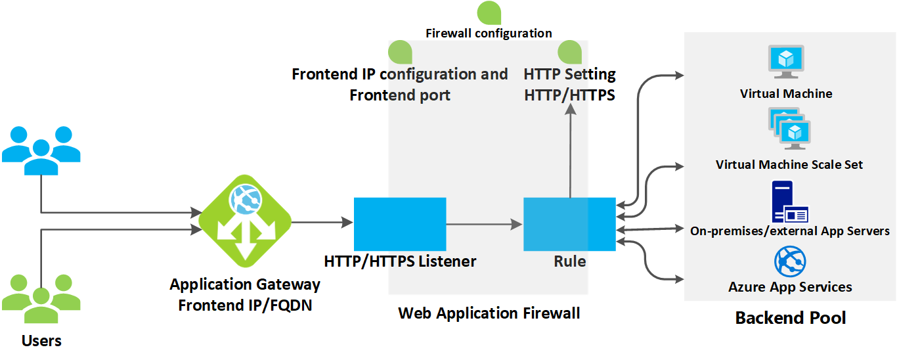
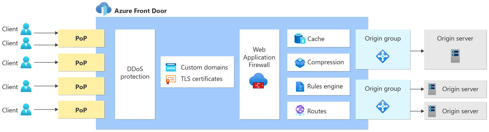
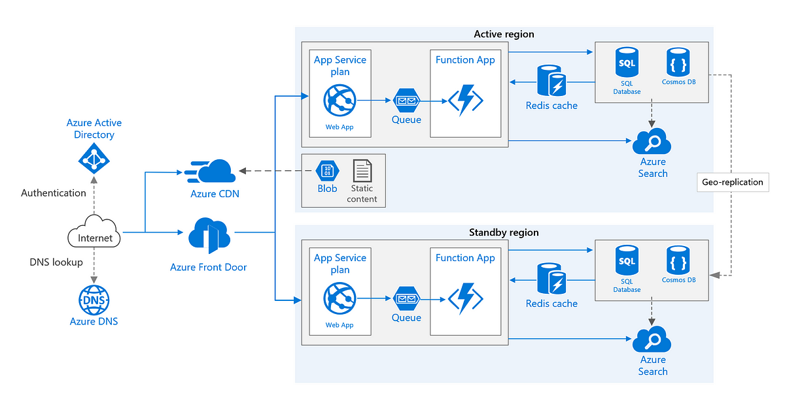
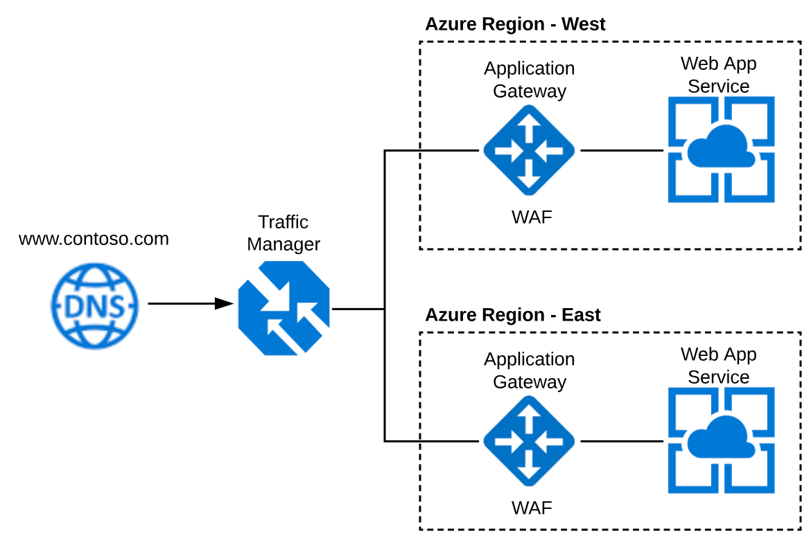
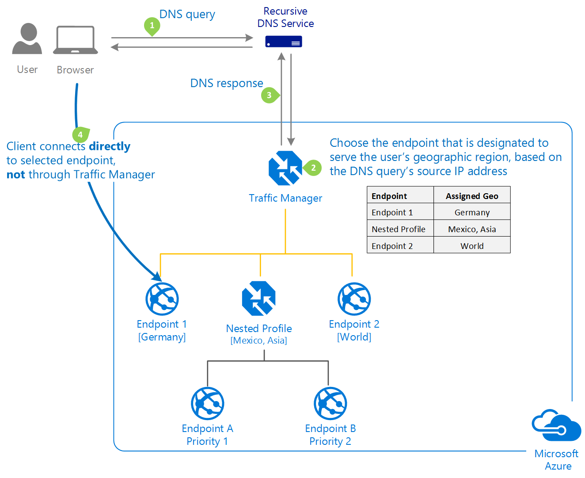

# 📦 Design for application delivery

### Azure Load Balancer;

<figure><figcaption></figcaption></figure>

Azure Load Balancer, Microsoft Azure'da bulunan ve gelen ağ trafiğini sanal makineler (VM'ler) ve diğer kaynaklar arasında dağıtan bir servistir. Azure Load Balancer, Layer 4 **(TCP, UDP)** seviyesinde çalışır ve ağ trafiğini, belirtilen sağlık durumuna göre sunucuların veya hizmetlerin sağlık durumunu kontrol ederek, yalnızca sağlıklı olanlara trafiği yönlendirir. Bu, uygulamaların yüksek kullanılabilirliğini ve dayanıklılığını sağlar. Azure Load Balancer, ölçeklenebilirlik sağlar ve farklı kullanılabilirlik bölgelerinde yedekliliği destekleyerek bir bölgedeki arıza durumunda bile servislerin kesintisiz çalışmasını mümkün kılar.&#x20;

Genel (Public) ve iç (Internal) olmak üzere iki tür Load Balancer sunar: Genel Load Balancer internetten gelen trafiği yönetirken, İç Load Balancer sadece Azure sanal ağı içindeki veya ona özel bağlı ağ yapılandırmalarındaki trafiği yönetir.

***

### Azure Application Gateway;

<figure><figcaption></figcaption></figure>

Azure Application Gateway, Microsoft Azure'da bulunan bir uygulama seviyesi load balancer hizmetidir. Bu hizmet, HTTP ve HTTPS trafiğini yönetmek üzere özel olarak tasarlanmıştır ve yalnızca load balancing yapmanın ötesinde, uygulama düzeyinde çeşitli güvenlik ve yönlendirme özellikleri sunar.

Azure Application Gateway'in sunduğu başlıca özellikler şunlardır:

* **URL Tabanlı Yönlendirme**: Gelen trafiği URL yolu (örneğin, /images, /video vb.) gibi isteklere göre belirli sunucu havuzlarına (backend pools) yönlendirir.
* **Çok Katmanlı Güvenlik**: Web Application Firewall (WAF) entegrasyonu ile uygulamaları web tabanlı saldırılara karşı korur.
* **SSL Termination**: SSL şifrelemesini Gateway seviyesinde sonlandırarak, arkadaki sunucuların iş yükünü azaltır ve kaynak kullanımını daha verimli hale getirir.
* **Otomatik Ölçeklendirme**: Trafik artışına göre otomatik olarak kaynaklarını ölçeklendirir ve performansı korur.
* **Sabit Oturum (Session Affinity)**: Kullanıcı oturumunu aynı sunucu havuzuna bağlı tutarak, bir kullanıcının tüm isteklerinin aynı sunucuya yönlendirilmesini sağlar.
* **Özel Sağlık Denetimleri**: Belirli sağlık denetimleri yapılandırarak, yalnızca sağlıklı sunucu örneklerine trafik gönderilmesini sağlar.


**Azure Load Balancer:**

* Layer 4 (Transport Layer) seviyesinde çalışır, yani TCP ve UDP protokollerine dayalı olarak trafiği yönlendirir.
* Genellikle basit yük dağıtımı için kullanılır; örneğin, gelen istekleri birden fazla sunucu arasında dağıtmak.
* Sağlık denetimleri yaparak, yalnızca sağlıklı sunuculara trafiği yönlendirir.
* Genel (internet trafiği için) veya iç (VNet içi trafiği için) olabilir.
* Bir IP adresi ve port numarası üzerinden gelen trafiği birden fazla sunucuya dağıtır.

**Azure Application Gateway:**

* Layer 7 (Application Layer) seviyesinde çalışır ve HTTP, HTTPS gibi protokoller üzerinden daha zengin içerik tabanlı yönlendirme sağlar.
* URL tabanlı yönlendirme, çoklu-site hosting, cookie tabanlı session affinity gibi özellikler sunar.
* Web Application Firewall (WAF) özelliği ile uygulamaları çeşitli web tabanlı saldırılardan korur.
* SSL termination/offloading yaparak, HTTPS trafiğini yönetir ve backend sunucuların iş yükünü azaltır.
* Otomatik ölçeklendirme özellikleri sunar ve dinamik olarak trafiğe cevap verebilir.


***

### Azure Front Door;

<figure><figcaption></figcaption></figure>

\
Azure Front Door, Microsoft Azure'un global CDN hizmetidir. Uygulamalarınıza hızlı, güvenli ve yüksek kullanılabilir erişim sağlamak için tasarlanmıştır. Azure Front Door, uygulamalarınızı dünya genelindeki kullanıcılara daha yakın getirerek içerik dağıtımını hızlandırır ve aynı zamanda WAF (Web Application Firewall) gibi güvenlik özellikleri ile koruma sağlar.

İşte Azure Front Door'un temel özellikleri:

* **Global HTTP/HTTPS Yük Dengeleme**: Azure Front Door, HTTP/HTTPS trafiğini global olarak yönlendirerek uygulamalara erişimi hızlandırır ve yükü dengeler.
* **SSL Offloading ve SSL Termination**: İstemci bağlantılarının SSL şifrelemesini CDN de sonlandırarak, backend sunucuların iş yükünü azaltır ve SSL yönetimini kolaylaştırır.
* **URL Tabanlı Yönlendirme**: Gelen trafiği URL yolu temelinde farklı backend hizmetlere veya sunucu havuzlarına yönlendirme yeteneği.
* **Otomatik Ölçeklendirme ve Anlık Etkinleştirme**: Trafik artışına karşı otomatik olarak ölçeklenir ve uygulamalarınızı anında etkinleştirir.
* **Özel Sağlık Denetimleri**: Backend sunucuların sağlık durumunu sürekli olarak izleyerek, yalnızca sağlıklı sunuculara trafiği yönlendirir.
* **WAF ile Entegre Güvenlik**: Web Application Firewall özelliği ile uygulamalarınızı SQL enjeksiyonu, cross-site scripting (XSS) ve diğer yaygın web saldırılarından korur.

Azure Front Door, özellikle coğrafi olarak dağıtılmış uygulamalar ve mikro hizmet mimarileri için uygundur. Müşterilere düşük gecikme süresiyle hizmet sunarken, uygulamalarınızı siber tehditlere karşı korumak ve yönetimini basitleştirmek isteyen organizasyonlar tarafından sıklıkla kullanılır.

<figure><figcaption></figcaption></figure>

<figure><figcaption></figcaption></figure>


**Azure CDN:**

* Azure CDN, özellikle statik içeriğin önbelleğe alınması ve dağıtılması için tasarlanmıştır.
* Bu içerik web sayfaları, resimler, videolar, stil dosyaları ve JavaScript gibi kaynakları içerebilir.
* Azure CDN, kullanıcıya coğrafi olarak en yakın edge sunucularından içerik sunarak içeriğin yüklenme süresini azaltır.
* CDN, içeriği global olarak dağıtılmış önbellek sunucularında depolar ve kullanıcıların bu içeriğe daha hızlı erişimini sağlar.

**Azure Front Door:**

* Azure Front Door, dinamik içeriğin yönetimi ve yüksek performanslı global HTTP/HTTPS yük dengesi sağlamak için kullanılır.
* WAF (Web Application Firewall) entegrasyonu gibi gelişmiş yönlendirme ve güvenlik özellikleri sunar.
* URL tabanlı yönlendirme, otomatik failover, SSL offloading gibi özellikler ile daha zengin içerik yönetimi ve uygulama seviyesinde kontrol imkanı sağlar.
* Front Door, özellikle mikro hizmetler ve modern uygulama mimarileri için uygun olan gelişmiş özellikler sunar.

Her iki hizmet de içerik ve uygulamalarınızı son kullanıcılara daha hızlı bir şekilde sunmak için kullanılır, ancak Azure Front Door daha dinamik içerik ve karmaşık uygulama mimarileri için tercih edilirken, Azure CDN genellikle statik içerik dağıtımı için kullanılır.


***

### Azure Traffic Manager;

<figure><figcaption></figcaption></figure>

Azure Traffic Manager, Microsoft Azure'un DNS tabanlı bir trafik yük dengesi ve yönlendirme hizmetidir. Bu hizmet, kullanıcı taleplerini coğrafi konumlarına veya diğer kurallara göre farklı Azure hizmetlerine veya global olarak dağıtılmış uygulama konumlarına yönlendirir. Traffic Manager, özellikle uygulamaların yüksek kullanılabilirliğini ve yanıt süresini iyileştirmek için tasarlanmıştır.

Azure Traffic Manager'ın öne çıkan özellikleri şunlardır:

* **DNS Tabanlı Yönlendirme**: Kullanıcıların DNS sorgularına yanıt vererek, istekleri en uygun hizmet konumuna yönlendirir.
* **Çeşitli Yönlendirme Metodları**: Performans, ağırlıklı yuvarlak sıra (weighted round-robin), öncelik (priority), coğrafi ve çok değerli (multi-value) gibi çeşitli yönlendirme metodları sunar.
* **Sağlık Denetimleri**: Ayarlanmış sağlık denetimleri ile hizmetlerin durumunu izleyerek, sadece çalışır durumdaki hizmet konumlarına trafik yönlendirir.
* **Düşük Gecikme Süresi**: Kullanıcı taleplerini en yakın veya en hızlı yanıt verebilecek uygulama konumuna yönlendirerek gecikme süresini düşürür.
* **Otomatik Failover**: Bir hizmet konumu başarısız olduğunda, trafiği otomatik olarak diğer sağlıklı hizmet konumlarına yönlendirir.

<figure><figcaption></figcaption></figure>

Traffic Manager, DNS sorgularını yönlendirme mekanizması olarak kullandığından, uç noktalara yönlendirilen trafik şifrelenmemiş olabilir ve Traffic Manager yük dengesi için herhangi bir ağ trafiği içeriğini işlemez. Bu, Azure Load Balancer veya Application Gateway gibi Layer 4 veya Layer 7 yük dengesi hizmetlerinden farklıdır. Traffic Manager, özellikle uygulama yedekliliği ve failover stratejileri için kullanılır ve kullanıcıya en yakın veya en uygun uygulama sunucusuna yönlendirme yaparak kullanıcı deneyimini iyileştirir.

Traffic Manager'ı kullanabilmek için yapmanız gereken, DNS sisteminizin veya alan adı kayıt sağlayıcınızın DNS ayarlarında, ilgili alan adı için CNAME (Canonical Name) veya A kaydı olarak Azure Traffic Manager'ın DNS adını belirtmektir. Bu şekilde, kullanıcıların istekleri önce Traffic Manager'a yönlendirilir ve ardından Traffic Manager, yapılandırılmış trafik yönlendirme politikalarına göre kullanıcıyı uygun uç noktaya yönlendirir.

***

### Choosing a load balancing solution;

<figure><figcaption></figcaption></figure>
