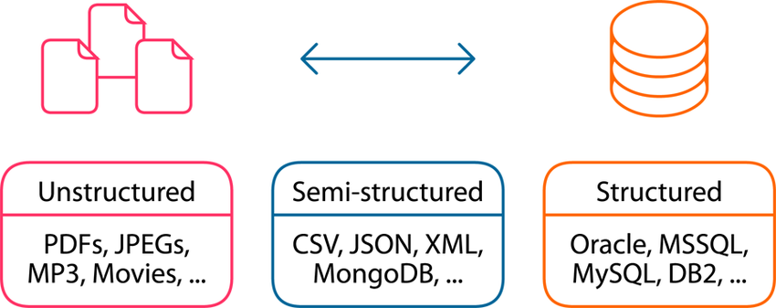

# 🧑‍💼 Design for data storage

### Types of data:

<figure><figcaption></figcaption></figure>

1. **Structured Data**: Veriler, önceden tanımlanmış bir modele veya şemaya sahip olan, genellikle ilişkisel veritabanlarında depolanan verilerdir. Bu veriler, sıkı bir şekilde düzenlenmiş satır ve sütunlardan oluşur. Yapısal verilere örnek olarak müşteri kayıtları, ürün envanteri, finansal işlemler verilebilir.
2. **Semi-structured Data**: Veriler yapılandırılmıştır, ancak ilişkisel bir formatta değildir. Gömülü etiketlerin yardımıyla saklanan veriler sınıflandırılır. JSON, XML, YAML bu tür verilerin örneklerindendir.
3. **Unstructured Data**: Verilerin herhangi bir yapısal özelliği yoktur ve ilişkisel olmaktan uzaktır. Videolar, Word belgeleri ve medya dosyaları bu türe örnektir.

### Storage services:

<figure><figcaption></figcaption></figure>

1. **Container**: Azure Blob Storage'ın bir parçası olarak, container'lar, blob olarak adlandırılan nesneleri gruplandıran yapılardır. Blob'lar, büyük boyutlu yapılandırılmamış veri kütlelerini saklamak için uygundur. Örneğin; belgeler, fotoğraflar, videolar, ses dosyaları, yedekleme dosyaları, veritabanları, log kayıtları ve büyük veri setleri (Big Data) blob'lar içinde saklanabilir.

&#x20;       **Azure Blob Storage, aşağıdaki üç tür blob'u destekler:**

* **Block Blobs**: En yaygın kullanılan blob türüdür. Çoğunlukla metin veya ikili veri dosyalarını (örneğin, JPEG, PNG görüntüler veya PDF dokümanlar gibi) depolamak için kullanılır. Block blobs, verileri bir dizi blok olarak yönetir ve bu da onları büyük veri miktarlarını saklamak veya düzenlemek için ideal yapar.
* **Append Blobs**: Log gibi sürekli eklemeler için optimize edilmiştir. Bu blob türü, veri eklenirken en iyi performansı sağlar, çünkü yeni veriler mevcut verilerin sonuna eklenir.
* **Page Blobs**: Rastgele erişim gerektiren büyük dosyalar için kullanılır. VHD (Virtual Hard Disk) dosyaları gibi sanal makinelerin disklerini saklamak için idealdir.

1. **Files**: Azure File Storage, dosyaları ve dizinleri bulutta SMB protokolü üzerinden erişilebilen bir yapıda saklar, böylece birden fazla kullanıcı, sunucu ve uygulama tarafından kullanılabilir. Ayrıca, NFS protokolünü destekleyerek UNIX ve Linux tabanlı sistemler için uygun paylaşımlar sağlar.
2. **Table**: Azure Table Storage, yapılandırılmış verileri, NoSQL veri tabanı formatında depolar. Her bir varlık (entity), bir dizi özelliğe (properties) sahip olabilir ve bu yapı, genellikle genişletilebilir ve esnek şema gerektiren uygulamalar için uygundur.
3. **Queue**: Azure Queue Storage, asenkron mesaj işleme için kuyruklama (queue) mekanizması sağlar. Bu hizmet, farklı bulut hizmetleri arasında veya uygulama bileşenleri arasında mesaj tabanlı iletişim için kullanılır ve karmaşık işlemlerin ve büyük iş yüklerinin yönetilmesine yardımcı olur.


