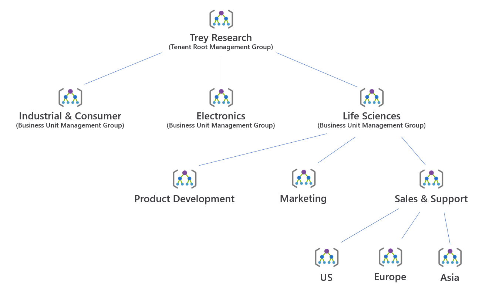

# 💠 Design for Management Groups

Azure Management Groups, Microsoft Azure bulut platformunda bulunan kaynakların yönetimini kolaylaştırmak için bir yapılandırma hizmetidir. Bu hizmet, çok sayıda Azure aboneliğiniz olduğunda, bu abonelikleri ve ilişkili kaynakları yönetmek için bir hiyerarşi oluşturmanıza olanak tanır. Temelde, bu gruplar bir organizasyonun Azure kaynaklarını daha merkezi ve düzenli bir şekilde yönetmesine yardımcı olur.

<figure><figcaption></figcaption></figure>

### Best Practices   ⤵️

#### Flat Hierarchy Design:

* Azure Flat Hierarchy Design, Azure Management Groups kullanımında basitlik ve esnekliğe odaklanan bir yaklaşımdır. Bu tasarım stratejisi, az sayıda yönetim grubu kullanarak kaynakları organize etmeyi ve yönetmeyi amaçlar. Flat hierarchy, yönetim karmaşıklığını minimize ederken, kaynakların ve aboneliklerin yönetimini kolaylaştırır. Genellikle, küçükten orta ölçekli işletmeler veya basit kaynak yapıları için önerilir. Bu yaklaşım, yönetim ve denetim işlemlerini basitleştirerek, Azure kaynaklarının daha hızlı ve etkin bir şekilde yönetilmesine olanak tanır.

**Örnek: Flat Hierarchy Design Uygulaması**

* Bir teknoloji startup'ı düşünelim, bu şirket Microsoft Azure üzerinde birkaç farklı servisi barındırmaktadır: bir web uygulaması, bir API ve bir veritabanı. Bu şirketin yönetim kolaylığı için tüm Azure kaynaklarını bir tek yönetim grubu altında toplaması idealdir.\

* **Yönetim Grubu:** TechStartupMG
  *   **Abonelikler:**

      * WebAppSubscription
      * APISubscription
      * DatabaseSubscription

      Bu yapı, şirketin tüm kaynaklarını tek bir yerden yönetmesine olanak tanıyarak yönetim süreçlerini basitleştirir. Bu basit hiyerarşi sayesinde güvenlik politikaları, erişim kontrolleri ve cost analizi gibi çeşitli yönetim görevleri kolayca uygulanabilir ve takip edilebilir.

***

#### **Use the Tenant Root Group as top level and implement a structure:**

* Tenant Root Group, Azure Management Groups hiyerarşisi içindeki en üst seviyedeki gruptur. Bu grup, Azure tenant 'ınız içerisindeki tüm yönetim gruplarını ve abonelikleri kapsar. Azure kaynaklarınızı organize etmek için Tenant Root Group'u en üst düzey olarak kullanmanız ve buna bağlı bir yapı oluşturmanız çok daha yönetilebilir olacaktır.&#x20;
* Özetle, Tenant Root Group içinde, ihtiyaç duyulduğunda organizasyonel seviyede politikalar kullanabilir ve iş birimleri veya departmanları temsil eden gruplar oluşturabiliriz. Gerekirse, bu gruplar için özel politikalar hazırlanabilir ve yalnızca bunlara uygulanabilir.

***

#### **Use geographic structure with separate group for production:**

* Azure Yönetim Gruplarını, coğrafi bir yapı ile ortamlara göre hiyerarşik olarak kullanmak, Azure kaynaklarınızı coğrafi konumlarına göre organize etmenize olanak tanırken aynı zamanda production kaynaklarını belirgin bir grupta izole etmenizi sağlar. Bu yöntem, kaynakları coğrafi olarak ve ortam (prod, test) bazında kategorize ederek yönetim verimliliğini, güvenliğini ve politika uygulamasını kolaylaştırır. Basitleştirilmiş bir örnek:\

* **Tenant Root Group**
  * **North America**
    * **Production**
    * **Development**
    * **Testing**
  * **Europe**
    * **Production**
    * **Development**
    * **Testing**
  *   **Asia**

      * **Production**
      * **Development**
      * **Testing**

* Yönetim politikalarını coğrafi bölgelere özgü olarak ilgili grup düzeyinde uygulanabiliriz. Ayrıca, production ortamları için ayrı gruplar bulundurmak, production kaynaklarının güvenliğini ve istikrarını sağlamak adına daha sıkı politika ve kontrol sağlar.

***

#### **Sandbox management group and separate management group to isolate sensitive data:**

* Azure'da, güvenlik ve organizasyonu iyileştirmek için iki tip yönetim grubu oluşturabilirsiniz:

1. **Hassas Veri Grubu:** Bu grup, güvenliğin özellikle önemli olduğu hassas veri ve uygulamalarınız için ayrılır. Bu yaklaşım, bu kritik kaynakların korunmasını sağlar ve yanlışlıkla erişilmesi veya değiştirilmesi riskini azaltır.
2. **Sandbox Grup:** Test, geliştirme ve deneme için kullanılan ayrı bir ortam olarak tanımlanır. "Sandbox" olarak adlandırılan bu yönetim grubu, yeni uygulamaların veya güncellemelerin güvenli bir şekilde denenebilmesi için izole edilmiş bir alandır.

* Bu yapılandırma, veri güvenliğini artırır ve aynı zamanda geliştirme veya test sırasında önemli sistemlere zarar verme riskini minimize eder.

