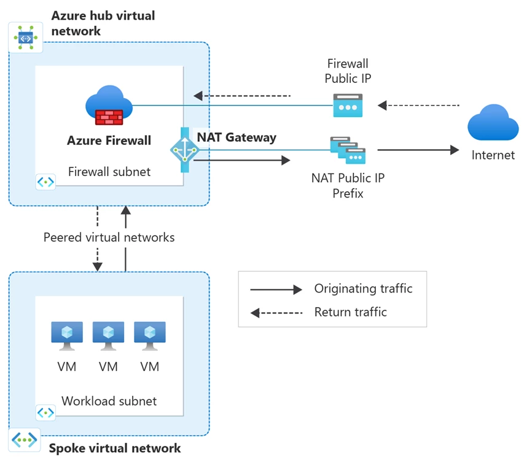
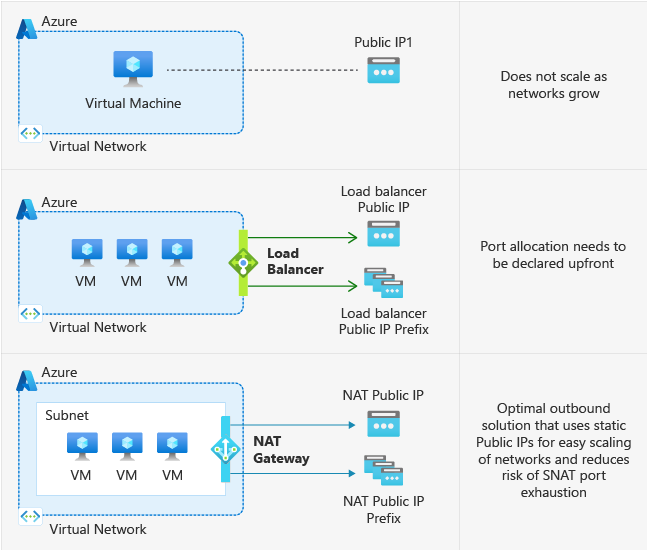

# 🔽 Design for network connectivity

### Single network approach;

<figure><figcaption></figcaption></figure>

Azure'da "Single network approach" (Tek ağ yaklaşımı), tüm kaynakların tek bir sanal ağ içerisinde yerleştirildiği ve ağ segmentasyonunun alt ağlar (subnets) kullanılarak gerçekleştirildiği bir ağ tasarım stratejisini tanımlar. Ekran görüntüsündeki örnekten yola çıkarak, Sanal ağın içinde üç farklı alt ağ (subnet) bulunur: frontendSubnet, midSubnet ve dbSubnet.

* frontendSubnet: Genellikle kullanıcıların erişim sağladığı web sunucuları veya uygulama ön yüzleri gibi kaynakları barındıran alt ağdır.&#x20;
* midSubnet: Uygulamanın iş mantığı veya işlemlerini yürüten arka uç sunucular (backend servers) gibi ara katman kaynakları için ayrılmıştır.&#x20;
* dbSubnet: Veritabanı sunucuları gibi veri depolama kaynaklarının yer aldığı alt ağdır.&#x20;

Bu yapı, farklı türdeki kaynakları mantıksal olarak ayırarak yönetimi kolaylaştırmayı ve güvenliği artırmayı amaçlar. Örneğin, dbSubnet içindeki SQL sunucuları genellikle yalnızca midSubnet içindeki uygulama sunucularından gelen trafiğe izin verecek şekilde kısıtlanabilir, bu da veritabanı katmanını doğrudan dış tehditlere karşı daha güvenli hale getirir.

***

### Multiple peered networks;

<figure><figcaption></figcaption></figure>

Azure'da "Multiple peered networks", birbiriyle eşleştirilmiş birden fazla sanal ağın olduğu bir yapıyı ifade eder. Bu, farklı sanal ağlar arasında doğrudan, güvenli ve özel bir bağlantı kurulmasını sağlar, ve bu Azure'un Virtual Network Peering özelliği aracılığıyla mümkündür.

\
Örnekteki ekran görüntüsü, Azure'da "Multiple peered networks"ın nasıl yapılandırılabileceğini gösterir. İki farklı Azure Bölgesi gösterilmekte: Bölge A ve Bölge B. Her bölgede ayrı sanal ağlar bulunmakta ve bu ağlar (Virtual Network A, B ve C olarak gösterilmiş) birbirleriyle eşleştirilmiş durumda:

* **Azure Region A** içinde iki sanal ağ (Virtual Network A ve B) bulunmaktadır. Her biri kendi frontendSubnet ve dbSubnet'lerine sahip olacak şekilde yapılandırılmıştır.
* **Azure Region B** içinde ise bir sanal ağ (Virtual Network C) ve içinde bir appSubnet bulunmaktadır.

Bu çoklu eşleştirilmiş ağ yapısı, farklı coğrafi bölgelerde veya farklı ağlar arasında yüksek kullanılabilirlik ve yük dengesi sağlamak için kullanılabilir. Örneğin, bir bölgede sorun olması durumunda, diğer bölge ağ trafiği devralabilir.&#x20;

Virtual Network Peering, Azure'daki ağlar arasında düşük gecikme süresi ile yüksek bant genişliğinde veri aktarımına izin verir ve çeşitli ağlar arasında kaynakların birbirleriyle sorunsuz bir şekilde iletişim kurmasını sağlar.

***

### Hub spoke architecture;

<figure><figcaption></figcaption></figure>

Azure'da "Hub and Spoke architecture" (Merkez ve Spoke mimarisi), bir merkez (Hub) sanal ağın, bir dizi Spoke sanal ağ ile eşleştirildiği bir ağ topolojisini ifade eder. Bu yapı, özellikle geniş ve karmaşık ağ yapılarında tercih edilir. Genel olarak, merkez sanal ağ ortak kaynakları (örneğin, güvenlik hizmetleri, VPN bağlantıları veya Azure'daki diğer ortak hizmetler) barındırırken, Spoke sanal ağlar ise özel iş yüklerini, uygulamaları veya hizmetleri içerir.

Örnekteki ekran görüntüsünde, iki Azure Bölgesi (A ve B) içerisinde bu topoloji gösterilmektedir:

* Her iki bölgede de merkezde bir "Hub" ağ bulunmaktadır. Bu merkez ağlar, çevresindeki Spoke ağlara bağlantılar sağlar.
* Her Spoke ağı, özel iş yüklerini veya servislerini barındırır ve merkez ağa bağlıdır, böylece merkezdeki kaynaklardan yararlanabilir.
* Ayrıca, Bölge A'daki Hub, Bölge B'deki Hub ile eşleştirilebilir, böylece farklı bölgeler arasında da kaynak paylaşımı ve iletişim mümkün hale gelir.

Bu yapı, farklı iş yüklerini ve servisleri merkezi bir konumdan yönetmeyi kolaylaştırır ve ağ güvenliği ile izolasyonunu artırır. Örneğin, güvenlik politikaları ve erişim kontrol listeleri (ACL) merkez ağda merkezi olarak yönetilebilir ve Spoke ağlar arasında tutarlılık sağlanabilir. Ayrıca, bu yapı esneklik ve ölçeklenebilirlik sunar; yeni Spoke ağlar kolayca eklenebilir ve mevcut ağ yapılarına entegre edilebilir.

***

### Design outbound connectivity;

\
Azure'da "Design outbound connectivity" (Dışa çıkış trafiğini tasarlamak), bir sanal ağdan dış ağlara (örneğin, internete) yapılan trafiğin nasıl yönlendirileceğini ve kontrol edileceğini planlamak anlamına gelir. Azure sanal ağlarında dışa çıkış trafiğini yönetmek için kullanılabilecek üç farklı servisi inceleyelim.

<figure><figcaption></figcaption></figure>

1. **Azure Firewall**: Sanal ağdan gelen tüm dışa çıkış trafiğini kontrol etmek için kullanılır. Kullanıcı Tanımlı Yönlendirme Kuralları (UDRs) ile birlikte kullanılarak, tüm dışa çıkış trafiği belirli güvenlik politikaları ve kurallar setine uymak üzere zorlanabilir.

<figure><figcaption></figcaption></figure>

1. **Azure Load Balancer**: Dışa çıkış trafiğini yönlendirmek ve dengelenmesini sağlamak için kullanılır. Özellikle, yüksek kullanılabilirlik ve ölçeklenebilirlik gerektiren senaryolarda, çıkan trafiğin Azure Load Balancer üzerinden geçmesi ve buna göre dağıtılması sağlanabilir.
2. **NAT Gateway**: Dışa çıkış trafiğinin, tanımlı bir dizi genel IP adresi (Public IP) kullanarak NAT yoluyla yönlendirilmesini sağlar. Bu, özellikle sanal ağdaki kaynakların internete çıkış yaparken kullanacakları IP adreslerini kontrol etmek ve özelleştirmek istediğinizde kullanışlıdır.

Bu üç servis, bir Azure sanal ağının güvenlik, yönetim ve ölçeklenebilirlik ihtiyaçlarını karşılamak için birlikte veya ayrı ayrı kullanılabilir. Tasarım, ihtiyaçlara göre yapılandırılabilir, örneğin bazı sunuculara veya sanal ağlara ait trafiğin Azure Firewall üzerinden filtrelenmesi gerekebilirken, diğer trafikler için LB veya NAT daha uygun olabilir.

***

### Routing;

<figure><figcaption></figcaption></figure>

1. **Sistem Yönlendirmesi (System Route)**: Azure, bir sanal ağ oluşturduğunuzda otomatik olarak sistem yönlendirmelerini ekler. Bu yönlendirmeler, sanal ağ içindeki kaynakların birbiriyle ve internetle iletişim kurmasını sağlar. Sanal ağlar arası eşleme yapıldığında, eşlenen ağın adres alanı da bu yönlendirme tablosuna dahil edilir.
2. **Kullanıcı Tanımlı Yönlendirme (User Defined Route - UDR)**: Sistem yönlendirmelerinin üzerine yazarak daha spesifik trafik akışı kuralları belirlemenizi sağlar. UDR'ler, trafik akışının belirli bir sonraki adıma (next hop) - örneğin bir Azure Firewall'a - yönlendirilmesini sağlamak için kullanılır.

Diagramda, sistem yönlendirme kullanılarak front-end ve veritabanı alt ağlarının (subnets) internete nasıl bağlandığı ve bir UDR kullanılarak bu trafik akışının Azure Firewall üzerinden nasıl yönlendirildiği gösteriliyor.&#x20;


BGP  Protokolü yönlendirmeleri, sistem yönlendirmelerine göre daha yüksek önceliğe sahipken, UDR'ler her zaman en yüksek önceliğe sahiptir ve sistem veya BGP yönlendirmelerinin üzerine yazabilir. Bu, ağ yöneticilerine trafik akışını çok detaylı bir şekilde kontrol etme yeteneği verir.


