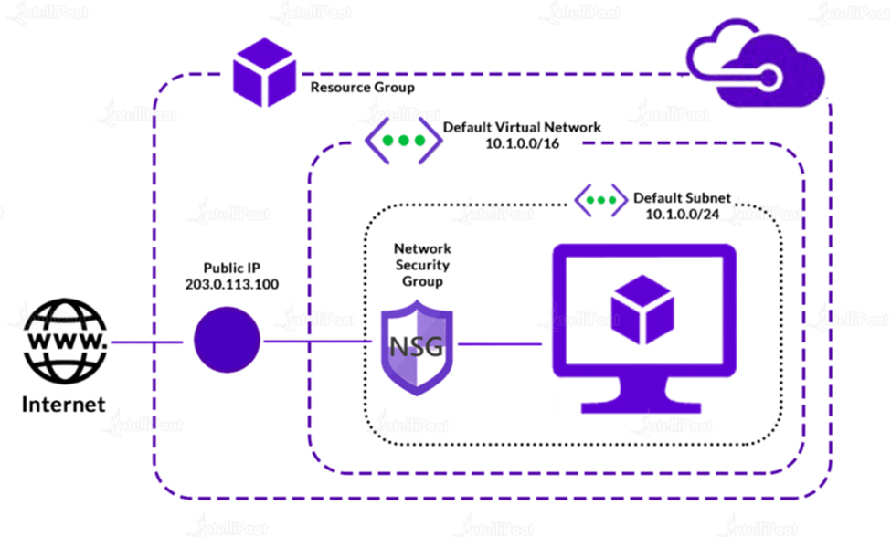

# 🥞 Design for network security and application protection

### Service Endpoint;

<figure><figcaption></figcaption></figure>

Azure Service Endpoint, Azure sanal ağınızdan Azure hizmetlerine doğrudan ve güvenli bir bağlantı sağlayan bir özelliktir. Bu, sanal ağ kaynaklarınızın (örneğin, VM'ler veya uygulamalar) Microsoft'un omurga ağı üzerinden Azure hizmetlerine (örneğin, Azure Storage, Azure SQL Database) özel bir bağlantı kullanarak erişmesini sağlar. Bu özellik sayesinde, bu kaynaklara internet üzerinden erişilemezken, sanal ağınızdaki kaynaklardan erişilebilirler. Böylece güvenlik artırılır, çünkü hizmetlere yalnızca sanal ağınızdan erişilebilir ve bu hizmetler için herhangi bir genel IP adresi atanması gerekmez. Service Endpoint, aynı zamanda optimizasyon ve basit kurulum için Azure'un ağ altyapısını kullanır, böylece karmaşık bir yapılandırma yapmanıza gerek kalmaz.



***

### Private Link;

<figure><figcaption></figcaption></figure>

Azure Private Link, Azure hizmetlerinizi ve Azure üzerinde barındırılan uygulamalarınızı özel ağınız üzerinden güvenli bir şekilde erişilebilir kılan bir hizmettir. Bu hizmet, sanal ağınızdan Azure hizmetlerine özel ve güvenli bir bağlantı kurmanızı sağlar, böylece hizmetlerinizin genel internet üzerinden erişilebilir olmasına gerek kalmaz. Private Link, Azure PaaS hizmetlerini, müşteriye ait veya ortak hizmetleri özel IP adresleri üzerinden doğrudan sanal ağınıza bağlamanıza olanak tanır. Bu, hem güvenlik seviyesini artırır hem de ağ trafiğinin Azure'un ağ omurgası üzerinden geçmesini sağlayarak genel internete maruz kalma riskini azaltır.



***

### Network Security Groups;

<figure><figcaption></figcaption></figure>

Azure Network Security Groups (NSG'ler), Azure sanal ağınızdaki kaynaklara erişimi denetlemek için kullanılan bir güvenlik hizmetidir. Bir NSG, hem gelen (inbound) hem de giden (outbound) ağ trafiği için kurallar belirlemenizi sağlar. Bu kurallar, belirli IP adres aralıkları, port numaraları ve protokoller üzerinden trafiğin izin verilip verilmeyeceğini kontrol eder. NSG'ler, sanal makinelerinizi (VM'ler), sanal ağlarınızı ve diğer Azure hizmetlerinizi istenmeyen ağ trafiğinden korumak için etkili bir yol sunar. Yani, bir sanal güvenlik duvarı gibi düşünülebilir ve her sanal ağ arayüzüne (NIC), veya alt ağa (subnet) uygulanabilir.

***

### Azure Firewall;

<figure><figcaption></figcaption></figure>

Azure Firewall, Azure tarafından sunulan bulut tabanlı bir güvenlik duvarı servisidir. Bu yönetilen servis, sanal ağ kaynaklarınızın korunmasını sağlar ve geniş ağ trafiği filtreleme kapasitesine sahiptir. Uygulama kuralları, ağ kuralları ve NAT kuralları oluşturmanıza olanak tanıyarak, gelen ve giden ağ trafiğini merkezi olarak yönetmenizi sağlar. Ayrıca, Azure'daki kaynaklarınız arasında zorunlu trafik yolları (forced tunnelling) ayarlayarak, veri sızıntılarını ve diğer güvenlik tehditlerini azaltmaya yardımcı olur. Azure Firewall, kuralları otomatik olarak ölçeklendirir ve bulut kaynaklarınızı korumak için sürekli güncellenir.

***

### Web Application Firewall (WAF);

<figure><figcaption></figcaption></figure>

Azure Web Application Firewall (WAF) Azure’un güvenlik duvarı servisinin bir parçasıdır ve özellikle web uygulamalarını korumak için tasarlanmıştır. WAF, web uygulamalarınızı yaygın saldırılara ve güvenlik açıklarına karşı korur, örneğin SQL enjeksiyonu ve Cross-Site Scripting (XSS) gibi. Azure WAF, OWASP (Open Web Application Security Project) güvenlik kuralları listesini temel alır ve uygulamanızı bu tür tehditlere karşı proaktif bir şekilde savunur. Kuralları, uygulamanızın gereksinimlerine göre özelleştirebilir ve yönetebilirsiniz, bu da uygulamanızın güvenliğini sürekli olarak sağlamaya yardımcı olur.

***

### DDoS Protection;

<figure><figcaption></figcaption></figure>

Azure DDoS Protection, Azure kaynaklarını Distributed Denial of Service (DDoS) saldırılarına karşı korumak için tasarlanmış bir hizmettir. Bu hizmet, Azure platformuna yapılan potansiyel DDoS saldırılarını algılar ve bu saldırılara karşı savunma yaparak Azure uygulamalarınızın sürekli olarak erişilebilir ve performanslı kalmasını sağlar. Azure DDoS Protection, otomatik ağ analizi ve makine öğrenimi ile saldırıları tanır ve uygun savunma mekanizmalarını devreye sokar. Temel koruma varsayılan olarak tüm Azure servislerinde mevcuttur ve gelişmiş koruma seçenekleri ek güvenlik ve özelleştirme için kullanılabilir.

***

### Azure Bastion;

<figure><figcaption></figcaption></figure>

Azure Bastion, Azure sanal makinalarınıza (VM'ler) doğrudan Azure portal üzerinden erişim sağlayan bir hizmettir. Bu tamamen yönetilen bir hizmettir ve kullanıcıların herhangi bir ek istemci yazılımına ihtiyaç duymadan, güvenli bir şekilde VM'lerine SSH veya RDP (Remote Desktop Protocol) ile bağlanmalarına olanak tanır. Azure Bastion, güvenlik duvarlarının arkasında oluşturulur ve VM'lere herhangi bir public IP ataması yapmadan güvenli bir bağlantı noktası sunar.

Ayrıca, Jumpbox ise; Genellikle büyük bir sanal ağdaki diğer sanal makineler (VM'ler) için güvenli bir erişim noktası olarak kullanılan bir sanal makinedir. Bu, güvenlik amacıyla izole edilmiş bir ağda bulunan kaynaklara erişirken kullanılır. Jumpbox, ayrıca Bastion Host olarak da bilinir ve genellikle yalnızca yönetim görevleri için kullanılır. Kullanıcılar önce Jumpbox'a bağlanır ve ardından diğer VM'lere veya kaynaklara geçiş yapar. Bu yöntem, doğrudan internete maruz kalan VM'lerin sayısını azaltır ve potansiyel saldırı yüzeyini sınırlandırır.

***

### JIT access;

Azure'da JIT (Just-In-Time) erişimi, Azure Security Center'in bir özelliği olarak sunulan ve sanal makinelerinize (VM) yapılan erişimi güvenli bir şekilde yönetmenizi sağlayan bir mekanizmadır. JIT erişimi, belirli bir zaman aralığı için RDP veya SSH gibi erişim portlarını açarak onaylanmış kullanıcılara geçici erişim izni verir. Bu, gerektiğinde gereken minimum süre için en az gerekli erişimi sağlayarak güvenlik duruşunuzu iyileştirir ve VM'lerinizi olası tehditlere karşı korur. Erişim talepleri, belirlenen politikalara göre otomatik olarak onaylanır veya reddedilir.



Just-In-Time (JIT) VM erişimi, Azure Security Center içinde oluşturulur. JIT erişimi etkinleştirmek için, Azure Security Center'daki 'Gelişmiş koruma' özelliklerine gidip sanal makinenizi seçmeniz ve JIT erişimi yapılandırmanız gerekmektedir. Orada, hangi portların JIT erişimi için açılacağını, isteklerin ne kadar süreyle açık kalacağını ve hangi IP adres aralıklarından erişim izni verileceğini belirleyebilirsiniz. Erişim izni talep edildiğinde, kullanıcıya belirlenen süre boyunca erişim verilir ve süre dolduğunda otomatik olarak kapatılır. Bu süreç, Azure aboneliğinize bağlı olarak ve Azure Security Center lisansınıza göre değişiklik gösterebilir.

