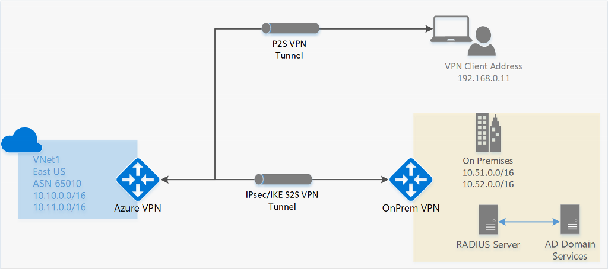
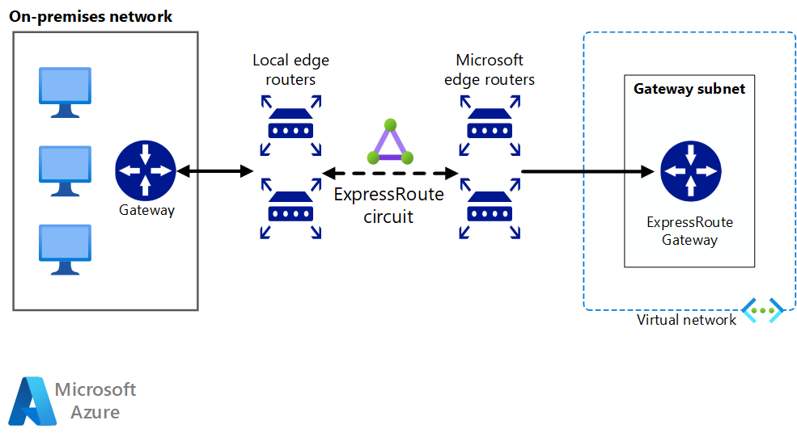
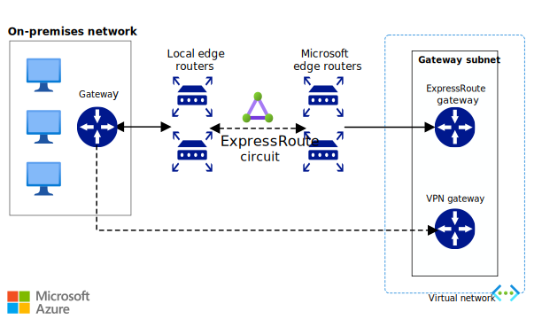

# 🛫 Design for on-premises connectivity to Azure

### VPN Connection;

<figure><figcaption></figcaption></figure>

Azure VPN Connection, verilerin internet üzerinden güvenli bir şekilde aktarılmasını sağlayarak, şirketlerin bulut kaynaklarını güvenli bir şekilde yönetmelerine olanak tanır. İki temel bileşenden oluşur: Site-to-Site VPN ve Point-to-Site VPN.

#### Site-to-Site VPN

Site-to-Site VPN, şirketin yerel ağı ile Azure VNet'i (Sanal Ağ) arasında kalıcı bir VPN bağlantısı kurar. Bu tür bir bağlantı, genellikle sabit bir konumdan buluta erişim gerektiren büyük kuruluşlar tarafından kullanılır. VPN cihazı veya VPN ağ geçidi gerektirir ve IPsec (Internet Protocol Security) protokolünü kullanarak veri şifrelemesi sağlar.



#### Point-to-Site VPN

Point-to-Site VPN, bireysel kullanıcıların uzaktan, örneğin evden veya seyahat halindeyken, Azure VNet'e güvenli bir şekilde bağlanmalarını sağlar. Bu bağlantı türü için kullanıcıların VPN istemci yazılımı yüklemeleri gerekir. Bu, daha çok mobil çalışanlar veya küçük ekipler için uygundur.

#### Nasıl Çalışır?

Azure VPN Connection, şifreleme ve tünel protokolleri kullanarak bir ağ geçidi oluşturur. Bu geçit, kullanıcıların veya ağların Azure hizmetlerine güvenli bir şekilde bağlanmalarını sağlar. Veriler, VPN tüneli üzerinden şifrelenir ve internet üzerinden güvenli bir şekilde aktarılır. Bu sayede, verilerin izinsiz erişime veya saldırılara karşı korunması sağlanır.

***

### ExpressRoute Connection;

<figure><figcaption></figcaption></figure>

Azure ExpressRoute, Microsoft Azure'un sunduğu bir hizmettir ve kullanıcıların kendi veri merkezleri, ofisler veya co-location ortamları ile Azure'un veri merkezleri arasında özel, yüksek bant genişliğine sahip bağlantılar kurmalarını sağlar. Bu hizmet, internet üzerinden geçmeyen ve bu nedenle daha güvenilir, daha tutarlı ağ performansı sunan bir ağ bağlantısı kurar. ExpressRoute, özellikle büyük veri aktarımı gereksinimleri olan, bulut kaynaklarını yoğun olarak kullanan kuruluşlar için tasarlanmıştır.

#### Nasıl Çalışır?

Azure ExpressRoute, iki ana bileşenden oluşur: ExpressRoute devreleri ve peering.

1. **ExpressRoute Devreleri:** Kullanıcılar, Azure ile onların arasında özel bir bağlantı kurmak için bir telekom sağlayıcısı aracılığıyla bir ExpressRoute devresi oluşturur. Bu devre, kullanıcının altyapısı ile Microsoft'un Azure altyapısı arasında fiziksel veya sanal bir bağlantı olarak işlev görür.
2. **Peering:** Kurulumun bir parçası olarak, kullanıcılar Microsoft Azure ile çeşitli peering konfigürasyonları ayarlayabilir. Bu peering türleri arasında şunlar bulunur:
   * **Private Peering:** Azure kaynaklarına (sanal makineler, depolama hesapları vb.) özel erişim sağlar. Bu, kullanıcının kendi VNet'ine doğrudan ve güvenli bir şekilde erişmesini sağlar.
   * **Public Peering (Artık kullanımdan kaldırıldı ve Microsoft tarafından önerilen Azure Microsoft Peering ile değiştirildi):** Azure hizmetlerine (Microsoft 365, Dynamics 365 vb.) güvenli erişim sağlar.
   * **Microsoft Peering:** Kullanıcıların Microsoft'un kamu hizmetlerine (örneğin, Office 365, Dynamics 365) erişimini sağlar ve bu hizmetlere özel ağ üzerinden bağlanmayı mümkün kılar.

#### Kurulum Süreci:

Kurulum süreci genellikle şu adımları içerir:

1. **Servis Sağlayıcı Seçimi:** Kullanıcılar, Microsoft'un onayladığı ExpressRoute ortaklarından biri ile çalışmalıdır.
2. **Devre Oluşturma:** Kullanıcılar, seçtikleri servis sağlayıcı aracılığıyla bir ExpressRoute devresi oluşturur.
3. **Peering Konfigürasyonu:** Kullanıcılar, Azure portalı üzerinden gereken peering ayarlarını yaparlar.
4. **Bağlantı Testi:** Kurulum tamamlandıktan sonra, bağlantının düzgün çalıştığından emin olmak için testler yapılır.

***

### ExpressRoute with VPN failover;

<figure><figcaption></figcaption></figure>

Azure ExpressRoute with VPN failover, Azure ExpressRoute bağlantısının yanı sıra VPN (Sanal Özel Ağ) kullanarak yüksek kullanılabilirlik ve felaketten korunma sağlayan bir çözümdür. Bu yapılandırma, Azure ExpressRoute'un sunduğu yüksek bant genişliği ve düşük gecikme avantajlarını korurken, ExpressRoute bağlantısında bir kesinti olması durumunda otomatik olarak VPN bağlantısına geçiş yaparak kesintisiz hizmet sunar.

#### Nasıl Çalışır?

1. **ExpressRoute Bağlantısı:** Kuruluşlar, veri merkezi ve Azure arasında özel, yüksek performanslı bir ExpressRoute bağlantısı kurarlar. Bu bağlantı, bulut kaynaklarına güvenli ve hızlı erişim sağlar.
2. **VPN Bağlantısı:** Aynı zamanda, kuruluşlar internet üzerinden Azure'a bağlanmak için bir VPN tüneli oluştururlar. Bu VPN bağlantısı, ExpressRoute bağlantısıyla aynı VNet'e bağlanır.
3. **Failover Mekanizması:** Azure, ExpressRoute bağlantısında bir sorun algılandığında otomatik olarak VPN bağlantısına yedekleme (failover) yapacak şekilde yapılandırılabilir. Bu, Azure'un yerleşik sağlık kontrolleri ve izleme araçları kullanılarak yönetilir.
4. **Failback:** Sorun giderildikten sonra, trafik otomatik olarak ExpressRoute bağlantısına geri yönlendirilebilir, böylece normal operasyonlara dönülür.

***

### Hub-Spoke;

<figure><figcaption></figcaption></figure>

Azure Hub-Spoke modeli, Azure'da ağ tasarımı ve mimarisi için kullanılan bir yapılandırmadır. Bu model, merkezi (hub) ve spoke ağlarının bir araya getirilmesiyle oluşturulan bir ağ topolojisidir. Hub-Spoke modeli, büyük ölçekli kuruluşların ve bulut tabanlı uygulamaların gereksinimlerini karşılamak üzere tasarlanmıştır, çünkü güvenlik, izolasyon ve yönetim üzerinde daha fazla kontrol sağlar.

Hub, genellikle ortak hizmetleri barındıran merkezi bir ağdır. Bu hizmetler arasında ağ geçidi (VPN ya da ExpressRoute), güvenlik duvarı, ad çözümleme (DNS) ve diğer paylaşılan hizmetler bulunabilir. Hub, genellikle farklı Spoke ağları arasında veya internete çıkış noktası olarak güvenlik ve bağlantı hizmetleri sağlar.

Spoke ağları, hub'a bağlanan ve genellikle belirli bir iş birimi, uygulama ya da hizmet grubunu temsil eden ayrı ağ segmentleridir. Spoke'lar, hub üzerinden birbirleriyle ve dış dünyayla iletişim kurabilirler, ancak genellikle birbirlerinden izole edilmişlerdir, bu da güvenlik ve yönetim kolaylığı sağlar.

#### Çalışma Prensibi

* **Bağlantı:** Spoke ağları, VPN, ExpressRoute veya Azure Virtual Network peering gibi teknolojiler kullanarak hub ağına bağlanır. Bu bağlantı, tüm trafik akışını merkezi bir noktadan yönetmeye olanak tanır.
* **Güvenlik ve Yönetim:** Hub, ağ güvenliği ve trafiğin yönetimi için merkezi bir nokta olarak hizmet eder. Güvenlik politikaları, firewall kuralları ve diğer yönetim kontrolleri hub üzerinden uygulanır, bu da güvenlik duruşunu güçlendirir ve yönetimi kolaylaştırır.
* **Esneklik ve Ölçeklenebilirlik:** Bu model, yeni spoke ağlarının eklenmesini ve mevcut olanların genişletilmesini kolaylaştırır, böylece kuruluşlar ihtiyaç duydukça ölçeklenebilirlik sağlayabilirler.

***

### Hub-Spoke architecture using VWAN;

<figure><figcaption></figcaption></figure>

Azure Virtual WAN, çoklu bağlantı senaryolarını basitleştirmek için tasarlanmış bir hizmettir. Çeşitli VPN bağlantı türlerini (Site-to-Site, Point-to-Site, ExpressRoute) destekler ve bu bağlantıları yönetmek için merkezi bir hub sunar. VWAN, otomatik ağ yönlendirme ve yönetim özellikleri ile büyük ölçekli ağ senaryolarını daha kolay yönetmenize olanak tanır.

#### Azure VWAN ile Hub-Spoke Mimarisi Nasıl Çalışır?

* **Merkezi Hub:** Azure VWAN, bir veya daha fazla merkezi hub oluşturarak ağ bağlantılarını yönetir. Bu hub'lar, farklı ağ segmentleri (spoke'lar) ve dış bağlantılar (örneğin, internet, on-premises ağlar) arasında trafik akışını yönlendirir.
* **Spoke Bağlantıları:** Spoke'lar, iş birimleri, uygulamalar veya lokasyonlar gibi ayrı ağ segmentleridir. Azure VWAN, bu spoke'ları hub'a bağlamak için Virtual Network Peering kullanır, böylece kolay ve güvenli bir şekilde trafik akışı sağlanır.
* **Otomatik Yönlendirme ve Optimizasyon:** VWAN, trafik akışını otomatik olarak yönlendirir ve optimize eder, WAN bağlantılarınızın performansını ve güvenliğini artırır.
* **Genişletilebilirlik ve Esneklik:** Kuruluşlar, ihtiyaçlarına göre yeni spoke ağları ekleyebilir veya mevcut bağlantıları ölçeklendirebilirler. VWAN, büyük ölçekli ağ yapılandırmalarını basitleştiren ve yönetimini merkezileştiren esnek bir yapı sunar.

