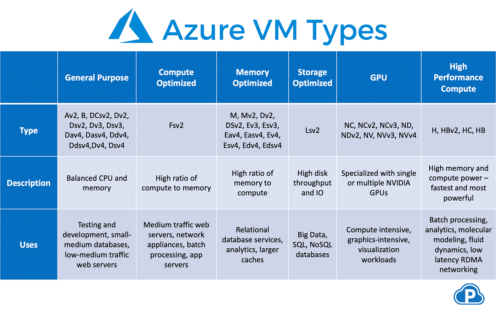

# 🌊 Design for virtual machines

Azure'da sanal makineleri seçmeniz gereken durumlar şunlardır:

1. **Tam Kontrol Gerektiğinde**: Eğer bulut ortamında çalışacak uygulamanız için altyapının tam kontrolüne ihtiyacınız varsa ve fiziksel donanım hariç olmak üzere her şey üzerinde tam yetki istiyorsanız, sanal makineler uygun bir seçenektir.
2. **Lift-and-Shift Göçü İçin**: Mevcut bir uygulamayı doğrudan göç ettirmek istiyor ancak uygulamanızı konteynerize etmek mümkün değilse veya bir web/API uygulaması değilse, yani "lift-and-shift" göçü için uygunsa ancak cloud-native özelliklere ihtiyaç duymuyorsanız sanal makineleri tercih edebilirsiniz.
3. **Özel İş Yükleri İçin**: Yüksek performanslı hesaplama (HPC), SAP gibi özel iş yüklerini barındırmak için sanal makineler idealdir.
4. **Eski Uygulamalar İçin**: Legacy uygulamalarınızı modern donanımlar üzerinde çalıştırmak istiyorsanız ve bunları buluta taşımak istiyorsanız, sanal makineler bu tür uygulamalar için genellikle tercih edilir.

Bu durumlar, sanal makinelerin esnekliği ve kontrol seviyesi nedeniyle Azure'da tercih edildikleri senaryoları yansıtmaktadır. Yani, eğer bulut ortamında fiziksel donanım dışında her şeye hükmetmek, özel veya eski uygulamaları çalıştırmak ya da "lift-and-shift" göçü yapmak istiyorsanız, sanal makineler uygun bir seçim olacaktır.

### Plan for virtual machines;

<figure><figcaption></figcaption></figure>

1. **Start with network**: Sanal makinelerinizi kurmadan önce, onların çalışacağı ağ altyapısını planlanmalı. Bu, ağ güvenliği, alt ağlar, IP adresleme planı ve erişim kontrol listeleri(ACL) gibi unsurları içerir.
2. **Location of the VM**: VM'nin barındırılacağı bölgeyi seçerken, gecikme sürelerini ve veri gizliliği gibi yasal gereklilikleri göz önünde bulundurmalıyız.
3. **Operating system of the VM**: VM'niz için hangi işletim sistemini kullanacağınıza karar verebiliriz. Bu, Windows, Linux dağıtımları veya özel bir işletim sistemi olabilir.
4. **Pricing of the VM**: VM için bütçe belirlerken, makinenin boyutu, kullanım süresi ve rezerve edilmiş instancelar gibi çeşitli fiyatlandırma seçeneklerini kontrol edebiliriz.
5. **Naming convention for the VM**: Organizasyon için VM adlandırma kuralları belirlemeliyiz ki, kaynaklarınızı kolaylıkla tanımlayıp yönetebilesiniz.
6. **Storage performance of the VM**: VM'nizin gereksinimlerine uygun depolama performansını seçmek önemlidir. Bu, disk tipleri ve yapılandırmaları ile ilgili kararları içerir.
7. **Update and patch management**: VM'in güvenliğini sağlamak için düzenli güncelleme ve yama uygulama stratejisi oluşturmalıyız.
8. **Monitoring**: VM'in performansını, sağlığını ve güvenliğini izlemek için uygun araçlar ve alarmlar belirlemeliyiz.

***

### Plan for virtual machine family;

<figure><figcaption></figcaption></figure>

***

### Choose between VM and VMSS;

Sanal Makineler (VM'ler) ve Sanal Makine Ölçek Kümeleri (VMSS'ler). VM'ler, kontrol ve özelleştirme üzerinde yüksek derecede esneklik sağlarken, VMSS'ler yönetimi basitleştirmek ve otomasyonu artırmak için tasarlanmıştır.

**Sanal Makineler (VM'ler):**

* **Manuel Yapılandırma:** VM'lerde, her bir sanal makineyi manuel olarak oluşturmanız ve yapılandırmanız gerekir. Bu, detaylı bir kurulum süreci gerektirebilir.
* **Yük Dengeleyiciye Manuel Ekleme:** VM'leri bir yük dengeleyicinin arkasına eklemek manuel bir süreçtir ve bu, genişleme sırasında ek yük getirebilir.
* **Kullanılabilirlik Setleri/Zoneları Gerektirir:** Yüksek kullanılabilirlik sağlamak için, VM'lerin kullanılabilirlik setleri veya zonelar oluşturulması gerekir, bu da ek planlama ve konfigürasyon gerektirebilir.
* **Otomatik Ölçeklendirme Yok:** VM'ler, trafiğe veya diğer performans metriklerine dayalı olarak otomatik ölçeklendirme özelliğini doğrudan desteklemezler.

**Sanal Makine Ölçek Kümeleri (VMSS'ler):**

* **Merkezi Yapılandırma:** VMSS, tüm instance'ların aynı yapılandırmaya sahip olacağı merkezi bir yapılandırmaya dayanır. Bu, yönetimi kolaylaştırır ve tutarlılık sağlar.
* **Tek Konfigürasyonda Yük Dengeleyiciye Ekleme:** VMSS instanceları, tek bir yapılandırma kullanarak bir yük dengeleyiciye otomatik olarak eklenebilir. Bu, yeni instanceların hızlı ve kolay bir şekilde sisteme dahil edilmesini sağlar.
* **Otomatik Ölçeklendirme:** VMSS'ler, belirli metrikler veya bir zaman çizelgesi temelinde otomatik ölçeklendirme yapabilir. Bu, uygulamanızın ihtiyaç duyduğu kaynakları dinamik olarak ayarlayarak maliyetleri optimize etmenize yardımcı olur.

**Sanal Makineler** daha çok tekil, detaylı kontrol ve özelleştirme ihtiyacı olan senaryolar için uygunken, **Sanal Makine Ölçek Kümeleri** yüksek oranda otomasyon ve kolay ölçeklendirme gerektiren uygulamalar için idealdir. Ölçeklendirme, yük dengesi ve yüksek kullanılabilirlik gibi özellikler otomatik olarak yönetildiğinden, VMSS'ler, özellikle değişken yük ve büyük ölçekte uygulama dağıtımları için mükemmel bir çözümdür.
