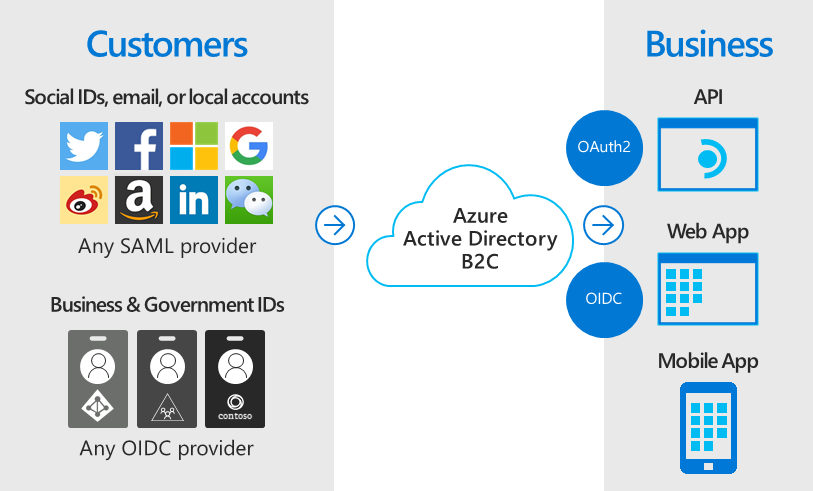

# 🛃 Desing For Azure B2C

<figure><figcaption></figcaption></figure>

Azure AD B2C, Microsoft tarafından sunulan bir kimlik yönetimi hizmetidir. Bu hizmet, işletmelerin ve geliştiricilerin web siteleri, uygulamalar vb için kullanıcı kimlik doğrulaması ve giriş işlemlerini yönetmelerine olanak tanır. Kullanıcılar, sosyal medya hesapları veya e-posta ve şifre kullanarak uygulamalara giriş yapabilirler. Azure AD B2C, özellikle tüketiciye yönelik (B2C - Business to Consumer) uygulamalar için tasarlanmıştır ve işletmelerin kullanıcı deneyimini kişiselleştirmelerine, güvenliklerini artırmalarına ve hukuki gerekliliklere uyum sağlamalarına yardımcı olur.

Önemli noktalar:

* Kullanıcı arayüzlerini markanızın tarzına uygun şekilde özelleştirmeyi düşünebilirsiniz. Bu, marka kimliğinizi güçlendirir ve kullanıcılara daha kişisel bir deneyim sunar.
* Kullanıcılarınıza çeşitli kimlik doğrulama seçenekleri sunmayı değerlendirebilirsiniz, örneğin sosyal medya hesaplarıyla ya da e-posta ve şifreyle giriş yapma imkanı. Bu, kullanıcı deneyimini basitleştirir ve farklı tercihlere sahip kullanıcılara hitap eder.
* Güvenlik özelliklerini, özellikle iki faktörlü kimlik doğrulama ve şifre politikalarını etkin bir şekilde kullanmak, kullanıcı verilerinin güvenliğini artırabilir.
* GDPR, HIPAA gibi veri koruma ve gizlilik standartlarına uyum sağlamak, kullanıcıların güvenini kazanmanıza ve yasal gerekliliklere uyma konusunda sizi rahatlatır.
* Kullanıcı erişim kontrollerini, rollerine ve izinlerine göre ayarlamak, uygulamanızdaki veri güvenliğini ve kullanıcı deneyimini iyileştirebilir.
* Azure AD B2C'yi diğer hizmetlerle entegre ederken, API kullanımını ve performansını optimize etmek, genel sistem verimliliğini artırabilir.
* Kullanıcı etkinliklerini, güvenlik olaylarını ve performans metriklerini sürekli izlemek, olası sorunları erken tespit etmenize ve hızlı müdahale etmenize olanak tanır.

**B2B VS B2C:**

<figure><figcaption></figcaption></figure>

Azure AD B2B:

* Kuruluşa ait kullanıcılar, yerel sistemlerden senkronize edilen kullanıcılar ve iş birliği için davet edilen harici kullanıcıları içerir.
* Kullanıcılar, davet yoluyla, erişim incelemesi, Rol Tabanlı Erişim Kontrolü (RBAC) ve benzeri yöntemlerle yönetilir.
* Davet edilen kullanıcılar, dizinde zaten bulunan kullanıcılarla etkileşimde bulunabilir.
* Misafir kullanıcılar, organizasyonun çalışanlarıyla aynı tenant içinde yönetilir.
* Organizasyon markalama işlemleri yapılabilir.

Azure AD B2C:

* Uygulamanızın müşterileri bu kategoride yer alır. Bu kullanıcılar B2C tenant'ınızda ayrı olarak yönetilir ve B2B tenant'ınızla ilişkili değildir.
* Kullanıcılar, kendi profillerini kendileri yönetir.
* Müşteriler diğer müşterilere görünmez.
* Bu kullanıcılar çalışanlarla etkileşimde bulunamaz ve ayrı bir tenant içinde yönetilir.
* Sistem tamamen özelleştirilebilir.


