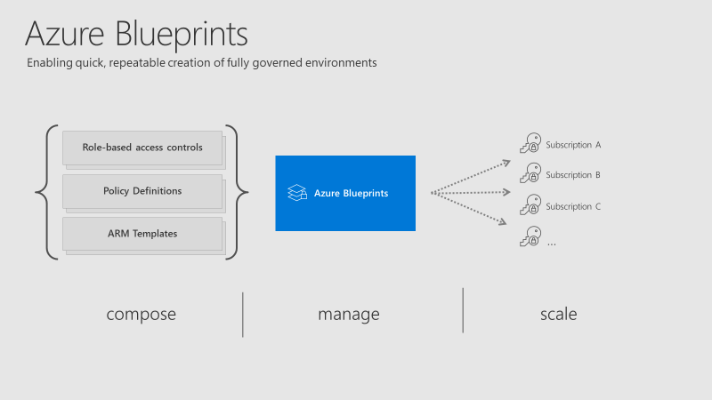
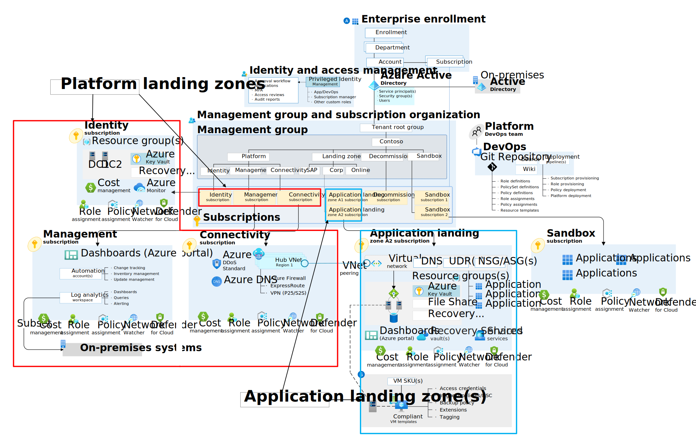

# 🫐 Desing For Blueprints

Azure Blueprints, Azure abonelikleriniz üzerinde tekrarlanabilir, denetlenebilir ve uyumlu ortamlar oluşturmak için kullanılan bir hizmettir. Azure Blueprints, bulut kaynaklarının ve yapılandırmalarının önceden tanımlı bir setini kullanarak, güvenlik, tasarım ve uyumluluk gereksinimlerini karşılayacak şekilde Azure ortamlarını hızlı ve tutarlı bir şekilde kurmanıza olanak tanır. Azure Blueprints, Resource Groups, Role Assignments, Policy Assignments, ARM Templates ve daha fazlasını içerebilir.

<figure><figcaption></figcaption></figure>



### **ARM. VS BLUEPRINTS;**

* ARM şablonları daha çok kaynak dağıtımı ve yapılandırması üzerine odaklanırken, Azure Blueprints bir Azure ortamının genel yapısını, güvenlik politikalarını, rol atamalarını ve uyumluluk standartlarını kapsar.
* Blueprints, bir ortamın birden fazla kez ve tutarlı bir şekilde kurulmasını sağlamak üzere tasarlanmıştır. ARM şablonları ise genellikle belirli bir dağıtım senaryosuna odaklanır.
* Blueprints, ARM şablonlarını içerebilir, bu da Blueprints'in ARM şablonlarının sunduğu tüm özellikleri ve esnekliği desteklediğini gösterir. Ayrıca, güvenlik politikaları ve rol atamaları gibi ek yapılandırma öğelerini de entegre eder.

Kısacası, Azure Blueprints ve ARM şablonları, Azure kaynaklarını yönetme ve dağıtma sürecinde birlikte çalışabilir. Blueprints, ARM şablonları dahil olmak üzere çeşitli yapılandırma öğelerini bir araya getirerek geniş kapsamlı ortam yapılandırmalarını ve uyumluluğu yönetmenizi sağlar.

<figure><figcaption></figcaption></figure>





***

### Bonus:&#x20;

<figure><figcaption></figcaption></figure>

Azure Landing Zone, Azure'da yeni bir proje başlatırken ihtiyacınız olan her şeyi hazırlamanıza yardımcı olacak bir başlangıç noktasıdır. Bir nevi, bulut üzerinde çalışacak projeleriniz için sağlam ve güvenli bir temel oluşturur. Bu temel, projelerinizin ihtiyaç duyduğu güvenlik, performans ve maliyet yönetimi gibi önemli konularda size rehberlik eder.

Azure Landing Zone kullanmanın amacı, buluta taşınma sürecinizi kolaylaştırmak ve Azure üzerinde çalışacak sistemlerinizin en başından itibaren doğru şekilde kurulmasını sağlamaktır. Böylece, sistemlerinizi daha hızlı, güvenli ve etkili bir şekilde yönetebilirsiniz.

Basitçe söylemek gerekirse, Azure Landing Zone şunları sağlar:

* **Güvenlik:** Sistemlerinizin güvenli bir şekilde çalışmasını sağlar.
* **Yönetim Kolaylığı:** Kaynaklarınızı daha kolay yönetmenize olanak tanır.
* **Maliyet Kontrolü:** Maliyetleri daha iyi kontrol etmenizi sağlar.
* **Hız:** Projelerinizi daha hızlı başlatmanıza yardımcı olur.

Azure Landing Zone, bir projeyi Azure'da başlatırken izlemeniz gereken adımları ve dikkate almanız gereken önemli noktaları size sunar. Bu sayede, projelerinizin bulut üzerinde sorunsuz ve etkili bir şekilde çalışmasını sağlayacak bir yapı kurmuş olursunuz.


Azure Landing Zone, tek bir hizmet veya ürün değil, bulut ortamlarını planlama, kurma ve yönetme sürecinde izlenmesi gereken bir dizi yönerge ve metodolojidir. Microsoft tarafından sağlanan bu metodoloji, Azure'da güvenli, ölçeklenebilir ve uyumlu altyapılar oluşturmak için en iyi uygulamaları ve rehberlikleri içerir.



