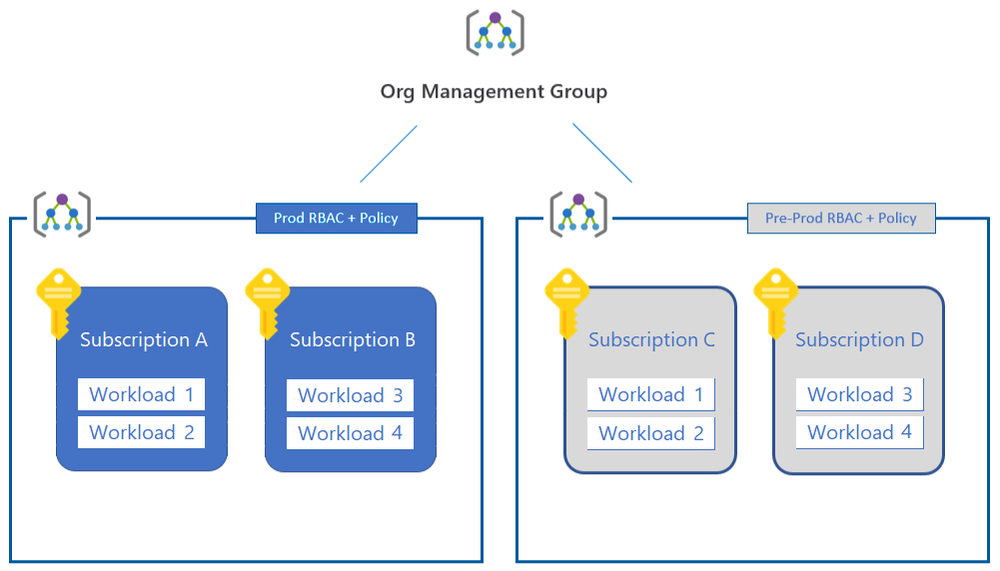

# 🔑 Desing for Subscriptions

<figure><figcaption></figcaption></figure>

### Best Practies:

* Aboneliklerinizin farklı yönetim grupları altında önceliklerinize ve iş ihtiyaçlarınıza göre gruplandırabilirsiniz.
* Her aboneliğin, Microsoft tarafından belirlenen sınırlamaları vardır ve bunların bazılarının Microsoft desteği ile değiştirilebilir, bazıları ise sabit sınırlamalardır.
* Firewall, ExpressRoute, VPN ağ geçitleri, Sanal WAN gibi paylaşılan servislerin tek bir abonelik altında toplanması sık kullanılan yöntemdir.  Bu durum Azure Landing Zones'un geliştirilmesi için de kullanılabilir.
* Aboneliklerin, policy ataması için bir kapsam olarak kullanılması, bu policy 'leri ve rolleri belirli aboneliklere veya kaynak gruplarına atayarak, organizasyonunuzun Azure kaynaklarını güvenli ve etkili bir şekilde yönetebilmesini sağlayabilirsiniz. En az ayrıcalık ilkesini takip etmek ve PIM'den yararlanmak, güvenlik risklerini en aza indirir ve verimliliği artırır.

