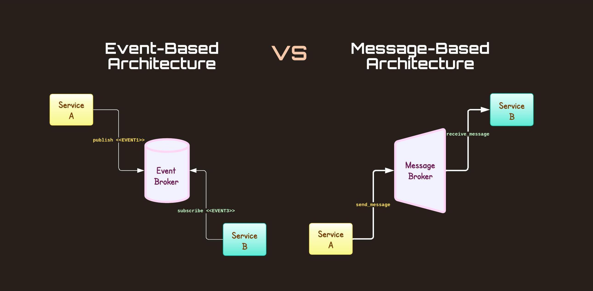

# 📩 Differentiate event and message

<figure><figcaption></figcaption></figure>

**Event (Olay):**

* Bir event, bir sistemde veya uygulamada meydana gelen bir olayı temsil eder. Örneğin, kullanıcının bir butona tıklaması veya bir zamanlayıcının sona ermesi bir event olabilir.
* Eventler yayıncı-abone (publisher-subscriber) modelini kullanır. Bir yayıncı bir eventi gönderir (broadcast eder), ve bir veya daha fazla abone bu evente abone olur ve o event gerçekleştiğinde haberdar olurlar.
* Eventler genellikle sistemin belirli bir durum değişikliğini bildirmek için kullanılır ve sistemdeki diğer bileşenler bu evente yanıt verebilir.
* Event tabanlı sistemlerde, eventler genellikle sadece bir bildirim içerir ve genellikle bir payload (yani taşıdıkları veri) içermezler ya da çok hafif bir payload taşırlar.

Misa&#x6C;**:** Bir e-ticaret web sitesi düşünün. Bir kullanıcı, bir ürünü sepetine eklediğinde, sistem bir "Ürün Sepete Eklendi" eventi yayınlar. Bu evente, çeşitli servisler abone olabilir. Örneğin:

* **Analitik Servisi:** Bu servis, ürün sepete eklendiğinde kullanıcı davranışlarını izlemek için bu eventi dinleyebilir ve analiz etmek üzere verileri toplayabilir.
* **Stok Yönetim Servisi:** Stok düzeylerini güncellemek için bu eventi dinleyebilir ve ilgili ürünün stok sayısını azaltabilir.
* **Tavsiye Motoru Servisi:** Kullanıcıya, sepete eklediği ürünle ilişkili diğer ürünleri önermek için bu eventi kullanabilir.

Bu örnekte, event, gerçekleşen bir durumu (ürünün sepete eklenmesi) temsil ediyor ve çeşitli servislerin bu duruma yanıt vermesini sağlıyor.

**Message (Mesaj):**

* Bir message, genellikle iki sistem veya uygulama bileşeni arasında veri aktarımı için kullanılan bir veri paketidir.
* Message, genellikle bir istemciden bir sunucuya, bir servisten diğerine ya da mikroservisler arasında gönderilir.
* Bir message, veriye ek olarak, verinin nasıl işleneceğine dair meta veriler veya komutlar da içerebilir.
* Message tabanlı sistemlerde, bir message genellikle bir işlemin tamamlanması için gerekli olan tüm bilgileri içerir ve bu mesajın alıcısı tarafından işlenmesi beklenir.

Misal: Bir uygulamada kullanıcının profili güncellendiğinde, bu değişiklikleri veritabanında saklamak üzere bir mesaj gönderilir. Mesaj, şu bilgileri içerebilir:

* **Kullanıcı ID:** Hangi kullanıcının profili güncellendiğini tanımlar.
* **Güncellenen Bilgiler:** Yeni kullanıcı adı, e-posta adresi veya profil fotoğrafı gibi güncellenen veriler.

Bir kullanıcı arayüzünden "Profilimi Güncelle" butonuna bastığında, uygulama bu bilgileri içeren bir mesajı arka uç sistemine (örneğin bir API'ye) gönderir. API bu mesajı alır ve kullanıcının veritabanı kaydını bu yeni bilgilerle günceller. Bu mesajın temel amacı, kullanıcının güncellenmiş profil bilgilerini taşımaktır ve veritabanı bu bilgilerle güncellenene kadar bu mesaj önemlidir.

Bu senaryoda, mesaj belirli bir eylemi tetiklemek için gönderilen ve işlenmesi gereken bilgileri içerir; yani kullanıcının profilinin güncellenmesi sürecini başlatır.

Kısacası, bir "event" genellikle bir sistemin durumunda bir değişikliği bildirirken, bir "message" genellikle iki bileşen arasında daha ağır veri alışverişi için kullanılır. Eventler genellikle "fire and forget" yaklaşımına dayalıdır, yani yayınlandıktan sonra yayıncı tarafından daha fazla işlem yapılmaz. Mesajlar ise genellikle daha güvenilir teslimat gerektirir ve genellikle işlemleri veya iş akışlarını tetiklemek için kullanılır.

