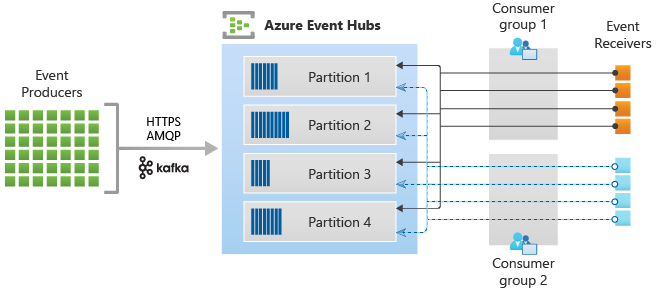
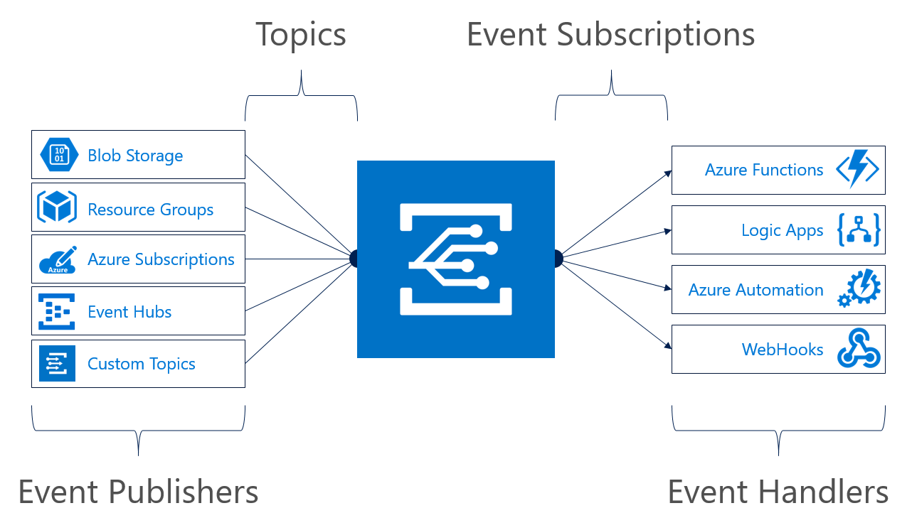

# 🚜 Event Hub

#### Azure Event Hubs

Azure Event Hubs, büyük miktarda veri akışını ve olayları toplamak ve işlemek için kullanılan bir olay yönlendirme servisidir. Yüksek hacimli veri akışları için tasarlanmıştır ve genellikle telemetri, otomasyon logları, uygulama logları gibi verilerin toplanmasında kullanılır. Örneğin, bir mobil uygulamadan gelen kullanıcı etkinlikleri veya IoT cihazlarından gelen sensör verileri Event Hubs'a gönderilebilir. Event Hubs, bu verileri toplar ve gerçek zamanlı analiz veya işleme için başka sistemlere aktarabilir.

<figure><figcaption></figcaption></figure>

1. **Event Producers**: Olay üreticileri, çeşitli kaynaklardan gelen olayları (events) üreten bileşenlerdir. Bunlar, IoT cihazları, uygulama logları veya kullanıcı etkinlikleri gibi olay üretebilen herhangi bir kaynak olabilir.
2. **Protocols**: Üreticiler, HTTPS ve AMQP protokolleri gibi güvenli iletişim protokolleri veya Apache Kafka protokolünü kullanarak olayları Event Hubs'a gönderirler. Bu protokoller, verilerin güvenli bir şekilde iletilmesini sağlar.
3. **Azure Event Hubs**: Burası, olayların toplandığı ve işlendiği merkezi bir noktadır. Event Hubs, büyük miktarda veriyi toplamak ve yönetmek için bölümlere (partitions) ayrılır. Her bir bölüm, farklı olayları tutar.
4. **Partitions**: Bölümler, olayları tutmak için kullanılır. Olaylar, belirli bir sıraya göre bu bölümlerde saklanır. Her bölümdeki olaylar ayrı ayrı işlenebilir.
5. **Consumer Groups**: Tüketici grupları, olayları işlemek ve almak için yapılandırılmış servis veya uygulama gruplarıdır. Bir Event Hubs bölümüne birden fazla tüketici grubu abone olabilir ve her grup, bölümlerden olayları bağımsız bir şekilde alabilir.
6. **Event Receivers**: Bu, olayları alan ve onları işleyen son uç noktadır. Tüketici gruplarına bağlı olan bu alıcılar, olayları gerçek zamanlı analiz etmek, veritabanlarına kaydetmek, bildirimler göndermek veya diğer uygulamalarla entegre etmek için kullanılabilir.

#### Azure Event Grid

Azure Event Grid ise, Azure hizmetleri arasında olay tabanlı bağlantıları yönetmek için kullanılır. Servisler arası etkinlikleri iletmek ve bu etkinliklere abone olmak için kullanılır. Event Grid, belirli olayların gerçekleşmesi durumunda (örneğin bir dosyanın Azure Storage'da oluşturulması veya bir Azure VM'nin durumu değiştiğinde) bu olaylara abone olan sistemlere otomatik bildirimler gönderir. Bu, uygulamaların ve servislerin daha modüler ve yanıt veren yapılar oluşturmasını sağlar.

<figure><figcaption></figcaption></figure>

1. **Event Publishers (Olay Yayıncıları)**: Bu, olayların kaynağıdır. Örneğin, Blob Storage, Resource Groups, Azure Subscriptions, Event Hubs ve Custom Topics gibi farklı Azure kaynakları olayları üretebilir.
2. **Topics**: Bu, Event Grid'de olayların yayınlandığı kanallardır. Her bir kaynak, örneğin bir blob depolama konteyneri ya da bir Azure aboneliği, olayları yayınlamak için bir "topic" kullanır. Topics, yayınlanan olayların kategorize edildiği ve ilgili olay aboneliklerine yönlendirildiği yerdir.
3. **Event Subscriptions (Olay Abonelikleri)**: Bu, belirli bir topic'ten olayları almak için yapılandırılmış olan aboneliklerdir. Uygulama veya servisler, ilgilendikleri olayları alacak şekilde Event Grid içinde abonelik oluştururlar.
4. **Event Handlers (Olay İşleyicileri)**: Bu, alınan olaylara yanıt veren veya bu olaylar üzerinde işlem yapan bileşenlerdir. Örneğin, Azure Functions, olaylara tepki olarak kod çalıştırabilir; Logic Apps, olaylara dayalı iş akışları oluşturabilir; Azure Automation, olaylar temelinde otomatik yönetim görevleri başlatabilir ve WebHooks üzerinden olaylar, HTTP üzerinden farklı servislere gönderilebilir.

Abone olacak tüketiciye tam olarak hangi topic'e abone olmaları gerektiğini bildirmeniz gerekir. Bu, sistem topic'inin adı veya özel topic'inizin adı olacaktır. Bu şekilde, abonelerin hangi olayları alacaklarını tam olarak belirtmiş olursunuz.

#### İşleyiş Süreci:

1. Bir olay oluşur (örneğin, bir dosya Blob Storage'a yüklenir).
2. Bu olay, ilgili Azure servisine ait bir topic'te yayınlanır.
3. Event Grid, yayınlanan olayı aboneliklere göre ilgili olay işleyicilere yönlendirir.
4. Olay işleyiciler, bu olayları alır ve önceden tanımlanmış işleri yürütür (örneğin, bir veritabanını günceller, bir e-posta gönderir vb.).

Azure Event Hub, genellikle büyük miktarda gerçek zamanlı veri akışını işlemek için optimize edilmiştir. Özellikle IoT uygulamaları gibi yüksek hızda veri toplama gerektiren senaryolarda kullanılır. Event Hub, büyük miktarda veriyi paralel olarak alabilir, bu veriyi depolayabilir ve sonrasında analiz veya işleme için çeşitli hedeflere yönlendirebilir. Bu, sensör verilerinin, telemetri bilgilerinin veya diğer sürekli akış verilerinin etkin bir şekilde yakalanması ve işlenmesi gereken durumlarda önemli bir avantaj sağlar.

Öte yandan, Azure Event Grid, dağıtılmış sistemler arasında olay tabanlı iletişimi kolaylaştırmaya odaklanır. Event Grid, farklı kaynaklardan (örneğin, storage account, subscription, IoT cihazları) gelen olayları dinleyicilere (abonelere) ileterek, olaylara yanıt olarak otomatik işlemler yapılmasını sağlar.&#x20;

Azure Event Hub genellikle büyük miktarda veri akışını işlemek için tasarlanırken, Azure Event Grid dağıtılmış sistemler arasında iletişimi kolaylaştırır. Her ikisi de farklı senaryolara hizmet eder ve genellikle birbirini tamamlayıcı olarak kullanılır.




