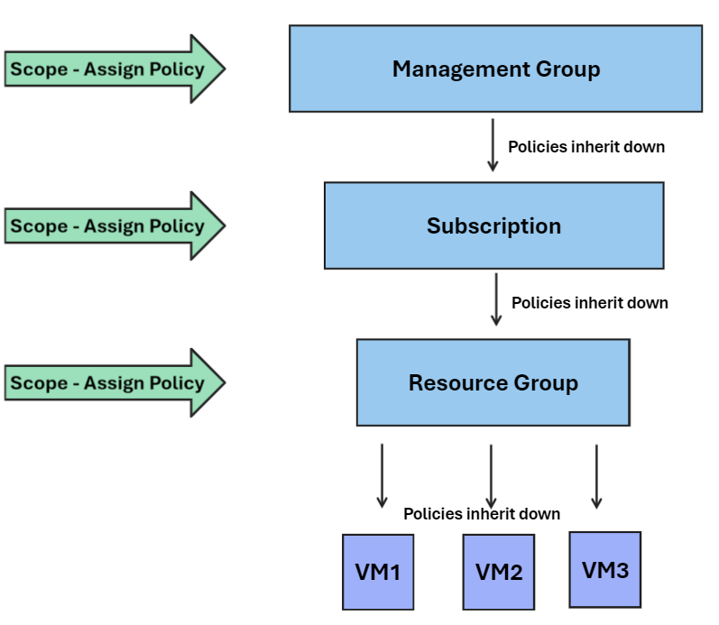

# 👑 Governance hierarchy

<figure><figcaption></figcaption></figure>

Azure yönetim hiyerarşisi, organizasyonunuzdaki kaynakları daha iyi yönetebilmeniz için kullanılır. Örneğin, belirli bir departman veya projeye ait kaynakları tek bir yönetim grubu altında toplayarak, bu grup için özelleştirilmiş izinler veya politikalar uygulayabilirsiniz. Bu hiyerarşi, genel bulut kaynaklarınızın güvenliğini ve uygunluğunu sağlamak için de önemlidir.

* **Management Groups**: **Subscription** üstünde bir kapsamdır ve birden fazla **Subscription** bir arada gruplamak için kullanılır.
* **Subscriptions**: Azure kaynaklarınızı oluşturduğunuz, yönettiğiniz ve faturalandırdığınız hesap birimidir. Her **Subscription**, bir veya daha fazla **Resource Group** içerebilir.
* **Resource Groups**: Mantıksal olarak ilişkili kaynakları gruplamak için kullanılır (örneğin, bir uygulama için gerekli sanal makineler, veritabanları vb.).
* **Resources**: Azure kaynakları, sanal makineler, ağlar, veritabanları gibi bulut hizmetleridir.


* **Root Yönetim Grubu (Root Management Group)**: Bu grup varsayılan olarak oluşturulur ve ana (kök) grubun dışında 6 seviyeye kadar iç içe yönetim grupları oluşturabilirsiniz.
* **Hiyerarşi Kullanımı**: Bu hiyerarşi, politikaları uygulamak, erişimi kontrol etmek ve maliyet yönetimi gibi işlemleri kolaylaştırmak için kullanılır.


\
Azure'da, şirketinizin bulut kaynaklarını düzenlerken bir düzen oluşturmak için bir hiyerarşi kullanılır. Bu hiyerarşi, şirket genelinde uygulamak istediğiniz kuralların ve politikaların kolayca yönetilmesini sağlar. Örneğin, bir management group içinde bir policy (politika) veya RBAC ayarı yaparsanız, bu ayar otomatik olarak bu grup altındaki tüm subscription'lara, kaynak gruplarına ve kaynaklara uygulanır. Bu sistem "miras alma" olarak bilinir.

<figure><figcaption></figcaption></figure>

İşte bu sürecin bir örneği: Şirketinizin IT güvenlik politikaları var diyelim. Bu politikaları Azure'daki en üst düzeydeki management group'a uygularsınız. Yaptığınız bu uygulama, alt düzeydeki tüm management group'lara ve onların içindeki subscription'lara otomatik olarak aktarılır. Böylece, her subscription veya kaynak için güvenlik ayarlarını tekrar tekrar yapmak zorunda kalmazsınız; üst seviyede yaptığınız ayarlar, alt seviyelere geçer. Bu yöntem, kuralların ve standartların şirket çapında tutarlı ve verimli bir şekilde uygulanmasını sağlar.


