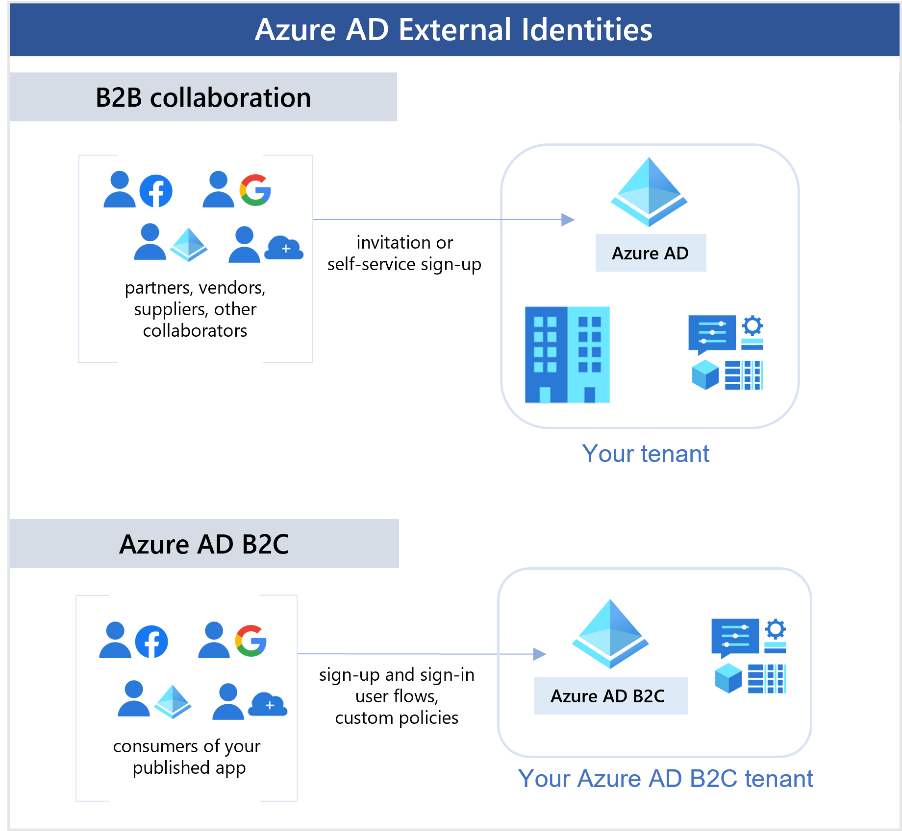

# 🆔 identity and access management

### Zero Trust:

<figure><figcaption></figcaption></figure>

Azure'da "Zero Trust" modeli, güvenliği bir adım öteye taşır. Bu model, "Güvenmek yok, her zaman sorgula" prensibini benimser. Şöyle düşünün: Siz bir partiye ev sahipliği yapıyorsunuz ve her kapıda bir güvenlik görevlisi var. Bu görevliler, partinize gelen herkesi dikkatle inceliyor. Hiç kimseyi tanımadan içeri almıyorlar, herkesin davetli olduğundan emin oluyorlar. İşte Azure'un "Zero Trust" modeli de böyle çalışıyor.

1. **Açıkça Doğrulama**: Bu, partinizde herkesin davetli listesinde olup olmadığını kontrol etmek gibi. Kimse sadece "Beni tanıyor musun?" diyerek içeri giremez. Azure, kim olduğunuzu, nereden bağlandığınızı ve hangi cihazı kullandığınızı kontrol eder.
2. **En Az Ayrıcalıkla Erişim**: Bu, misafirlerinize sadece gerekli alanlara erişim izni vermek gibidir. Mutfakta ne işleri varsa sadece orada işlerini yapabilirler, ama salon veya yatak odanıza giremezler. Azure'da da herkes sadece ihtiyacı olan bilgilere erişebilir.
3. **İhlal Varsayımı**: Bu, partide bir sorun çıkacağını varsayarak her zaman hazırlıklı olmak gibidir. Eğer bir şeyler ters giderse hemen müdahale edebilmek için güvenlik önlemleriniz var. Azure da aynı şekilde, olası bir güvenlik ihlaline karşı sürekli tetiktedir.

**Erişim Denetimi Süreci**:

* Kullanıcıların partiye girmesi gibi, Microsoft kaynaklarına erişim istekleri değerlendirilir.
* Güvenlik önlemleri, kapıdaki güvenlik görevlisi gibi, kimliklerini doğrular.
* Erişim izinleri, davetli listesine bakarak verilir ya da engellenir.
* İçeri giren herkesin hareketleri, partideki güvenlik kameraları gibi izlenir.
* Bir risk tespit edilirse, müdahale edilir ve düzeltme önerileri yapılır.

**Microsoft Kaynakları**:

* Azure Active Directory ve diğer araçlar, evinizdeki güvenlik sistemi gibi çalışır.
* Azure, Office 365 gibi kaynaklara erişim, bu güvenlik çerçevesi içinde yönetilir.

***

**Entra ID ( AZURE AD ) bize ne sağlar?**

**"Identity"**

1. **Unified Identity Management**: Bu, organizasyonunuzdaki tüm kullanıcıların, grupların ve cihazların kimlik bilgilerini merkezi bir sistem üzerinden yönetmeyi ifade eder. Yani, bir kullanıcının veya cihazın dünyanın neresinde olursa olsun, kimlik yönetimi ve erişim kontrolleri aynı merkezi politikalar ve prosedürler çerçevesinde yürütülür.
2. **Seamless User Experience**: Kullanıcıların, özellikle oturum açma ve şifre sıfırlama işlemleri gibi kimlik doğrulama süreçlerinde karşılaştıkları zorlukları en aza indirgemeyi hedefler. Bu, kullanıcıların verimliliğini artırır ve IT destek taleplerini azaltabilir.

**"Access"**

1. **Secure Adaptive Access**: Bu, kullanıcıların kimlik doğrulama durumuna, erişmeye çalıştıkları kaynağa ve çevresel risk faktörlerine bağlı olarak güvenlik önlemlerinin dinamik bir şekilde uyarlanmasını sağlar. Örneğin, bir kullanıcı şüpheli bir konumdan erişim sağlamaya çalışıyorsa, sistem ek kimlik doğrulama adımları talep edebilir.
2. **Simplified Identity Governance**: Kuruluşun kimlik yönetim süreçlerini basitleştirmek ve kaynaklara erişimi daha kolay yönetmek anlamına gelir. Bu, uygunluk ve denetim süreçlerini kolaylaştırabilir.

**Senaryolar:**

<figure><figcaption></figcaption></figure>

#### Azure AD(Entra ID) (Senaryo 01):

Diyelim ki, şirketinizde çalışanların kimliklerini ve onların şirket içindeki erişim haklarını düzenlemek istiyorsunuz. İşte bu durumda, Azure Active Directory (Azure AD) kullanmalıyız. Azure AD, personellerin şirketin cloud kaynaklarına nasıl erişebileceklerini yönetmenizi sağlar.

#### Azure AD B2B (Senaryo 02):

Bu senaryo, şirketinizin dışındaki iş ortakları, tedarikçiler gibi kuruluşlarla çalışırken devreye girer. Bu tür dış ilişkilerde, onlara şirketinizin sistemlerine güvenli bir şekilde erişim sağlamak için Azure AD B2B kullanılır. Kısacası, bu, farklı şirketler arasındaki işbirliğinde kimlik ve erişim yönetimini sağlar.

#### Azure AD B2C (Senaryo 03):

Eğer müşterilerinizin veya genel kullanıcıların şirketinizin uygulamalarına nasıl erişeceğini ve bu erişimi nasıl yöneteceğinizi planlıyorsanız, Azure AD B2C sizin için uygun olacaktır. Bu, özellikle tüketici odaklı uygulamalarda, kullanıcıların kimliklerini ve erişim haklarını yönetmek için kullanılır.

