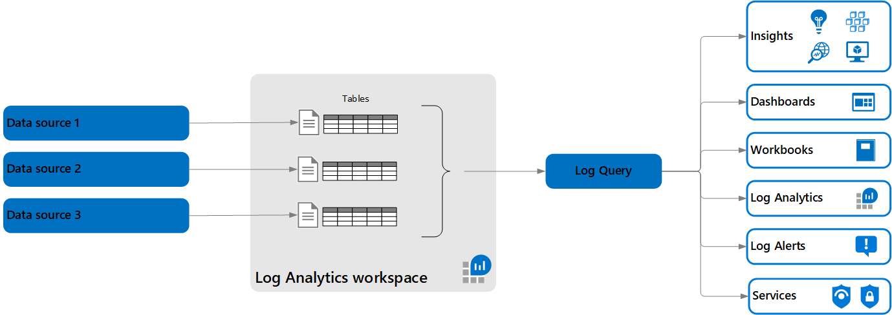

# 🅱️ Log Analytics

Azure Log Analytics, Azure Monitor tarafından toplanan verileri toplayan ve analiz eden yönetilen bir hizmettir. Hem bulut kaynaklarından hem de şirket içi ortamlardan üretilen verileri toplamanıza, işlemenize ve analiz etmenize olanak tanır. Verileri Azure Log Analytics çalışma alanına aktarır.

Azure Log Analytics'in temel özellikleri şunlardır:

1. **Veri Toplama:** Bulut ve şirket içi kaynaklardan üretilen veriler Azure Log Analytics'e toplanabilir.
2. **Sorgulama ve Konsolidasyon:** KQL (Kusto Query Language) kullanarak zengin raporlar ve görselleştirmeler oluşturabilirsiniz.&#x20;
3. **Veri Yerleşimi:** Çalışma alanları, veri yerleşimini sağlamak için farklı bölgelerde oluşturulabilir.
4. **Tasarım:** Log Analytics için tasarım yaparken, veri saklama (GB başına veya Kapasite başına), veri kısıtlama ve erişim hakları gibi fiyatlandırma unsurlarını göz önünde bulundurmanız gerekmektedir.

Azure Log Analytics, aşağıdaki gibi çeşitli kaynaklardan gelen verileri yönetebilir:

* Windows Event Logları
* Syslog
* Ajanlar tarafından toplanan performans metrikleri
* Özel Loglar
* Uyarılar

Bu veriler, Azure Monitor'dan alınır ve analiz edilmek üzere Log Analytics çalışma alanlarına aktarılır. Bu veriler, belirli hizmetlerin ve bileşenlerin performansını değerlendirmek ve izlemek, hataları teşhis etmek ve güvenlik tehditlerini belirlemek için kullanılabilir.

<figure><figcaption></figcaption></figure>

Azure Log Analytics, merkezi, merkezi olmayan ve hibrit olmak üzere farklı erişim kontrolü tasarımlarını destekler:

* **Merkezi (Centralized):** Tüm veriler tek bir çalışma alanında toplanır ve tek bir ekip tarafından yönetilir. Rol Tabanlı Erişim Kontrolü (RBAC) ile erişim kontrol edilebilir.
* **Merkezi Olmayan (Decentralized):** Merkezi olmayan bir yaklaşımda, her ekip kendi çalışma alanını yönetir ve veriler yalnızca ekiplerin kendi kaynaklarından toplanır.
* **Hibrit:** Güvenlik ve uyumluluk gereksinimleri nedeniyle, bazı organizasyonlar hem merkezi hem de merkezi olmayan modelleri yan yana kullanabilir.

Azure Log Analytics, Azure ekosisteminde güçlü bir log yönetim aracıdır ve kompleks sorgulama, analiz ve görselleştirme yetenekleriyle önemli bir bileşendir. İş süreçlerinde proaktif izleme ve hızlı müdahale için kritik öneme sahiptir.

