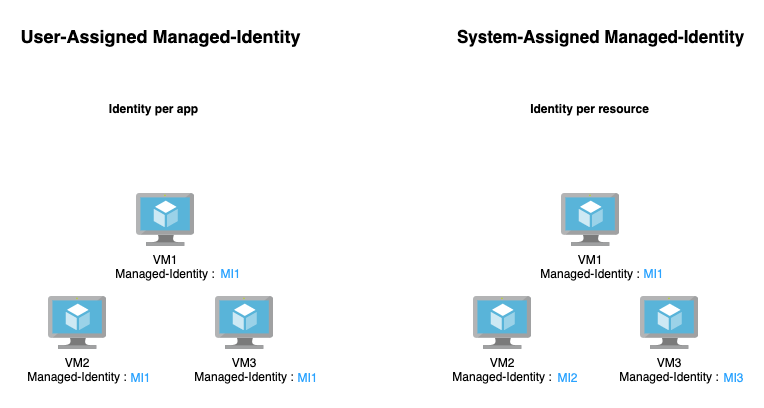

# 🚦 Managed identity Demostration

<figure><figcaption></figcaption></figure>

Azure Managed Identity, Azure kaynaklarınıza kimlik doğrulama ve yetkilendirme işlemlerini basitleştirmek için kullanılan bir Azure hizmetidir. Azure kaynaklarınızın (örneğin VM'ler, App Services veya Function Apps gibi) diğer Azure hizmetlerine güvenli bir şekilde erişmesini sağlar. Managed Identity, iki ana türde sunulur: System Assigned ve User Assigned.

#### System Assigned Managed Identity

* **Otomatik Yönetim**: Bu kimlik, bir Azure kaynağına (örneğin bir VM veya bir App Service) doğrudan atanır ve bu kaynakla birlikte yönetilir. Kaynak oluşturulduğunda otomatik olarak oluşturulur ve kaynak silindiğinde silinir.
* **Eşsiz**: Her kaynağın kendi Managed Identity'si vardır ve bu kimlik yalnızca bu kaynağa aittir.

#### User Assigned Managed Identity

* **Esnek Yönetim**: Kullanıcı tarafından atanır ve birden fazla Azure kaynağına atanabilir. Bu, aynı kimliği farklı kaynaklar arasında paylaşmak istediğiniz durumlarda kullanışlıdır.
* **Bağımsız Ömür**: Bu kimlik, oluşturulduğu kaynaktan bağımsız olarak var olabilir. Yani, atandığı kaynak silinse bile kimlik hala var olur.

***

User Assigned Managed Identity ve System Assigned Managed Identity arasında seçim yaparken, projenizin ihtiyaçları ve senaryoları önemli rol oynar. Her iki yöntemin avantajları ve dezavantajları vardır ve bunları anlamak, doğru seçimi yapmanıza yardımcı olacaktır.

<figure><figcaption></figcaption></figure>

#### System Assigned Managed Identity

**Avantajları:**

* **Otomatik Yönetim**: System Assigned Identity, ilgili Azure kaynağı ile otomatik olarak oluşturulur ve silinir. Bu, kimlik yönetimini basitleştirir ve otomatize eder.
* **Doğrudan İlişki**: Her kaynak, yalnızca kendi System Assigned Identity'sine sahiptir. Bu, kimlikler arasında karışıklığı önler ve güvenliği artırır.

**Dezavantajları:**

* **Esneklik Eksikliği**: Bu kimlik, yalnızca ona atanan tek bir kaynakla ilişkilendirilir. Birden fazla kaynak arasında paylaşılamaz.
* **Kaynağa Bağlı Yaşam Döngüsü**: Kaynak silindiğinde, System Assigned Identity de silinir. Bu, bazı durumlarda istenmeyen sonuçlara yol açabilir.

#### User Assigned Managed Identity

**Avantajları:**

* **Esneklik**: Bir User Assigned Managed Identity, birden çok Azure kaynağı tarafından paylaşılabilir. Bu, aynı kimliği birden çok kaynakta kullanmak istediğiniz durumlarda idealdir.
* **Bağımsız Yaşam Döngüsü**: Bu kimlikler, atandıkları kaynaklardan bağımsız olarak yönetilir ve yaşarlar. Bu, kaynakların silinmesi veya değiştirilmesi durumunda daha fazla kontrol ve esneklik sağlar.

**Dezavantajları:**

* **Ek Yönetim Gereksinimi**: User Assigned Identity'lerin oluşturulması ve yönetilmesi ek bir adımdır ve bu, bazı durumlarda yönetim karmaşıklığını artırabilir.
* **Manuel Atama Gereksinimi**: Bu kimliklerin kullanılabilmesi için Azure kaynaklarına manuel olarak atanmaları gerekir.

***

#### Kullanım Senaryoları

* Azure kaynaklarının diğer Azure hizmetlerine erişimi için kimlik bilgilerini güvenli bir şekilde saklayıp, yönetebilirsiniz.
* Uygulamaların Azure hizmetlerine erişimi sırasında kimlik bilgilerini güvende tutabilirsiniz.
* Birden fazla kaynakta tekrar eden kimlik bilgilerini yönetmek yerine, merkezi bir kimlik kullanarak yönetimi kolaylaştırabilirsiniz.


***

Managed Identity, Azure kaynaklarının (örneğin sanal makineler, app services veya fonksiyon uygulamaları gibi) kimlik bilgilerini yönetmeden Azure hizmetlerine güvenli bir şekilde erişmesini sağlayan bir Azure özelliğidir. Bu işlev, Azure Active Directory (AAD) ile entegre şekilde çalışır ve temelde iki ana adımdan oluşur: kimlik oluşturma ve token alarak hizmetlere erişim.

1. **Kimlik Oluşturma ve Atama**:
   * **System Assigned Identity**: Bir Azure kaynağı oluşturulduğunda, örneğin bir sanal makine veya app services, Azure otomatik olarak bir Managed Identity oluşturur ve bu kimliği ilgili kaynağa atar. Bu kimlik, kaynağın ömrü boyunca var olur ve kaynak silindiğinde otomatik olarak yok edilir.
   * **User Assigned Identity**: Bu durumda, kullanıcı öncelikle Azure portalı veya Azure CLI aracılığıyla bir Managed Identity oluşturur. Daha sonra bu kimlik, bir veya daha fazla Azure kaynağına manuel olarak atanabilir.
2. **Azure Hizmetlerine Erişim**:
   * Bir Azure kaynağı, örneğin bir sanal makine veya bir fonksiyon uygulaması, Azure hizmetlerine (Azure Key Vault, Azure SQL Database vb.) erişmek istediğinde, Managed Identity'nin kimlik doğrulaması gereklidir.
   * Bu aşamada, Managed Identity, Azure AD'den bir OAuth 2.0 token'ı talep eder. Bu token, ilgili Azure hizmetine güvenli bir şekilde erişmek için kullanılır.
   * Token alındıktan sonra, Azure kaynağı bu token'ı kullanarak hedef Azure hizmetine kimlik doğrulama yapar ve gerekli erişim izinlerine göre işlemlerini gerçekleştirir.

Bu süreç boyunca, Managed Identity'nin kimlik bilgileri (örneğin kullanıcı adları ve şifreler) hiçbir zaman açıkça görünmez veya manuel olarak yönetilmez. Bunun yerine, Azure, bu kimlik bilgilerini güvenli bir şekilde yönetir ve yeniler. Bu, güvenliği artırır ve kimlik bilgisi sızıntılarının önlenmesine yardımcı olur.

Rol Tabanlı Erişim Kontrolü (RBAC), bu süreçte önemli bir rol oynar. RBAC, Managed Identity'ye hangi Azure kaynaklarına erişebileceğini ve bu kaynaklarda hangi işlemleri gerçekleştirebileceğini belirleyen rolleri atamamızı sağlar. Bu roller, kaynaklara erişim sağlarken güvenlik politikalarına uyulmasını garanti eder.

***

### Demo:

Bu demoda, bir Azure VM'nin System Assigned Managed Identity kullanarak Azure Storage Account'ta bulunan blob verilerine erişmesi gösterilecektir. Bu senaryo, dosya depolama ve veri işleme için yaygın bir kullanım durumudur.

<figure><figcaption></figcaption></figure>

**Adım 1:** Öncelikle, Azure üzerinde Ubuntu 20.04 sanal sunucu oluşturmalıyız. Sanal sunucu oluşturma adımlarında "management" sekmesinde bulunan "identity" başlığı altında bulunan "Enable system assigned managed identity" seçeneğini aktif ediyoruz. Bu seçenek, VM'nin Azure kaynaklarına erişimi için kullanabileceği bir kimlik oluşturur.


<figure><figcaption></figcaption></figure>

```bash
apt update -y && apt upgrade -y && sudo apt install python3 -y && apt install python3-pip -y
# Yukarıdaki komutlar ile güncellemeleri yapıp, python ve pip paketlerini kuruyoruz.

pip install azure-storage-blob
# Yukarıdaki komut ile Azure Storage Blob SDK paketini sunucuya kuruyoruz.

pip install azure-identity
# Yukarıdaki komutu ile identity paketini sunucuya kuruyoruz.
```

**Adım 2:** Sunucuya SSH ile bağlanıp, güncellemelerin yapılmalıdır. Python-Pip-Azure Storage Blob SDK-Managed identity paketleri kurulmalıdır.


<figure><figcaption></figcaption></figure>

**Adım 3:** Storage Account oluşturup ve içerisine blob container oluşturuyoruz. Test için içerisine 3 adet dosya upload ediyoruz.


<figure><figcaption><p>Okuma yapacağımız için Storage Blob Data Reader rolünü seçiyoruz.</p></figcaption></figure>

<figure><figcaption><p>Atayacağımız identity'i seçiyoruz. Bu örnekte vm ile birlikte oluşturduğumuz system assigned managed identity seçiyoruz.</p></figcaption></figure>

<figure><figcaption></figcaption></figure>

**Adım 4:** Oluşturduğumuz VM'nin Managed Identity'sine, blob verilerini okuma izni vermeliyiz. Bunun için oluşturduğumuz storage account'un IAM sekmesine gelip, Storage Blob Data Reader rolünü seçip, vm kurulurken oluşturulan system assigned managed identity 'yi members kısmına ekleyip, RBAC rolünü oluşturuyoruz.



```python
from azure.storage.blob import BlobServiceClient, BlobClient, ContainerClient
from azure.identity import DefaultAzureCredential

# Azure Storage Account bilgileri
account_url = "https://identitydemostorage.blob.core.windows.net"
container_name = "identitycontainer"

# DefaultAzureCredential kullanarak Managed Identity ile kimlik doğrulaması
credential = DefaultAzureCredential()

# Blob Service Client'ı başlatma
blob_service_client = BlobServiceClient(account_url=account_url, credential=credential)

# Blob Container'a erişim
container_client = blob_service_client.get_container_client(container_name)

# Container'daki tüm blobları listeleme ve içeriğini okuma
blobs_list = container_client.list_blobs()
for blob in blobs_list:
    blob_client = container_client.get_blob_client(blob)
    blob_content = blob_client.download_blob().readall()
    print(f"Blob Name: {blob.name}, Content: {blob_content[:100]}...")  # İlk 100 karakteri gösterir
```


<figure><figcaption></figcaption></figure>

Adım 5: Artık ubuntu sunucumuz 'da python scripti kullanarak, storage üzerinde verileri okuyabiliriz. Script Managed identity kullanarak, storage'a erişecek ve RBAC rollerine göre blob üzerinde işlemler yapabilecek. Bizim senaryomuzda sadece okuma yapabiliyor. Yukarıdaki ekran görüntüsünde görüleceği üzere, script başarılı bir şekilde çalıştı.



Yukarıdaki örnekte, system assigned managed identity kullandık fakat, user assigned managed identity'de kullanabilirdik.  Bunun için, gidip manuel olarak user assigned managed identity oluşturmamız gerekecekti. Çalışma anlamında değişen bir şey olmayacaktı.




