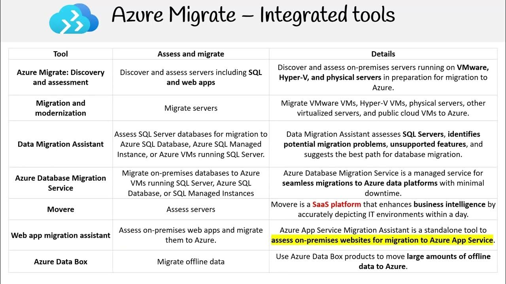

# 🪡 Migration tools

<figure><figcaption></figcaption></figure>

#### 1. Azure Migrate: Discovery and Assessment

Bu araç, şirketlerin on-premises (yerinde) sunucularını, uygulamalarını keşfetmelerine, performanslarını değerlendirmelerine ve Azure'a taşınma maliyetlerini hesaplamalarına olanak tanır.&#x20;

#### 2. Azure Migrate: Server Migration

Bu araç, on-premises sanal makineleri (VM) ve fiziksel sunucuları veya diğer cloud sağlayıcılarda barındırılan sanal sunucuları Azure sanal makinelerine (VMs) taşımak için kullanılır. VMware, Hyper-V ve fiziksel sunucuları destekler ve "lift-and-shift" geçişini (doğrudan taşıma) basitleştirir.

#### 3. Azure Migrate: Database Migration

Azure SQL Database, Azure SQL Managed Instance veya diğer Azure veri hizmetlerine veritabanı geçişi yapmak için kullanılır. Bu araç, SQL Server, MySQL, PostgreSQL gibi popüler veritabanı sistemlerinden verilerin Azure'a taşınmasını destekler.

#### 4. Azure Migrate: Web App Migration

Bu araç, on-premises web uygulamalarını Azure App Service'e taşımak için tasarlanmıştır. ASP.NET ve PHP gibi teknolojilere dayalı web uygulamalarının kolaylıkla buluta taşınmasını sağlar.

#### 5. Data Box

Büyük miktarda verinin (terabaytlar veya petabaytlar) Azure'a fiziksel olarak taşınması gerektiğinde kullanılır. Data Box cihazları verileri güvenli bir şekilde Azure veri merkezlerine taşır, özellikle internet üzerinden veri transferi yavaş veya pahalı olduğu durumlarda kullanışlıdır.

#### 6. Azure Site Recovery

Bu, genellikle felaket kurtarma amaçlı kullanılan bir hizmettir ama aynı zamanda on-premises VM'leri, Azure VM'leri veya ikincil bir bölgeye geçici olarak replike etmek için de kullanılabilir.

