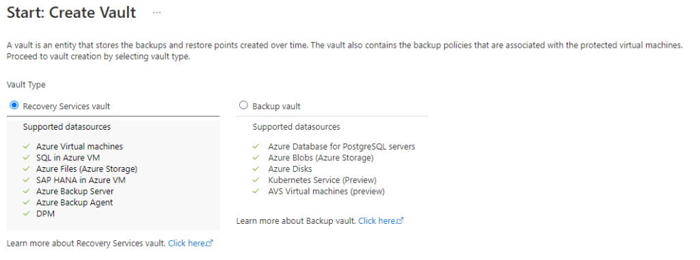

# Backup And Recovery

### File and Folder Backup;

<figure><figcaption></figcaption></figure>

Azure File and Folder Backup, Microsoft Azure bulut platformunun bir parçası olan bir veri yedekleme çözümüdür. Bu servis, kullanıcıların hem Azure'da barındırılan (Azure Files) hem de yerel ortamlarındaki (On-Premises) dosya ve klasörlerin yedeklemesini yapmasına olanak tanır.

Ekran görüntüsünden yola çıkarak;

1. **Azure Files:** Burada, Azure'da barındırılan dosyaların yedeklemesinin nasıl yapılabileceğine dair bir iş akışı gösterilmekte. Kullanıcılar "What do you want to backup?" (Ne yedeklemek istiyorsunuz?) bölümünden Azure dosya paylaşımını seçtiklerinde, "Configure Backup" (Yedeklemeyi Yapılandır) butonu aktif hale gelir. Bu işlem, dosyaların Azure'daki Recovery Services Vault adı verilen güvenli bir depolama alanına yedeklenmesini sağlar.
2. **On-Premises:** Yerel bir sunucuda (örneğin, Windows Server) çalışan ve yedeklenecek dosya ve klasörlerin olduğu bir ortamı göstermektedir. "MARS agent" (Microsoft Azure Recovery Services ajanı) yerel sunucuda çalışan bir yazılım bileşeni olarak işlev görür ve yerel dosyaların Azure Recovery Services Vault'a yedeklenmesini yönetir.

Genel olarak Azure File and Folder Backup özellikleri şunlardır:

* **Azure ve Yerel Yedekleme:** Hem Azure bulut servislerindeki dosyaları hem de yerel makinelerdeki dosya ve klasörleri yedekleme imkanı sunar.
* **Recovery Services Vault:** Yedeklenen verilerin tutulduğu, yüksek erişilebilirlik ve güvenlik özelliklerine sahip bir Azure hizmetidir.
* **MARS Agent:** Yerel ortamdaki verilerin Azure'a yedeklenmesini sağlayan bir ajan yazılımıdır.
* **Yedekleme Yapılandırması:** Kullanıcılar yedekleme işlemlerini, ihtiyaçlarına göre yapılandırabilirler. Örneğin, yedekleme sıklığını ve yedeklemenin ne kadar süre saklanacağını belirleyebilirler.

### Virtual Machine Backup;

Azure'da Sanal Makine (VM) Yedekleme, Azure Backup hizmetinin bir parçasıdır ve Azure'da barındırılan sanal makinelerin verilerinin güvenli ve güvenilir bir şekilde yedeklenmesini sağlar.&#x20;

<figure><figcaption></figcaption></figure>

1. **Konfigürasyon (Configure):** Sanal makinelerinizin yedekleme politikalarını ve zamanlamalarını yapılandırırsınız. Yedekleme sıklığı ve saklama süreleri gibi parametreleri belirleyebilirsiniz.
2. **Yedekleme (Backup):** Belirlenen konfigürasyonlara göre yedekleme işlemi gerçekleştirilir. Bu işlem otomatik olarak yapılabileceği gibi, kullanıcı tarafından manuel olarak da tetiklenebilir.
3. **Anlık Görüntü (Snapshot):** Yedekleme sırasında, Azure sanal makinelerinizin disklerinin anlık görüntüleri alınır. Bu, "Instant Recovery Snapshot" olarak adlandırılır ve acil durum kurtarmaları için kullanılabilir.
4. **Transfer:** Yedeklenen veriler, güvenli bir şekilde (HTTPS üzerinden) Azure Backup Service'a transfer edilir.
5. **Azure Backup Service:** Azure Backup Service, yedekleme politikalarının yönetildiği ve yedekleme işlemlerinin yapıldığı yerdir. Hizmet, yedekleme işlemlerinin merkezi olarak yönetilmesini ve izlenmesini sağlar.
6. **Recovery Services Vault:** Yedeklenen veriler, Azure'da saklanır ve yönetilir. Recovery Services Vault, verilerinizi şifreler ve yalnızca yetkili kullanıcıların erişebileceği bir yerde saklar. Yedekleme işlemleri sırasında, yalnızca yeni veya değişen veri bloklarının yedeklenmesini sağlayan "incremental backups" (artımlı yedeklemeler) yapılır, böylece veri aktarımı ve depolama maliyetleri optimize edilir.

### Virtual Machine Backup – On-premises VMs;

<figure><figcaption></figcaption></figure>

1. **Specialized Workloads:** Bu kategori altında, Microsoft Exchange, SharePoint ve SQL Server gibi özel uygulamaların veri yedeklemeleri yer alır.
2. **Virtual Machines on VMWare & Hyper-V (VMWare ve Hyper-V Üzerinde Sanal Makineler):** Bu bölümde, hem Microsoft'un kendi Hyper-V'si hem de VMWare gibi üçüncü parti sanallaştırma platformları üzerinde çalışan sanal makinelerin yedeklemelerini yönetmek için seçenekler sunulur.
3. **Files/Folders/Volumes (Dosyalar/Klasörler/Birimler):** Windows Server ve Windows masaüstü işletim sistemlerinin çeşitli sürümleri için dosya ve klasör yedeklemeleri bu kısımda ele alınır.
4. **Physical servers (Fiziksel Sunucular):** Yedekleme hizmeti ayrıca yerel ortamda bulunan fiziksel sunucuların da yedeklenmesini destekler.
5. **MABS or DPM:** Microsoft Azure Backup Server (MABS) veya Data Protection Manager (DPM), yerel yedekleme ve kurtarma çözümleri olarak işlev görür. Bu araçlar, verileri yedeklemek için kullanılır ve Azure Recovery Services vault'a aktarımı sağlar.
6. **Recovery Services Vault:** Tüm yedeklenen veriler, Azure bulutundaki Recovery Services Vault'ta saklanır. Bu vault, yedeklenen verilerin güvenli bir şekilde saklanmasını ve gerektiğinde kurtarılmasını sağlar.

### Azure Site Recovery;

<figure><figcaption></figcaption></figure>

Azure Site Recovery (ASR) bir felaket sırasında uygulamalarınızı ve verilerinizi korumak için kullanılan bir hizmettir. ASR, sanal ve fiziksel sunucularınızı Azure'a veya başka bir veri merkezine replike eder, böylece bir kesinti veya felaket durumunda bu kopyaları hızla devreye alabilirsiniz.&#x20;

1. **Source Environment:** Bu, verilerinizi ve uygulamalarınızı barındıran orijinal konumunuzdur. Genellikle birincil veri merkeziniz olarak düşünülebilir. Burada, sanal ağlar (vnet), alt ağlar (subnet) ve sanal makineler (VM'ler) gibi kaynaklarınız bulunur.
2. **Cache Storage Account:** Replikasyon sırasında veriler geçici olarak bu hesapta saklanır.
3. **Failover:** Kaynak ortamında bir sorun olduğunda (örneğin, bir sunucu çöktüğünde), ASR failover işlemini başlatır. Bu, tüm trafik ve verilerin hedef ortama yönlendirildiği anlamına gelir.
4. **Target Environment:** Bu, replike edilmiş verilerinizi ve uygulamalarınızı barındıran ikincil konumdur. Bu ortam genellikle farklı bir coğrafi konumda bulunur ve bir felaket durumunda yükü devralmaya hazır olacak şekilde yapılandırılır.
5. **vnet-asr:** Hedef ortamdaki sanal ağ, replikasyon için özel olarak yapılandırılmıştır ve kaynak ortamdaki orijinal sanal ağın bir yansımasıdır.

### RSV VS BV;

<figure><figcaption></figcaption></figure>

Azure'da yedekleme hizmetleri, veri koruma ve felaket kurtarma için iki ana hizmet olan Recovery Services vault ve Backup vault üzerinden sağlanır. Her ikisi de verileri güvenli ve erişilebilir tutmak için kullanılır, ancak belirli kaynaklar ve senaryolar için farklı özellikler sunarlar.

**Recovery Services Vault:**

* **Sanal Makineler (VM'ler):** Azure sanal makinelerinizi doğrudan Recovery Services vault üzerinden yedekleyebilirsiniz.&#x20;
* **Dosya Paylaşımları (File Shares):** Azure File Shares, Recovery Services vault kullanılarak yedeklenebilir.

**Backup Vault:**

* **Blob Container:** Blob verilerini yedeklemek için Backup vault kullanmanız gerekir.&#x20;
* **Azure Database for MySQL:** Backup vault kullanılarak yedeklenir.

Recovery Services vault genellikle işletim sistemi ve disk seviyesinde yedekleme için kullanılırken, Backup vault daha çok veri tabanı ve Blob verilerinin yedeklemesi için kullanılır. Her iki hizmet de otomatik yedekleme, politika tabanlı yedekleme yönetimi ve uzun süreli saklama gibi özellikler sunar.


Microsoft Azure'da yeni oluşturulan bir Recovery Services Vault için varsayılan yedeklilik, genellikle coğrafi yedeklilik anlamına gelen "Geo-Redundant Storage" (GRS) olarak ayarlanır.


