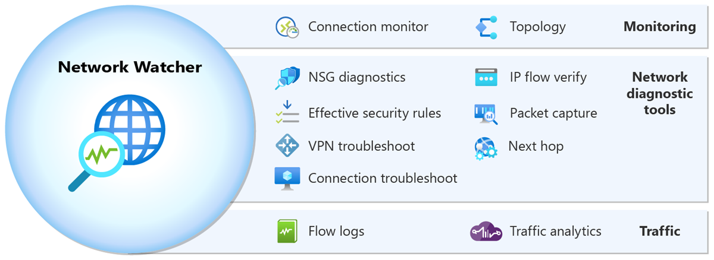

# 🪐 Network Watcher

<figure><figcaption></figcaption></figure>

Azure Network Watcher, Azure içinde barındırılan kaynakların ağ performansını izlemek, potansiyel sorunları teşhis etmek ve ağ trafiğini analiz etmek için kullanılan bir hizmettir.

**Ağ Tanılama Araçları:**

* **IP Flow Verify:** Bu araç, belirli bir veritabanı sunucusu ve uygulama sunucusu gibi iki sanal makine arasındaki ağ trafiğinin beklenen şekilde olup olmadığını kontrol etmek için kullanılır. Eğer trafiğin düzgün bir şekilde akışını engelleyen bir sorun varsa, IP Flow Verify aracı, olayın NSG kurallarından kaynaklanıp kaynaklanmadığını test etmek amacıyla kullanılabilir.
* **NSG Diagnostic:** Bu araç, bir uygulamanın belirli bir hizmete erişiminde beklenmeyen bir engelleme yaşandığında devreye girer. Sorunun hangi NSG kuralı veya kuralları tarafından oluşturulduğunu belirlemek için detaylı bir teşhis sağlar.
* **Next Hop:** Bir ağ paketinin beklenen hedefe ulaşmaması durumunda, Next Hop aracı ile paketin hangi ağ cihazına yönlendirildiğini ve olası yönlendirme sorunlarını belirleyebilirsiniz.
* **Effective Security Rules:** Bir sanal makineye uygulanmış tüm güvenlik kurallarını ve bu kuralların öncelik sırasını görmek için kullanıldığında, ağ güvenlik yapılandırmanızın genel bir resmini elde edebilirsiniz.
* **VPN Troubleshoot:** Azure'a bağlanmaya çalışan bir VPN cihazında bağlantı sorunları yaşandığında, VPN Troubleshoot ile sorunun kaynağını teşhis edebilir ve gerekli düzeltmeleri yapabilirsiniz.
* **Packet Capture:** Bir sunucunun şüpheli ağ trafiğine maruz kaldığından şüpheleniyorsanız, Packet Capture aracı ile trafiği yakalayabilir ve inceleyerek güvenlik ihlallerini tespit edebilirsiniz.
* **Connection Troubleshoot:** Örneğin, iki sanal makine arasındaki ağ bağlantısının neden düşük performans gösterdiğini anlamak için Connection Troubleshoot aracını kullanabilirsiniz.

**İzleme:**

* **Topology:** Ağınızın kompleks yapısını anlamak ve her bir kaynağın nasıl birbirine bağlandığını görmek için Topology özelliği kullanılır. Bu, özellikle yeni bir ağ hizmeti eklediğinizde veya mevcut yapılandırmayı değiştirdiğinizde yararlıdır.
* **Connection Monitor:** Bir bağlantının güvenilirliğini ve performansını sürekli olarak izlemek istediğinizde, Connection Monitor bu bağlantının kalitesine dair geri bildirim sağlar.
* **Network Performance Monitor:** Şirket genelindeki ağ performansını izlemek ve uçtan uca yapılan bağlantıların kalitesini değerlendirmek için Network Performance Monitor kullanılır. Bu, özellikle hibrit bulut yapılarında önemlidir.

**Günlükler:**

* **NSG Flow Logs:** Ağ trafiğinin detaylı kayıtlarını inceleyerek, hangi tür trafik akışlarının gerçekleştiğini ve bu trafiklerin güvenlik kurallarıyla nasıl etkileşime girdiğini anlamak için NSG Flow Logs kullanılır.
* **Diagnostic Logs:** Ağ kaynakları tarafından üretilen logları toplayarak, ağınızda meydana gelen olayları ve potansiyel sorunları anlamak için Diagnostic Logs kullanılır.
* **Traffic Analytics:** Uzun vadeli trafik analizi sağlar ve gelişmiş tehdit analizi ve ağ akış analizi yapılmasına olanak tanır. Traffic Analytics, ağ trafiğini anlamak ve güvenlik açıklarını tespit etmek için kritik bir araçtır.
