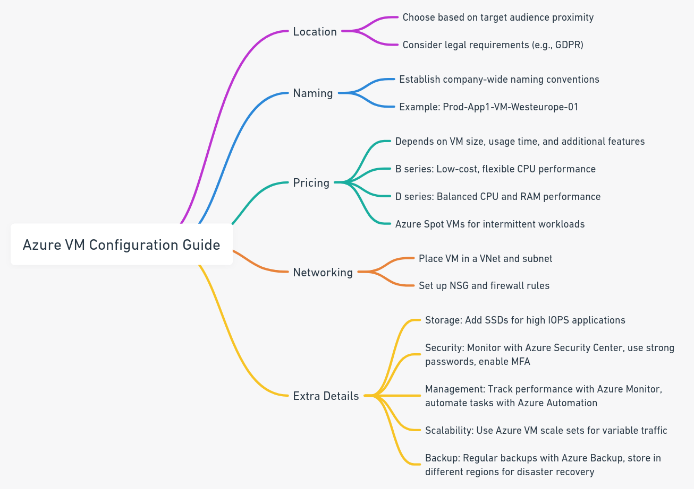
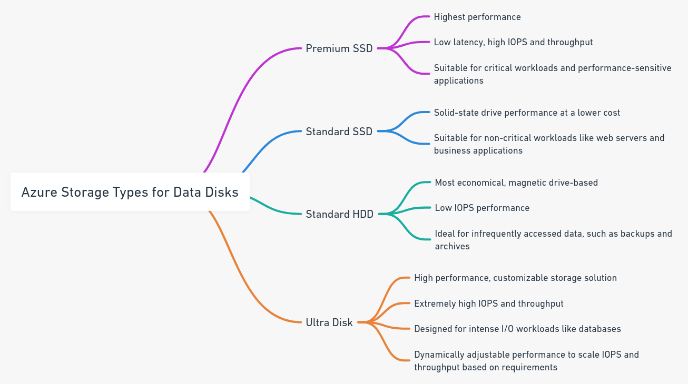
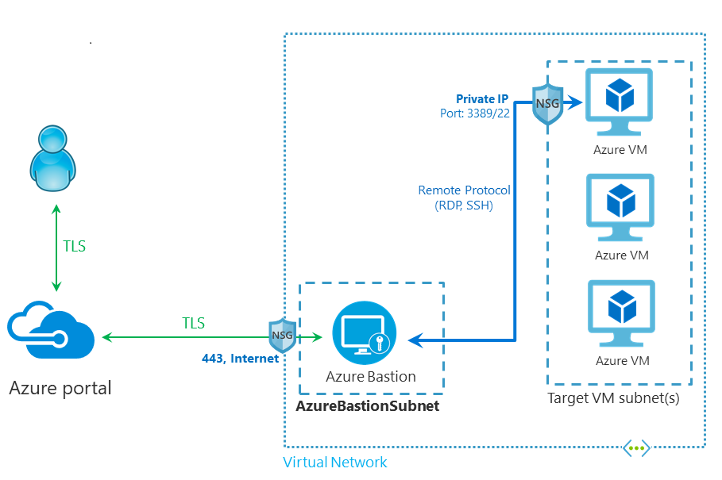
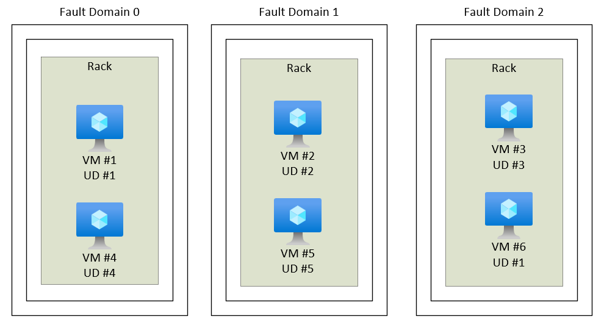

# 💻 Virtual Machines

Azure'da sanal makine (VM) oluştururken dikkate almanız gereken birkaç önemli husus bulunmaktadır.&#x20;

<figure><figcaption></figcaption></figure>

#### 1. Location (Konum)

Azure, dünya genelinde birçok bölge sunar. Örneğin, eğer hedef kitleniz Türkiye'deyse, veri merkezlerinin yakınlığı ve yanıt süresi açısından "Batı Avrupa" (Amsterdam) veya "Kuzey Avrupa" (İrlanda) bölgesini tercih edebilirsiniz. Fakat, GDPR gibi düzenlemeler nedeniyle verilerin AB dışına çıkmaması gerekiyorsa, bu durumda bölge seçiminizi bu tür yasal gerekliliklere göre yapmanız gerekir.

#### 2. Naming (Adlandırma)

Azure kaynaklarını adlandırma konusunda şirket içi bir standartınız olmalıdır. Örneğin, `Prod-App1-VM-Westeurope-01` adı, üretim ortamında, `App1` uygulaması için, Batı Avrupa bölgesindeki ilk sanal makineyi ifade edebilir. Bu adlandırma yapısı kaynakların kolay tanımlanmasını ve yönetilmesini sağlar.

#### 3. Pricing (Fiyatlandırma)

Azure fiyatlandırması, VM'in boyutuna (CPU, RAM), kullanım süresine ve ek özelliklere (yedekli depolama, ağ trafiği vb.) bağlı olarak değişir. Örneğin, B serisi VM'ler düşük maliyetli ve esnek CPU performansı sağlarken, D serisi VM'ler ise CPU ve RAM açısından daha dengeli bir performans sunar. Eğer sürekli kullanım yerine aralıklı iş yükleri için VM gerekiyorsa, Azure Spot VM'ler daha düşük maliyetle kaynak sağlayabilir.

#### 4. Networking (Ağ Oluşturma)

Azure sanal makinenizi oluştururken, onu bir sanal ağa (VNet) ve özel bir alt ağa yerleştirmeniz gerekecektir. Bu ağ içerisinde, VM'inize erişim için ağ güvenlik grupları (NSG) ile güvenlik duvarı kuralları oluşturabilirsiniz. Örneğin, bir web sunucusu VM için sadece HTTP (port 80) ve HTTPS (port 443) trafiğine izin verilebilirken, SSH (port 22) yalnızca belirli IP adreslerinden erişilebilir olabilir.

#### Ek Detaylar:

* **Storage (Depolama)**: VM'inize ekstra bir SSD ekleyebilirsiniz ki bu, veri tabanı gibi yüksek IOPS (Input/Output Operations Per Second) gerektiren uygulamalar için faydalı olacaktır.
* **Security (Güvenlik)**: Azure Security Center ile sanal makinenizi sürekli olarak izleyebilir ve güvenlik tehditlerine karşı koruyabilirsiniz. Ayrıca, her VM için güçlü şifreler kullanmalı ve mümkünse çok faktörlü kimlik doğrulama (MFA) etkinleştirmelisiniz.
* **Management (Yönetim)**: Azure Monitor kullanarak VM'nizin performansını izleyebilir ve anormal durumları algılayabilirsiniz. Azure Automation ile günlük veya rutin görevleri otomatize edebilirsiniz.
* **Scalability (Ölçeklenebilirlik)**: Trafik artışına göre VM sayısını otomatik olarak artırıp azaltan Azure VM scale sets özelliğini kullanabilirsiniz. Bu, özellikle değişken trafik örüntülerine sahip uygulamalar için idealdir.
* **Backup (Yedekleme)**: Azure Backup servisi ile VM'nizin düzenli yedeklerini alabilir ve olası bir veri kaybına karşı korunabilirsiniz. Bu yedekler, farklı bir bölgede saklanabilir ki bu da felaket kurtarma için önemlidir.

### Vm Sizes;

VM boyutları, kullanıcıların geniş yelpazedeki iş yükleri için uygun kaynakları seçmelerine yardımcı olmak için tasarlanmıştır. Her bir boyut, özelleştirilmiş donanım ve yapılandırma seçenekleri ile farklı performans özellikleri sunar.

<table><thead><tr><th width="205.33333333333331">Type</th><th width="179">Sizes</th><th>Targeted workloads</th></tr></thead><tbody><tr><td>General Purpose</td><td>B, Dsv3, Dv3, Dasv4, Dav4, Dsv2, Dv2, Av2, DC, DCv2, Dv4, Dsv4, Dadsv5, Dav5, Dasv5, Dsv5</td><td>Dengeli CPU-bellek oranına sahip olup test ve geliştirme, küçükten orta ölçeğe veri tabanları ve düşükten orta düzeyde trafik içeren web sunucuları için idealdir.</td></tr><tr><td>Compute Optimized</td><td>F, Fs, Fsv2, FX</td><td>Yüksek CPU-bellek oranı ile orta dereceli trafik web sunucuları, ağ cihazları, batch işlemleri ve uygulama sunucuları için uygun olan VM'lerdir.</td></tr><tr><td>Memory Optimized</td><td>Esv3, Ev3, Easv4, Eav4, Ebdsv5, Ebv5, Esv4, Esv4, Edv4, Edsv4, Ev5, Esv5, Edsv5, Easv5, Eadv5, Mv2, M, Dsv2, Dv2</td><td>Yüksek bellek-CPU oranına sahip olup ilişkisel veri tabanları, yüksek bellek kullanımı gerektiren büyük önbellekler ve in-memory analizler için mükemmeldir.</td></tr><tr><td>Storage Optimized</td><td>Lsv2</td><td>Yüksek disk giriş/çıkış kapasitesi ve I/O işlemleri ile Büyük Veri, SQL ve NoSQL veri tabanları, veri ambarları ve büyük işlem hacmine sahip iş yükleri için tasarlanmıştır.</td></tr><tr><td>GPU</td><td>NC, NCv2, NCv3, NCasT4_v3, ND, NDv2, NV, NVv3, NVv4, NDasrA100_v4, NDm_A100_v4</td><td>Yoğun grafik işlem gerektiren sanal makineler olup ağır grafik işleme, video düzenleme, model eğitimi ve çıkarımı (ND) ile derin öğrenme gibi iş yükleri için idealdir. Tekli veya çoklu GPU seçenekleri bulunur.</td></tr><tr><td>HPC</td><td>HB, HBv2, HBv3, HC, H</td><td>En yüksek CPU performansına sahip sanal makineler olup bilimsel hesaplamalar, araştırma ve yoğun hesaplama gerektiren iş yükleri için uygundur. RDMA arayüzleri seçeneği mevcuttur.</td></tr><tr><td>Confidential Computing</td><td>DCsv2, DCsv3, DCdsv3</td><td>Hassas verilerin işlenmesi sırasında verilerinizi izole etmenizi sağlar. Müşteri hassas bilgileri işleyen bankalar ve hastaneler için idealdir</td></tr></tbody></table>


VM tipleri ve özellikleri hakkında yukarıdaki URL'den daha fazla bilgiye erişebilirsiniz.



Azure VMleri ve diğer servislerin hangi regionlarda kullanabileceğinize dair yardımcı sayfaya bu linkten ulaşabilirsiniz.


### VM Storage Types;

Azure sanal makinalarında depolama genellikle üç ana tür disk kullanılarak yönetilir: OS diski, geçici disk ve veri diskleri.

1. **OS Diski:**
   * Her Azure sanal makinasının bir işletim sistemi diski vardır ve bu disk sanal makina oluşturulduğunda otomatik olarak eklenir.
   * Bu disk, sanal makinenin işletim sistemini içerir ve genellikle VHD (Virtual Hard Disk) formatındadır.
   * OS diskleri genellikle kalıcılık garantisi ile gelir, yani sanal makina silinse bile disk korunabilir.
2. **Geçici Disk (Temp Disk):**
   * Geçici disk, Azure tarafından sunulan geçici depolama alanıdır ve sanal makina ile birlikte sağlanır.
   * Geçici disk, veri kaybı riskine karşı önemli olmayan geçici veriler için kullanılır, çünkü bu disk üzerindeki veriler, sanal makina yeniden başlatıldığında veya başka bir host sunucuya taşındığında kaybolabilir.
   * Bu diskler genellikle daha hızlı I/O performansı sunar ve uygulama önbelleği, sayfalama dosyaları gibi geçici veriler için idealdir.
3. **Veri Diskleri:**
   * Veri diskleri, kullanıcıların sanal makinalarına ekleyebileceği ek depolama birimleridir.
   * Bu diskler, özellikle büyük miktarda verinin depolanması ve işlenmesi gereken durumlar için tasarlanmıştır.
   * Veri diskleri, yüksek düzeyde dayanıklılık ve isteğe bağlı olarak yüksek I/O performansı sağlayabilir.
   * Veri disklerinin boyutu ve sayısı, sanal makinanın boyutuna ve ihtiyaç duyulan performansa göre değişebilir.

Azure VM'lerde işletim sistemi ve veri disklerinin yol ve etiketleri, kullanılan işletim sistemine bağlı olarak farklılık gösterecektir:

**Linux'ta:**

* **OS Diski:** Genellikle `/dev/sda` olarak adlandırılır ve içinde tek bir bölüm (örneğin, `/dev/sda1`) işletim sistemini barındırır.
* **Geçici Disk:** Azure'da Linux VM'ler için geçici disk genellikle `/dev/sdb` olarak tanımlanır ve `/mnt` veya `/mnt/resource` altında bir noktaya bağlanır. Bazen bu disk `/dev/sdc` olarak da görülebilir.
* **Veri Diskleri:** Ek veri diskleri `/dev/sdc`, `/dev/sdd`, `/dev/sde` gibi art arda gelen harflerle tanımlanır. Bunlar VM'ye eklendiğinde, diskleri dosya sistemine bağlamak için `mount` komutunu kullanmanız gerekebilir.

Disklerinizi dosya sisteminize mount etmek için, genellikle şu adımları izlersiniz:

1. Disk bölümlerini oluşturun (`fdisk` veya `parted` gibi araçlarla).
2. Dosya sistemini oluşturun (örneğin, `mkfs.ext4 /dev/sdc1`).
3. Mount noktası oluşturun (örneğin, `mkdir /mnt/mydatadisk`).
4. Diski mount edin (örneğin, `mount /dev/sdc1 /mnt/mydatadisk`).
5. Kalıcı mount için, `/etc/fstab` dosyasına ekleyin.

**Windows'ta:**

* **OS Diski:** Genellikle `C:` sürücüsü olarak atanır ve sistem dosyalarını içerir.
* **Geçici Disk:** Azure Windows VM'lerinde geçici disk genellikle `D:` sürücüsü olarak atanır. Ancak bu, Windows güncellemeleri veya diğer konfigürasyon değişiklikleri sonrasında değişebilir.
* **Veri Diskleri:** Ek veri diskleri, `E:`, `F:`, `G:` vb. gibi harflerle sırayla atanır. Disk Yönetimi aracılığıyla bu diskleri görüntüleyebilir ve bölümlendirme, biçimlendirme ve sürücü harfleri atama işlemlerini gerçekleştirebilirsiniz.

Azure'da bir Windows VM'ye yeni bir veri diski eklendiğinde, genellikle şu adımları takip edersiniz:

1. Disk Yönetimi'ni açın.
2. Yeni diski çevrimiçi hale getirin.
3. Diski başlatın.
4. Bir bölüm oluşturun.
5. Diski NTFS veya ReFS gibi bir dosya sistemi ile biçimlendirin.
6. Bir sürücü harfi atayın.

Her iki işletim sisteminde de, diskleri ve bölümleri yönetirken etiketler ve yol adları kullanabilirsiniz. Örneğin, Linux'ta `e2label` veya `tune2fs` araçlarıyla, Windows'ta ise Disk Yönetimi veya `label` komutu ile etiketleyebilirsiniz. Bu, özellikle sistem çok sayıda depolama birimine sahip olduğunda diskleri tanımlamayı kolaylaştırır.

<figure><figcaption></figcaption></figure>

Azure'da veri diskleri için birkaç farklı depolama türü bulunmaktadır. Bunlar arasında performans, fiyat ve kullanım durumuna göre seçim yapabilirsiniz:

1. **Premium SSD:**
   * En yüksek performansı sunan disk türüdür ve düşük gecikme süresi ile yüksek IOPS (Input/Output Operations Per Second) ve veri aktarım hızları sağlar.
   * Kritik iş yükleri ve performans odaklı uygulamalar için uygundur.
2. **Standard SSD:**
   * Premium SSD'ye göre daha düşük bir maliyetle, yine de katı hal sürücüsü tabanlı bir performans sunar.
   * Web sunucuları ve iş uygulamaları gibi önemli olmayan iş yükleri için uygun bir seçenektir.
3. **Standard HDD:**
   * Manyetik sürücü tabanlı en ekonomik disk türüdür ve düşük IOPS performansı sunar.
   * Düşük maliyetli ve az kullanılan verilerin saklanması için idealdir (örneğin, yedekleme ve arşivleme).
4. **Ultra Disk:**
   * Yüksek performanslı ve özelleştirilebilir depolama çözümüdür.
   * Çok yüksek IOPS ve veri aktarım hızları sunar ve özellikle veritabanı iş yükleri gibi yoğun I/O gerektiren uygulamalar için tasarlanmıştır.
   * Bu disklerde performans dinamik olarak ayarlanabilir; IOPS ve throughput (MB/s) gereksinimlerinize göre disk performansını ölçeklendirebilirsiniz.

Bu disk türlerinin her biri, farklı durumlarda kullanım için optimize edilmiştir. Örneğin, yüksek düzeyde tutarlı performansa ihtiyaç duyduğunuz durumlarda Premium SSD kullanmak en iyi seçenek olabilirken, maliyetten tasarruf etmek ve yalnızca arşivleme gibi az kullanılan verileri saklamak istediğinizde Standard HDD yeterli olacaktır.&#x20;

### Connecting to VMs;

Azure sanal makinelerine (VM) bağlanmanın çeşitli yolları vardır, her biri farklı güvenlik ve kullanılabilirlik özellikleri sunar:

1. **Public IP Kullanarak Doğrudan Bağlantı:**

<figure><figcaption></figcaption></figure>

* Sanal makineye, internet üzerinden erişilebilen bir genel IP adresi atanarak doğrudan bağlantı sağlanabilir.
* SSH (Linux için) veya RDP (Windows için) protokollerini kullanarak bağlantı yapabilirsiniz.
* Bu yöntem kolay olsa da, genel IP adresleri güvenlik riskleri taşıyabilir, bu nedenle ağ güvenlik grupları (NSG) ile uygun güvenlik kuralları uygulamak önemlidir.

1. **Jumpbox (Bastion Host) Kullanarak Bağlantı:**

<figure><figcaption></figcaption></figure>

* Jumpbox, genellikle özel bir ağ içindeki diğer makinelerin yönetimine erişim sağlamak için kullanılan, güvenli ve kontrollü bir ara sunucudur.
* Jumpbox'a genel bir IP atayabilir ve bu sunucu üzerinden diğer özel ağdaki VM'lere bağlanabilirsiniz.
* Bu, ağınıza dışarıdan erişimi kısıtlayarak ek bir güvenlik katmanı sağlar.

1. **Azure Bastion Kullanarak Bağlantı:**

<figure><figcaption></figcaption></figure>

* Azure Bastion, Azure portalı üzerinden doğrudan RDP ve SSH oturumları başlatmanıza olanak tanıyan tamamen yönetilen bir hizmettir.
* Bu hizmet, sanal makinelerinize genel IP adresi ataması yapmadan güvenli bir bağlantı sunar.
* Bastion, Azure'un sanal ağ altyapısını kullanır ve ayrı bir VPN veya müşteri cihazı kurulumu gerektirmez.

#### VM Availability Set;

<figure><figcaption></figcaption></figure>

"Availability Set", sanal makinelerin yüksek kullanılabilirlikte çalışmasını sağlamak için kullanılan bir yapıdır. Temel amacı, Azure altyapısındaki planlı bakım veya beklenmedik arızalardan kaynaklanabilecek kesintilere karşı sanal makinelerinizi korumaktır. Bu yapı, iki ana bileşenden oluşur: "Update Domains" ve "Fault Domains".

1. **Update Domains (Güncelleme Alanları):** Bu, Azure'un planlı bakım işlemleri sırasında etkilenecek sanal makinelerin gruplandırıldığı alanlardır. Bir availability set birden fazla update domain içerir. Azure, bakım sırasında her seferinde sadece bir update domain'deki makineleri yeniden başlatır. Bu sayede, tüm sanal makinelerinizin aynı anda etkilenmemesi sağlanır.
2. **Fault Domains (Arıza Alanları):** Fault domainler, aynı fiziksel donanım kaynaklarının (örneğin, aynı sunucu, ağ anahtarı veya güç kaynağı) arızalanması durumunda etkilenecek sanal makinelerin gruplandırıldığı alanlardır. Bir availability set birden fazla fault domain içerir. Sanal makineleriniz bu domainler arasında dağıtılır, böylece bir donanım arızası tüm makinelerinizi etkilemez.

Availability Set kullanımının amacı, meydana gelebilecek arızaların veya bakım çalışmalarının tüm sanal makinelerinizi etkilememesini sağlamaktır. Bu, özellikle sürekli çalışması gereken kritik uygulamalar için önemlidir. Sanal makinelerinizi bir Availability Set içinde yapılandırarak, hizmet kesintisi riskini azaltmış olursunuz.

Örnek:\
\
Diyelim ki bir web uygulaması çalıştırıyorsunuz ve bu uygulamanın 24/7 kesintisiz çalışmasını istiyorsunuz. Bu uygulama için iki sanal makine (VM) kullanıyorsunuz: VM1 ve VM2.

1. **Availability Set Oluşturma:** İlk olarak, VM1 ve VM2 için bir Availability Set oluşturursunuz. Bu set, bu iki VM'nin farklı güncelleme ve arıza alanlarında bulunmasını sağlar.
2. **Update Domains (Güncelleme Alanları):** VM1'i Update Domain 1'e ve VM2'yi Update Domain 2'ye atarsınız. Bu, Azure'un bakım sırasında her iki VM'yi aynı anda yeniden başlatmamasını sağlar. Örneğin, Azure Update Domain 1'deki makineleri yeniden başlatıyorsa, VM2 hala çalışır ve uygulamanız kesintiye uğramaz.
3. **Fault Domains (Arıza Alanları):** VM1'i Fault Domain 1'e ve VM2'yi Fault Domain 2'ye atarsınız. Eğer Fault Domain 1'deki donanım arızalanırsa, yani VM1 etkilenirse, VM2 farklı bir donanım üzerinde çalıştığı için bu arızadan etkilenmez ve hizmetiniz devam eder.

Sonuç olarak, Availability Set kullanarak, planlı bakım veya beklenmedik donanım arızaları sırasında bile uygulamanızın sürekli çalışmasını sağlamış olursunuz. Her iki VM de farklı güncelleme ve arıza alanlarında olduğu için, birinin etkilenmesi durumunda diğeri hizmet vermeye devam eder. Bu, uygulamanızın yüksek kullanılabilirlikte olmasını sağlar.

<figure><figcaption></figcaption></figure>

Azure'da bir Availability Set'e eklediğiniz her sanal makine (VM) için, Azure otomatik olarak Update Domain ve Fault Domain ataması yapar. Bununla birlikte, her VM'in Update Domain ve Fault Domain'inin farklı olması zorunlu değildir. Azure, bu atamaları Availability Set içindeki sanal makineler arasında dengeli bir şekilde yapar. İşte detaylar:

1. **Update Domains (Güncelleme Alanları):** Bir Availability Set içinde belirli bir sayıda Update Domain vardır (varsayılan olarak 5, ancak bu sayıyı artırabilirsiniz). Azure, sanal makineleri bu Update Domain'ler arasında dengeli bir şekilde dağıtır. Eğer 5 Update Domain varsa ve 5'ten fazla VM'iniz varsa, bazı Update Domain'ler birden fazla VM içerecektir. Azure, VM'leri bu domainlere otomatik olarak atar, ancak siz de bu atamaları özelleştirebilirsiniz.
2. **Fault Domains (Arıza Alanları):** Bir Availability Set içinde genellikle 2 veya 3 Fault Domain bulunur. Azure, sanal makinelerinizi bu Fault Domain'ler arasında dağıtır. Bu, bir Fault Domain'deki fiziksel donanımın arızalanması durumunda, o domain'deki tüm VM'lerin etkilenmesini, ancak diğer domainlerdeki VM'lerin etkilenmemesini sağlar.

Özetle, her VM'in farklı bir Update Domain ve Fault Domain'de olması garantilenmez, ancak Azure sanal makinelerinizi mümkün olan en iyi şekilde dağıtarak yüksek kullanılabilirlik sağlamayı hedefler.&#x20;

#### VM Availability Zone;

<figure><figcaption></figcaption></figure>

Diyelim ki, yüksek kullanılabilirlik gerektiren kritik bir web uygulaması çalıştırıyorsunuz. Bu uygulamayı Azure'da üç farklı Availability Zone üzerinde dağıtmak istiyorsunuz: Zone 1, Zone 2 ve Zone 3. Her bir Zone, Azure bölgesi içinde fiziksel olarak ayrı ve bağımsız bir konumdadır.

1. **Fiziksel İzolasyon:** Her Zone, kendi elektrik, soğutma ve ağ altyapısına sahiptir. Bu, bir Zone'da meydana gelebilecek bir elektrik kesintisinin veya donanım arızasının diğer Zone'ları etkilemeyeceği anlamına gelir.
2. **Uygulama Dağılımı:** Uygulamanızın farklı bileşenlerini (örneğin, veritabanı sunucusu, uygulama sunucusu ve web sunucusu) farklı Zone'larda çalışacak şekilde dağıtırsınız. Böylece, bir Zone'da meydana gelebilecek bir sorun diğer Zone'lardaki bileşenlerinize etki etmez.
3. **Yüksek Kullanılabilirlik:** Eğer Zone 1'deki altyapıda bir sorun oluşursa (örneğin, doğal bir afet nedeniyle), Zone 2 ve Zone 3'teki uygulama bileşenleri hala çalışmaya devam eder. Bu, uygulamanızın kesintiye uğramadan hizmet vermeye devam etmesini sağlar.
4. **Trafik Yönlendirme:** Azure'un trafik yönetim araçları, kullanıcı trafiğini otomatik olarak sağlam kalan Zone'lardaki sunuculara yönlendirebilir. Böylece, kullanıcılarınız uygulamanıza kesintisiz erişim sağlamaya devam eder.

Availability Zone'lar sayesinde, bir Zone'daki sorunların tüm uygulamanızı etkilemesi riski önemli ölçüde azalır ve böylece uygulamanız daha yüksek bir kullanılabilirliğe sahip olur. Bu yapı, özellikle kritik uygulamalar için oldukça değerlidir.

#### VM Scale Sets,

<figure><figcaption></figcaption></figure>

Diyelim ki bir e-ticaret web sitesi işletiyorsunuz ve bu web sitesi, yılın belirli zamanlarında (örneğin Black Friday veya tatil sezonunda) trafikte büyük artışlar yaşıyor. Bu dönemlerde, web sitenizin kullanıcı talebini karşılayabilmesi ve kesintisiz hizmet verebilmesi çok önemlidir. İşte burada VM Scale Sets devreye girer.

1. **Başlangıç Yapılandırması:** Öncelikle, VM Scale Sets ile bir grup sanal makine (VM) oluşturursunuz. Bu VM'ler, web sunucularınızı çalıştıracak şekilde yapılandırılır. Başlangıçta, örneğin, 5 VM ile başlarsınız.
2. **Ölçeklendirme Kuralları Belirleme:** Daha sonra, ölçeklendirme kuralları belirlersiniz. Örneğin, bir VM'nin CPU kullanımı %70'in üzerine çıktığında, ekstra bir VM eklemek üzere bir kural oluşturabilirsiniz. Aynı şekilde, CPU kullanımı %30'un altına düştüğünde, bir VM'yi kaldırma kuralı da belirleyebilirsiniz.
3. **Otomatik Ölçeklendirme:** Black Friday geldiğinde, web sitenize olan talep artar ve mevcut VM'lerinizin CPU kullanımı %70'in üzerine çıkar. VM Scale Sets, bu durumu algılar ve otomatik olarak ekstra VM'ler ekler. Diyelim ki talep çok yüksek olduğu için sistem otomatik olarak 5 ek VM daha başlatır ve toplamda 10 VM ile hizmet vermeye başlar.
4. **Yük Dengeleme:** Bu VM'ler, bir yük dengeleyici ile entegre edilir, böylece gelen kullanıcı trafiği otomatik olarak bu VM'ler arasında dağıtılır. Bu, her kullanıcının hızlı ve etkili bir şekilde hizmet almasını sağlar.
5. **Talep Azaldığında Ölçek Küçültme:** Tatil sezonu bittiğinde ve trafik normal seviyelere döndüğünde, VM Scale Sets otomatik olarak VM sayısını azaltır. Örneğin, CPU kullanımı düştüğünde otomatik olarak 5 VM kaldırılır ve sistem yeniden 5 VM ile çalışmaya başlar.

Bu örnekte, VM Scale Sets, e-ticaret sitenizin değişen trafik ihtiyaçlarına dinamik olarak yanıt verir, yüksek talep dönemlerinde yeterli kapasite sağlar ve talep azaldığında maliyetleri optimize eder. Bu, web sitenizin her zaman uygun maliyetle yüksek performans ve yüksek kullanılabilirlikte çalışmasını sağlar.


Azure VM Scale Sets kullanırken, trafik artışı veya kaynak kullanımındaki değişimler nedeniyle yeni bir sanal makine (VM) oluşturulduğunda, bu yeni VM'nin otomatik olarak istenilen yazılım ve yapılandırmalarla (örneğin, nginx, storage tanımları vb.) başlamasını sağlamak için özel imajlar (custom images) ve yapılandırma şablonları kullanabilirsiniz. İşte bu süreci nasıl otomatize edebileceğinize dair özet bir açıklama:

1. **Özel İmajlar (Custom Images):**
   * Bir custom image, işletim sistemi, nginx, ve diğer gerekli yazılımlar ile önceden yapılandırılmış bir VM görüntüsü olabilir.
   * Bu görüntüyü, VM Scale Sets oluştururken temel imaj olarak kullanabilirsiniz.
   * Böylece, Scale Set içinde oluşturulan her yeni VM, bu özelleştirilmiş görüntü üzerinden oluşturulur ve istenen yazılım ve yapılandırmalarla başlatılır.
2. **Yapılandırma Şablonları:**
   * Azure Resource Manager (ARM) şablonları veya Azure Desired State Configuration (DSC) gibi araçlar, VM'lerin yapılandırılmasını otomatize etmek için kullanılabilir.
   * Bu şablonlar, VM oluşturma sürecinin bir parçası olarak entegre edilir ve yeni VM'lerin oluşturulması sırasında uygulanır.
   * Şablonlar, nginx kurulumu, storage ayarları ve diğer gerekli yapılandırmaları içerebilir.

Sonuç olarak, Azure VM Scale Sets ile otomatik ölçeklendirme yaparken, custom image ve/ya yapılandırma şablonları kullanarak yeni oluşturulan VM'lerin otomatik olarak nginx yüklemesi, storage ayarları ve diğer yapılandırmaları içermesini sağlayabilirsiniz. Bu, özellikle dinamik olarak ölçeklendirilen ve sürekli kullanılabilirlik gerektiren uygulamalar için bir çözümdür.


