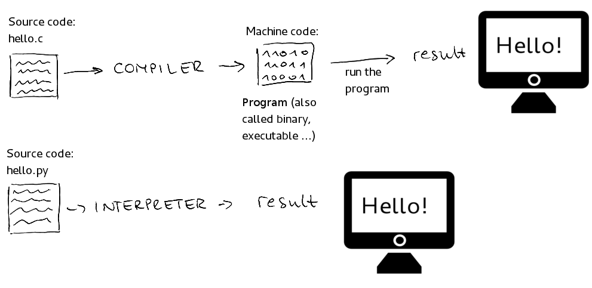
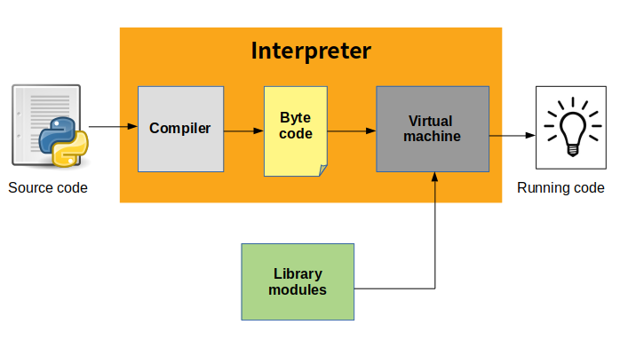

# 🩶 Applications Basics

<figure><figcaption></figcaption></figure>

### Programlama Dili Türleri,

**Compiled (Derlenen) Diller:**

* **Java, C, C++** gibi diller bu kategoriye girer.
* Derlenen dillerde, kaynak kod önce bir derleyici tarafından makine koduna dönüştürülür ve ardından çalıştırılır.

**Interpreted (Yorumlanan) Diller:**

* **Python, Ruby, Node.js, Perl** gibi diller bu kategoriye girer.
* Yorumlanan dillerde, kaynak kod doğrudan bir yorumlayıcı tarafından satır satır okunur ve çalıştırılır.


***

#### Derleme Süreci,

1 - Develop Source Code (Kaynak Kodu Geliştir):

* Kaynak kod bir dosya da yazılır. Örneğin, MyClass.java dosyası içinde:

```java
public class MyClass {
    public static void main(String[] args) {
        System.out.println("Hello World");
    }
}

```


2 - Compile (Derle):

* Kaynak kod, bir derleyici kullanılarak makine koduna çevrilir. Örneğin:

```bash
javac MyClass.java
```

* Bu komut, MyClass.java dosyasını derleyerek MyClass.class dosyasını oluşturur.


3 - Run (Çalıştır):

* Derlenen kod çalıştırılır. Örneğin:

```bash
java MyClass
```

* Bu komut, derlenmiş MyClass.class dosyasını çalıştırarak "Hello World" çıktısını üretir.


***

#### Yorumlama Süreci,

1 - Develop Source Code (Kaynak Kodu Geliştir):

* Kaynak kod bir dosyada yazılır. Örneğin, main.py dosyası içinde:

```python
def print_message():
    print("Hello World")

if __name__ == '__main__':
    print_message()

```


2 - Run ( Çalıştır ) :&#x20;

* Kaynak kod, bir yorumlayıcı kullanılarak doğrudan çalıştırılır. Örneğin:

```bash
python main.py
```

* Bu komut, main.py dosyasını yorumlayarak "Hello World" çıktısını üretir.


***

### Genel Farklar,

* **Derlenen Diller:**
  * Kaynak kod önce derlenir, ardından çalıştırılır.
  * Genellikle daha hızlı çalışır, çünkü kod makine koduna çevrilmiştir.
  * Hata bulma ve düzeltme süreci daha karmaşıktır, çünkü hatalar derleme sırasında ortaya çıkar.
* **Yorumlanan Diller:**
  * Kaynak kod doğrudan yorumlanır ve çalıştırılır.
  * Daha esnektir, çünkü kod satır satır çalıştırılır.
  * Hata bulma ve düzeltme süreci daha kolaydır, çünkü hatalar anında ortaya çıkar.

***

#### Python Çalışma süreci,

<figure><figcaption></figcaption></figure>

1 - **Örneğin, `main.py` dosyasındaki Python kodu:**

```python
def print_message():
    print("Hello World")

if __name__ == '__main__':
    print_message()
```

2 - **Derleme (Compilation):**

Python'da kaynak kod, bir derleyici tarafından **ara kod** olarak adlandırılan bir biçime dönüştürülür. Bu ara kod, makine tarafından doğrudan yürütülemez ancak yorumlayıcı tarafından okunabilir. Bu ara kod genellikle **bytecode** olarak adlandırılır.

Ara Kod (Intermediary Bytecode),

Bu aşamada, Python kaynak kodu bytecode olarak adlandırılan ara koda dönüştürülür:

```python
main.pyc
```

Bu dosya, `main.py` dosyasının derlenmiş halidir.

3 - **Yorumlama (Interpretation)**

Derlenmiş bytecode, bir yorumlayıcı tarafından makine koduna dönüştürülür ve çalıştırılır. Yorumlayıcı, bytecode'u satır satır okuyarak çalıştırır.

**Makine Kodu (Machine Code)**

Yorumlayıcı, bytecode'u makine koduna çevirir ve yürütür:

```bash
01101000 01100101 01101100 01101100 01101111 00100000 01110111 01101111 01110010 01101100 01100100

```

4 - **Sanal Makine (Virtual Machine)**

Python yorumlayıcısı, bir **Python Sanal Makinesi (Python VM)** üzerinde çalışır. Bu sanal makine, bytecode'u çalıştırarak son çıktıyı üretir.

**Sanal Makine (Python VM)**

Yorumlayıcı, bytecode'u Python VM üzerinde çalıştırır ve sonuç olarak:

```sh
Hello World
```

#### Özet,

Bu diyagram, `python hello-world.py` komutunun Python'daki derleme ve yorumlama sürecini nasıl çalıştığını göstermektedir.

```
+---------------------+     +--------------+     +-----------------+
|                     |     |              |     |                 |
|  Source Code        |---> |  Compiler    |---> |   Bytecode      |
|  (hello-world.py)   |     |  (Python)    |     |  (in memory)    |
+---------------------+     +--------------+     +-----------------+
                                                        |
                                                        |
                                                        v
                                               +-----------------+
                                               |                 |
                                               |  Interpreter    |
                                               |   (Python VM)   |
                                               |                 |
                                               +-----------------+
                                                        |
                                                        |
                                                        v
                                               +-----------------+
                                               |                 |
                                               |  Machine Code   |
                                               | ("Hello World") |
                                               |                 |
                                               +-----------------+
                                               
                                               
                                      ^
                                      |
                                      |                                             
+-----------------------------python hello-world.py-------------------------+
```

1. **Kaynak Kod (Source Code)** yazılır.
2. **Derleme (Compilation)**: Kaynak kod, bytecode'a dönüştürülür.
3. **Yorumlama ve Yürütme (Interpretation and Execution)**: Bytecode, Python VM tarafından yorumlanarak çalıştırılır ve makine koduna dönüştürülür.


