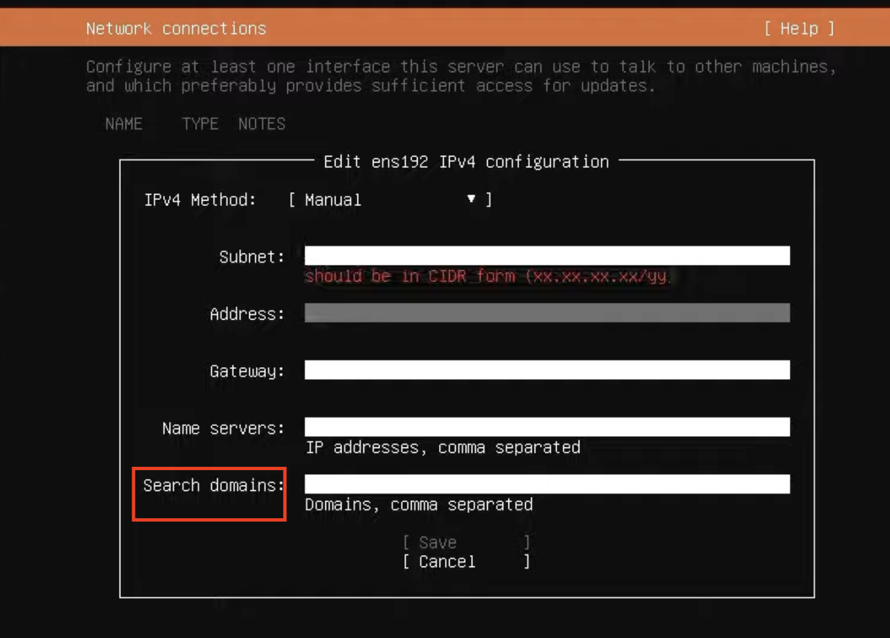

# 🤎 DNS Basics

**DNS,** internet ve yerel ağlardaki isimleri IP adreslerine çeviren, aynı zamanda çeşitli diğer bilgileri depolayan ve sorgulayan bir sistemdir. DNS, sadece web siteleri için değil, aynı zamanda e-posta sunucuları, ağ hizmetleri ve daha birçok sistem için kullanılır.

**DNS Nasıl Çalışır?**

1. Bir kullanıcı web tarayıcısına [www.google.com](http://www.google.com) yazdığında, tarayıcı DNS sunucusuna bu alan adının IP adresini sorar.
2. DNS sunucusu, bu alan adının IP adresini bulur ve tarayıcıya geri döner.
3. Tarayıcı, aldığı IP adresiyle web sunucusuna bağlanır ve kullanıcıya web sayfasını gösterir.


<figure><figcaption></figcaption></figure>

**Domain Name**, internet üzerindeki web sitelerinin adresleridir. Her alan adı, belirli bir IP adresine karşılık gelir ve bu adresler sayesinde web siteleri bulunabilir ve erişilebilir.


DNS (Domain Name System) sunucuları, internet ve diğer ağlardaki isim çözümleme işlemlerini gerçekleştiren ve yöneten sunuculardır. Bu sunucuların farklı türleri ve işlevleri vardır. Root DNS sunucuları, internetin DNS hiyerarşisinin en üstünde yer alır ve tüm DNS sorgularının başladığı yerdir. Dünyada toplamda 13 root sunucusu bulunur ve bu sunucular TLD (Top-Level Domain) sunucularına işaret eder. TLD DNS sunucuları ise üst düzey alan adlarını (.com, .net, .org gibi) yönetir ve root DNS sunucularından gelen istekleri alarak ilgili TLD'nin yetkili sunucusuna yönlendirir.

Root DNS sunucuları, DNS sisteminin en üst seviyesinde yer alan ve tüm internet trafiğinin yönlendirilmesinde kritik bir rol oynayan sunuculardır. Dünya genelinde 13 root DNS sunucusu bulunur ve bu sunucular çeşitli kuruluşlar tarafından yönetilir. ICANN gibi ana kuruluşlar, root DNS sisteminin operasyonel işlerini yürütür. Root DNS sunucuları, internetin temel yapı taşlarından biri olarak, her gün milyarlarca DNS sorgusunu doğru bir şekilde yönlendirir.


<figure><figcaption></figcaption></figure>

"search" direktifi, DNS aramalarında belirli bir domaini varsayılan olarak kullanmayı sağlar. Daha detaylı açıklamak gerekirse, "search" direktifi /etc/resolv.conf dosyasına eklenir ve burada belirtilen domain, kısa isim çözümlemelerinde otomatik olarak eklenir.

**örnek /etc/resolv.conf içeriği**:

```bash
nameserver 192.168.1.100
search mycompany.com
```

* **ping web**:
  * Bu komut çalıştırıldığında, sistem "web" ismini çözmeye çalışır. /etc/resolv.conf dosyasındaki search direktifi nedeniyle, sistem otomatik olarak "web.mycompany.com" ismini arar ve IP adresini bulur.
  * **Sonuç**: PING web.mycompany.com (192.168.1.10): 64 bytes of data...


**NSLookup**

`nslookup` (Name Server Lookup), DNS (Domain Name System) sorguları yapmak için kullanılan bir komut satırı aracıdır. Bu araç, bir alan adı veya IP adresi hakkında DNS kayıtlarını sorgulamak için kullanılır. Hem Windows hem de Unix tabanlı sistemlerde kullanılabilir.

#### NSLookup Kullanımı,

```bash
# Bir alan adının IP adresini öğrenmek için kullanılır.
nslookup example.com

# Çıktı
Server:  dns.example.com
Address:  192.168.1.1

Non-authoritative answer:
Name:    example.com
Address: 93.184.216.34
```

```bash
# Bir IP adresinin hangi alan adına karşılık geldiğini öğrenmek için kullanılır.
nslookup 93.184.216.34

# Çıktı
Server:  dns.example.com
Address:  192.168.1.1

Name:    example.com
Address: 93.184.216.34
```


**Dig**

`dig` (Domain Information Groper), DNS sorguları yapmak için kullanılan daha gelişmiş bir komut satırı aracıdır. `dig`, özellikle ağ yöneticileri ve sistem yöneticileri tarafından DNS sorunlarını teşhis etmek ve çözmek için kullanılır. Unix tabanlı sistemlerde yaygındır ve daha ayrıntılı çıktılar sağlar.

#### Dig Kullanımı,

```bash
# Bir alan adının IP adresini öğrenmek için kullanılır.
dig example.com


# Çıktı
; <<>> DiG 9.11.3-1ubuntu1.11-Ubuntu <<>> example.com
;; global options: +cmd
;; Got answer:
;; ->>HEADER<<- opcode: QUERY, status: NOERROR, id: 31386
;; flags: qr rd ra; QUERY: 1, ANSWER: 1, AUTHORITY: 1, ADDITIONAL: 1

;; QUESTION SECTION:
;example.com.                   IN      A

;; ANSWER SECTION:
example.com.            10368   IN      A       93.184.216.34

;; Query time: 32 msec
;; SERVER: 192.168.1.1#53(192.168.1.1)
;; WHEN: Mon Jan 20 14:55:07 UTC 2024
;; MSG SIZE  rcvd: 56
```


```bash
# Bir IP adresinin hangi alan adına karşılık geldiğini öğrenmek için kullanılır.
dig -x 93.184.216.34

# Çıktı
; <<>> DiG 9.11.3-1ubuntu1.11-Ubuntu <<>> -x 93.184.216.34
;; global options: +cmd
;; Got answer:
;; ->>HEADER<<- opcode: QUERY, status: NOERROR, id: 50852
;; flags: qr rd ra; QUERY: 1, ANSWER: 1, AUTHORITY: 0, ADDITIONAL: 1

;; QUESTION SECTION:
;34.216.184.93.in-addr.arpa.    IN      PTR

;; ANSWER SECTION:
34.216.184.93.in-addr.arpa. 300 IN      PTR     example.com.

;; Query time: 35 msec
;; SERVER: 192.168.1.1#53(192.168.1.1)
;; WHEN: Mon Jan 20 14:57:07 UTC 2024
;; MSG SIZE  rcvd: 73

```


* `nslookup` daha basit sorgular için uygunken, `dig` daha ayrıntılı bilgi ve daha fazla esneklik sağlar.
* `dig` genellikle daha ayrıntılı ve düzenli bir çıktı sağlar, bu da özellikle sorun giderme ve analiz için yararlıdır.
* `dig`, çeşitli sorgu türleri ve parametrelerle daha fazla özelleştirilebilir.

Her iki araç da DNS sorguları yapmak, DNS kayıtlarını kontrol etmek ve ağ sorunlarını gidermek için oldukça kullanışlıdır.

