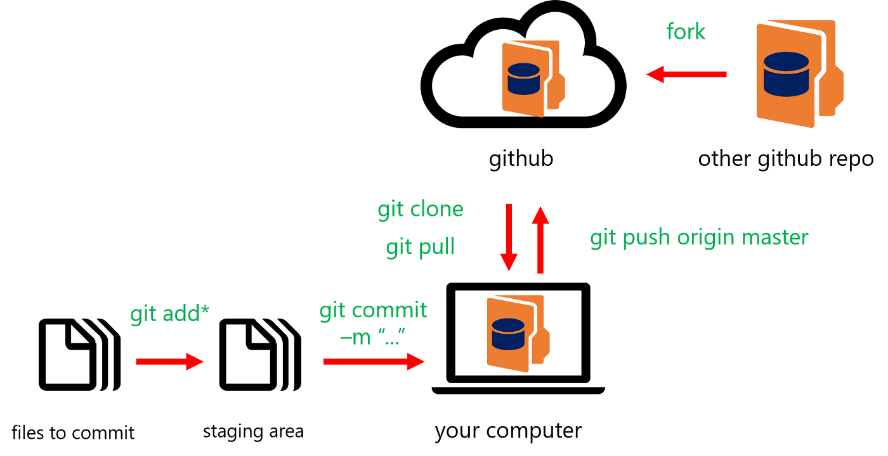

# 🟪 GIT Introduction

<figure><figcaption></figcaption></figure>

#### What is GIT?

Git, açık kaynaklı bir dağıtık versiyon kontrol sistemidir. Yazılım geliştirme süreçlerinde, geliştiricilerin kod değişikliklerini izlemelerine ve işbirliği yapmalarına olanak tanır.

#### Install GIT

Git'i kurmak oldukça basittir. İşletim sistemine göre farklı adımlar izlenir:

* **Windows**: [Git for Windows](https://gitforwindows.org/) sitesinden indirilebilir ve standart bir kurulum süreciyle kurulabilir.
* **macOS**: Homebrew kullanarak `brew install git` komutuyla kurulabilir.
* **Linux**: Paket yöneticisi kullanılarak kurulabilir. Örneğin, Debian tabanlı sistemlerde `sudo apt-get install git` komutuyla kurulabilir.

#### GIT Repositories

Git repository (depo), bir projenin tüm dosyalarını ve geçmişini içeren bir dizindir. Bir Git reposu, `git init` komutuyla oluşturulabilir ve bu komut mevcut bir dizini bir Git reposuna dönüştürür.

#### Remote Repositories

Remote repository, internette veya ağ üzerinde bulunan bir Git reposudur. Geliştiriciler, projelerini bu repolara göndererek (push) veya bu depolardan çekerek (pull) işbirliği yapabilirler. Örnek olarak GitHub, GitLab ve Bitbucket gibi platformlar remote repository hizmeti sunar.

#### Clone, Pull & Push

* **Clone**: `git clone <repository-url>` komutuyla, uzak bir depo yerel bilgisayara kopyalanır.
* **Pull**: `git pull` komutuyla, uzak depodaki değişiklikler yerel depoya çekilir ve birleştirilir.
* **Push**: `git push` komutuyla, yerel depodaki değişiklikler uzak depoya gönderilir.

#### GIT vs GITHUB

* **Git**: Versiyon kontrol sistemidir. Komut satırı araçlarıyla kullanılan, dağıtık bir sistemdir.
* **GitHub**: Git repolarını barındıran ve projelerin paylaşılmasını sağlayan bir platformdur. GitHub, Git'in üzerine ek özellikler sunar, örneğin, sorun takibi, proje yönetimi araçları ve wiki.

#### Basit Git Komutları

```bash
# Mevcut dizini bir Git deposu olarak başlatır.
git init
# Örnek: git init

# Uzak bir depoyu yerel olarak klonlar.
git clone <repository_url>
# Örnek: git clone https://github.com/user/repo.git

# Dosyaları izleme (staging) alanına ekler.
git add <file>
# Örnek: git add README.md

# Tüm değişiklikleri izleme (staging) alanına ekler.
git add .
# Örnek: git add .

# Yapılan değişiklikleri yerel depoya kaydeder.
git commit -m "Commit mesajı"
# Örnek: git commit -m "Initial commit"

# Değişiklikleri uzak depoya gönderir.
git push <remote> <branch>
# Örnek: git push origin main

# Uzak depodaki değişiklikleri yerel depoya çeker.
git pull <remote> <branch>
# Örnek: git pull origin main

# Yerel deponuzda yeni bir dal (branch) oluşturur.
git branch <branch_name>
# Örnek: git branch feature-branch

# Belirli bir dala geçiş yapar.
git checkout <branch_name>
# Örnek: git checkout feature-branch

# Yeni bir dal (branch) oluşturur ve ona geçiş yapar.
git checkout -b <branch_name>
# Örnek: git checkout -b new-branch

# Mevcut dalları listeler.
git branch
# Örnek: git branch

# Bir dalı (branch) siler.
git branch -d <branch_name>
# Örnek: git branch -d feature-branch

# İki dalı (branch) birleştirir.
git merge <branch_name>
# Örnek: git merge feature-branch

# Uzak depoları ve URL'lerini listeler.
git remote -v
# Örnek: git remote -v

# Bir dosyanın veya dizinin değişikliklerini geri alır.
git checkout -- <file>
# Örnek: git checkout -- README.md

# Son yapılan commit'i geri alır.
git revert <commit_hash>
# Örnek: git revert a1b2c3d4

# Yapılan commit'lerin logunu görüntüler.
git log
# Örnek: git log

# Değişiklikleri karşılaştırır.
git diff
# Örnek: git diff

# Geçici olarak değişiklikleri kenara koyar (stash).
git stash
# Örnek: git stash

# En son kenara konan değişiklikleri geri getirir.
git stash pop
# Örnek: git stash pop

# Depo durumunu gösterir (izlenen, izlenmeyen dosyalar vb.).
git status
# Örnek: git status

```

