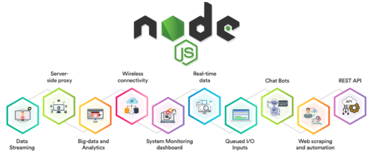

# 🟩 NodeJS Introduction

<figure><figcaption></figcaption></figure>

Node.js, sunucu tarafında JavaScript çalıştırmanızı sağlayan açık kaynaklı ve platform bağımsız bir çalışma ortamıdır. İlk olarak 2009 yılında Ryan Dahl tarafından geliştirilen Node.js, asenkron ve olay odaklı yapısı sayesinde yüksek performanslı ve ölçeklenebilir uygulamalar geliştirmeyi kolaylaştırır.

* Node.js, açık kaynaklı bir çalışma ortamıdır ve geniş bir topluluğa sahiptir.
* Windows, macOS ve Linux gibi çeşitli platformlarda çalışabilir.
* Asenkron I/O işlemleri sayesinde yüksek performans sunar.


Ubuntu 22.04 NodeJS kurulumu hakkında: [https://www.cherryservers.com/blog/install-nodejs-on-ubuntu](https://www.cherryservers.com/blog/install-nodejs-on-ubuntu)


#### Basic NodeJS Commands,

```javascript
// Node.js sürümünü kontrol etme komutu
node -v 
// Çıktı: v13.10.1

// Node.js Yardım Menüsünü Gösterme
node --help
// Çıktı: Node.js komut satırı seçeneklerinin listesi

// Bir JavaScript dosyasını çalıştırma
node add.js 
// Çıktı: Addition : 15

// Node.js modüllerinin yolunu gösterme
node -p "require.resolve('module_name')"
// Çıktı: Modül yolunu gösterir

// REPL (Read-Eval-Print Loop) başlatma
node
// Çıktı: Etkileşimli bir Node.js komut satırı başlatılır

// Bir JavaScript dosyasını çalıştırma ve hata ayıklama
node inspect add.js
// Çıktı: add.js dosyasında hata ayıklama başlatılır

// Bir JavaScript dosyasını çalıştırma ve bellek kullanımını izleme
node --trace-gc add.js
// Çıktı: add.js dosyası çalıştırılırken bellek kullanımı izlenir

// Giriş olarak verilen kodu çalıştırma
node -e "console.log('Hello, World!')"
// Çıktı: Hello, World!

// Modül yolu ekleyerek çalıştırma
node -r ./my-module add.js
// Çıktı: add.js dosyası, my-module yüklendikten sonra çalıştırılır

// Node.js versiyonunu yönetme (NVM kullanarak)
nvm use 14
// Çıktı: Node.js'in 14. sürümünü kullanır

// Node.js ortam değişkenlerini görüntüleme
node -p "process.env"
// Çıktı: Ortam değişkenlerinin listesi

```


### NPM,

Npm, Node.js için paket yöneticisidir ve "Node Package Manager" anlamına gelir. Npm, geliştiricilerin projelerinde kullanabilecekleri açık kaynaklı JavaScript paketlerini (modüllerini) kolayca yüklemelerine, paylaşmalarına ve yönetmelerine olanak tanır.

#### Basic NPM Commands,

```bash
# Yaygın olarak kullanılan npm komutları ve açıklamaları

# 1. Proje başlatma ve package.json dosyası oluşturma
npm init -y
# Bu komut, varsayılan ayarlarla yeni bir package.json dosyası oluşturur.

# 2. Paket yükleme (lokal)
npm install <package-name>
# Belirtilen paketi proje dizinine yükler.

# 3. Paket yükleme (global)
npm install -g <package-name>
# Belirtilen paketi global olarak yükler, tüm projelerde kullanılabilir.

# 4. Paket kaldırma
npm uninstall <package-name>
# Belirtilen paketi projeden kaldırır.

# 5. Paket güncelleme
npm update <package-name>
# Belirtilen paketi günceller.

# 6. Tüm bağımlılıkları yükleme
npm install
# package.json dosyasındaki tüm bağımlılıkları yükler.

# 7. Proje bağımlılıklarını listeleme
npm list
# Projede yüklü olan tüm paketleri ve bağımlılıklarını listeler.

# 8. Global olarak yüklü paketleri listeleme
npm list -g --depth=0
# Global olarak yüklü tüm paketleri listeler.

# 9. Paket güncellemelerini kontrol etme
npm outdated
# Projedeki güncellenmesi gereken paketleri listeler.

# 10. Paket betiklerini çalıştırma
npm run <script-name>
# package.json dosyasındaki belirli bir betiği çalıştırır.

# 11. Paket yayınlama
npm publish
# Paketi npm kayıt deposuna yayınlar.

# 12. Paketlerin erişim izinlerini değiştirme
npm access
# Paketin erişim izinlerini ayarlamak için kullanılır.

# 14. Paket arama
npm search <package-name>
# Belirtilen paketi npm kayıt deposunda arar.

```



Node.js uygulamasını çalıştırmak için `npm init -y` komutunu çalıştırmanız şart değildir. Bu komut, projenizin kök dizininde bir `package.json` dosyası oluşturur ve projeyi npm (Node Package Manager) ile yönetmenizi kolaylaştırır. Ancak, basit bir Node.js uygulaması çalıştırmak için bu dosyaya ihtiyacınız yoktur.

\
`package.json` dosyası olmadan da Node.js uygulamasını çalıştırabilirsiniz. Ancak, projeler büyüdükçe ve bağımlılıkları yönetmek gerektiğinde, `package.json` dosyası oluşturmak faydalı olur. Bu dosya, proje bilgilerinizi, bağımlılıkları ve npm komutlarını tanımlamanıza olanak tanır. Bu nedenle, projelerinizde genellikle `npm init` veya `npm init -y` komutunu kullanmak faydalı olabilir.


`package.json` dosyası, Node.js projelerinin merkezinde yer alan bir yapılandırma dosyasıdır. Bu dosya, projenizin adı, sürümü, yazar bilgileri, lisansı, bağımlılıkları ve betikleri (scripts) gibi çeşitli bilgileri içerir. Bu bilgiler, npm (Node Package Manager) ve diğer araçlar tarafından kullanılarak projenizin yönetimini kolaylaştırır.


```json
{
  // Projenin adı. npm üzerindeki benzersiz bir paket ismi.
  "name": "my-node-app",
  
  // Projenin sürümü. Semantic versioning kurallarına uygun olarak belirtilir.
  "version": "1.0.0",
  
  // Projenin kısa bir açıklaması.
  "description": "A simple Node.js application",
  
  // Uygulamanın ana dosyası. Projenin giriş noktası.
  "main": "app.js",
  
  // npm komutları ile çalıştırılabilecek betikler.
  "scripts": {
    // npm start komutu ile çalıştırılacak betik.
    "start": "node app.js",
    
    // npm test komutu ile çalıştırılacak betik.
    "test": "echo \"Error: no test specified\" && exit 1"
  },
  
  // Projeyi geliştiren kişi veya kurumun bilgileri.
  "author": "Onur",
  
  // Projenin lisansı.
  "license": "MIT",
  
  // Projenin çalışması için gereken bağımlılıklar.
  "dependencies": {
    // Express modülü, versiyon 4.17.1 ve üstü.
    "express": "^4.17.1"
  },
  
  // Geliştirme sırasında ihtiyaç duyulan bağımlılıklar.
  "devDependencies": {
    // Nodemon modülü, versiyon 2.0.7 ve üstü.
    "nodemon": "^2.0.7"
  },
  
  // Projenin kaynak kodunun bulunduğu depo bilgileri.
  "repository": {
    "type": "git",
    // Git deposunun URL'si.
    "url": "git+https://github.com/username/my-node-app.git"
  },
  
  // Projeyi tanımlayan anahtar kelimeler.
  "keywords": [
    "node",
    "express",
    "example"
  ]
}

```


* Projenizi başlatmak için `npm init` komutunu kullanarak interaktif olarak `package.json` dosyasını oluşturabilirsiniz.
* `npm install <paket-adı>` komutuyla bağımlılık eklediğinizde, bu bağımlılık otomatik olarak `package.json` dosyasına eklenir.
* `npm run start` komutuyla `scripts` bölümünde tanımladığınız `start` betiğini çalıştırabilirsiniz.


### Modules,

Node.js modülleri, kodunuzu daha yönetilebilir ve modüler hale getiren yapı taşlarıdır. Node.js, hem yerleşik modüller (Built-In Modules) hem de dış modüller (External Modules) sunar.

#### Yerleşik Modüller (Built-In Modules)

* **fs (File System)**: Dosya sistemi işlemlerini yönetmek için kullanılır. Örneğin, dosya okuma, yazma ve silme işlemleri.
* **http**: HTTP sunucusu barındırmak için kullanılır. Sunucu oluşturma ve HTTP isteklerini yönetme işlemlerini gerçekleştirir.
* **os (Operating System)**: İşletim sistemi ile ilgili işlemler yapmak için kullanılır. Sistem bilgileri, kullanıcı bilgileri gibi verilere erişim sağlar.
* **events**: Olayları (events) yönetmek için kullanılır. Olay tabanlı programlama modelini destekler.
* **tls (Transport Layer Security)**: TLS ve SSL uygulamalarını yönetmek için kullanılır. Güvenli bağlantılar kurmayı sağlar.
* **url**: URL dizelerini ayrıştırmak ve işlemek için kullanılır.

#### Dış Modüller (External Modules)

* **express**: Hızlı ve minimal bir web frameworküdür. Web uygulamaları ve API'ler oluşturmak için yaygın olarak kullanılır.
* **react**: Kullanıcı arayüzleri oluşturmak için kullanılır. Özellikle dinamik web uygulamaları için tercih edilir.
* **debug**: Uygulama hatalarını ayıklamak için kullanılır. Detaylı hata raporları ve loglar sağlar.
* **async**: Asenkron JavaScript işlemleri yönetmek için kullanılır. Promise tabanlı yapıların daha kolay yönetilmesini sağlar.
* **lodash**: Diziler, nesneler ve stringlerle çalışmak için geniş bir fonksiyon seti sunar.

#### Komutlar

```sh
# Yerleşik modülleri listeleme
ls /usr/lib/node_modules/npm/node_modules/

# Dış modülleri listeleme
ls /usr/lib/node_modules/
```

Node.js modülleri, çeşitli görevleri kolayca yönetmenize ve uygulamanızı modüler hale getirmenize yardımcı olur. Yerleşik modüller, Node.js tarafından sağlanan temel işlevleri içerirken, dış modüller, topluluk tarafından geliştirilmiş ve belirli işlevleri gerçekleştiren modüllerdir.


