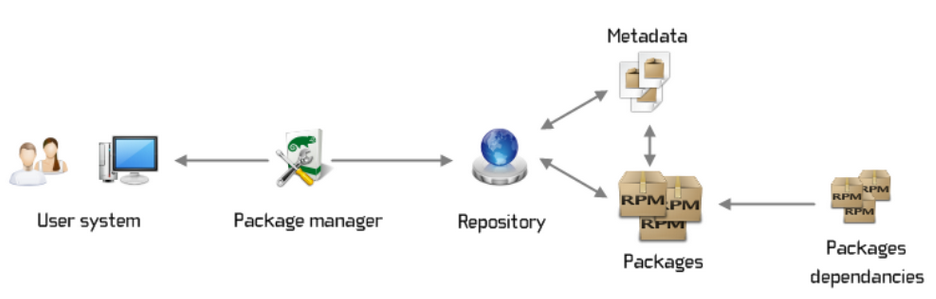

# 🧡 Package Managers (yum-rpm) | Linux Basics #4

<figure><figcaption></figcaption></figure>

Paket yöneticileri, Linux sistemlerinde uygulamaların kurulumu, güncellenmesi, kaldırılması ve yönetimi işlemlerini otomatikleştirir. Paket yöneticileri, belirli uygulama paketlerini içeren depolardan (repositories) uygulamaları indirir ve kurar. Her uygulama paketi, bağımlılık bilgilerini ve sistemde nereye yerleştirileceğini içeren meta verilerle birlikte gelir. Paket yöneticisi, uygulamanın bağımlılıklarını kontrol eder ve gerekli diğer paketleri de indirip kurar. Kurulum işlemi sırasında, paket yöneticisi dosyaları doğru yerlere kopyalar, gerekli izinleri ayarlar ve bağımlılıkları çözer.

Güncellemeler sırasında, paket yöneticisi kurulu paketlerin yeni sürümlerini kontrol eder ve indirir. Bu işlem, depo listelerinden güncel paket bilgilerini alarak sistemdeki mevcut paketlerle karşılaştırmak suretiyle yapılır. Paket kaldırma işlemlerinde ise paket yöneticisi, ilgili dosyaları ve bağımlılıkları sistemden kaldırarak temiz bir ortam sağlar.

Örneğin, Debian tabanlı sistemlerde APT (Advanced Package Tool) kullanılır. Kullanıcı `sudo apt update` komutunu çalıştırarak paket listelerini günceller, `sudo apt install package_name` komutuyla da belirli bir uygulama paketini kurar. Benzer şekilde, Red Hat tabanlı sistemlerde YUM veya DNF kullanılır; kullanıcı `sudo yum install package_name` veya `sudo dnf install package_name` komutlarıyla paketleri kurabilir.


### APT (Advanced Package Tool):

**Dağıtımlar**: Debian, Ubuntu ve türevleri

```bash
# Paket listelerini güncelle
sudo apt update

# Tüm sistem paketlerini güncelle
sudo apt upgrade

# curl paketini kur
sudo apt install curl

# curl paketini kaldır
sudo apt remove curl

# Uzak depolarda paket aramak için
apt search curl

# curl paketini güncelle
sudo apt install --only-upgrade curl
```


### RPM (Red Hat Package Manager):

**Dağıtımlar**: Red Hat, Fedora, CentOS

```bash
# Bir RPM paketini kurmak için
sudo rpm -i curl-7.68.0-1.el7.x86_64.rpm
# Açıklama: Belirtilen RPM paketini kurar. -i (install) seçeneği, paketi kurmak için kullanılır.

# Bir RPM paketini kaldırmak için
sudo rpm -e curl
# Açıklama: Belirtilen paketi kaldırır. -e (erase) seçeneği, paketi kaldırmak için kullanılır.

# Bir RPM paketini yükseltmek için
sudo rpm -U curl-7.68.0-2.el7.x86_64.rpm
# Açıklama: Mevcut bir paketi günceller veya yeni bir paketi kurar. -U (upgrade) seçeneği, paketi güncellemek veya kurmak için kullanılır.

# Kurulu paketleri listelemek için
rpm -qa
# Açıklama: Sistemde kurulu olan tüm RPM paketlerinin listesini gösterir. -qa (query all) seçeneği, tüm paketleri sorgulamak için kullanılır.

# Paket aramak için
rpm -qa | grep curl
# Açıklama: Sistemde kurulu olan curl paketini arar ve listeler.

rpm -q telnet
# Açıklama: Telnet paketinin sistemde kurulu olup olmadığını sorgular. -q (query) seçeneği, paketin kurulu olup olmadığını kontrol eder.

```


### YUM (Yellowdog Updater, Modified):

**Dağıtımlar**: CentOS, RHEL (Red Hat Enterprise Linux), Fedora (eski versiyonlar)

```bash
# Paket listelerini güncelle
sudo yum update

# Tüm sistem paketlerini güncelle
sudo yum upgrade

# curl paketini kur
sudo yum install curl

# curl paketini kaldır
sudo yum remove curl

# Uzak depolarda paket aramak için
yum search curl

# Kurulu ve mevcut ansible paketlerini listeler. Kurulu olan sürümleri ve mevcut depolarda bulunan sürümleri gösterir.
# --showduplicates parametresi, YUM kullanırken belirli bir paketin mevcut tüm sürümlerini gösterir. Bu, özellikle bir paketin eski bir sürümünü kurmak veya hangi sürümlerin mevcut olduğunu görmek istediğinizde kolaylık sağlar.
yum --showduplicates list ansible

# curl paketini güncelle
sudo yum update curl
```


`yum search` komutu, uzak depolarda belirli bir anahtar kelimeyi arar ve bu kelimeyi paket isimlerinde veya açıklamalarında içeren tüm paketleri listeler. Bu, özellikle bir paket hakkında genel bilgi sahibi olmak veya belirli bir işlevselliğe sahip paketleri keşfetmek istediğinizde kullanışlıdır. Örneğin, "ansible" kelimesini aradığınızda, ansible ile ilgili tüm paketleri ve açıklamalarını görebilirsiniz. Öte yandan, `yum list` komutu, sistemde kurulu olan ve uzak depolarda mevcut bulunan paketlerin listesini sağlar. Bu komut, belirli bir paketin kurulu olup olmadığını veya hangi sürümlerinin mevcut olduğunu görmek için kullanılır. Örneğin, "ansible" paketinin sistemde kurulu olup olmadığını ve hangi sürümlerinin mevcut olduğunu kontrol etmek için `yum list ansible` komutunu kullanabilirsiniz. Bu iki komut arasındaki temel fark, `yum search` komutunun geniş kapsamlı bir arama yaparak paketlerin isimlerini ve açıklamalarını hedef alması, `yum list` komutunun ise kurulu ve mevcut paketleri daha doğrudan listelemesidir.\
\
\
**YUM, arka planda RPM paketlerini kullanır. Yani, YUM ile bir paket kurduğunuzda, aslında RPM paketlerini indirir ve kurar.**


```bash
# YUM Komutları

# 1. Kullanılabilir YUM depolarının listesini görüntüleme
yum repolist
# Açıklama: Sistemde etkin olan ve kullanılabilir YUM depolarının listesini gösterir.
# Örnek Çıktı:
# repo id                       repo name                                       status
# base/7/x86_64                 CentOS-7 - Base                                  10097
# extras/7/x86_64               CentOS-7 - Extras                                 341
# mongodb-org-4.2/7/x86_64      MongoDB Repository                                 25
# mysql-connectors-community    MySQL Connectors Community                       141
# mysql-tools-community         MySQL Tools Community                            105
# mysql80-community             MySQL 8.0 Community Server                       161
# updates/7/x86_64              CentOS-7 - Updates                               1787

# 2. YUM repository dosyalarının bulunduğu dizini listeleme
ls /etc/yum.repos.d/
# Açıklama: YUM repository konfigürasyon dosyalarının bulunduğu dizini listeler.
# Örnek Çıktı:
# CentOS-Base.repo      CentOS-Media.repo      mysql-community.repo
# CentOS-CR.repo        CentOS-Sources.repo    mysql-community-source.repo
# CentOS-Debuginfo.repo CentOS-Vault.repo      mongodb-org-4.2.repo
# CentOS-fasttrack.repo

# 3. Belirli bir repository konfigürasyon dosyasının içeriğini görüntüleme
cat /etc/yum.repos.d/CentOS-Base.repo
# Açıklama: Belirtilen repository konfigürasyon dosyasının içeriğini görüntüler.
# Örnek Çıktı:
# [extras]
# name=CentOS-$releasever - Extras
# baseurl=http://mirror.centos.org/centos/$releasever/extras/$basearch/
# ...

# APT Komutları

# 1. Kullanılabilir APT depolarının listesini görüntüleme
sudo apt update
# Açıklama: Sistemde tanımlı olan APT depolarındaki paket listelerini günceller ve mevcut depoları gösterir.
# Not: Bu komut, hem depoları günceller hem de güncellenmiş depo listesini gösterir.

# 2. APT repository dosyalarının bulunduğu dizini listeleme
ls /etc/apt/sources.list.d/
# Açıklama: APT repository konfigürasyon dosyalarının bulunduğu dizini listeler.
# Örnek Çıktı:
# official-package-repositories.list
# ...

# 3. Belirli bir repository konfigürasyon dosyasının içeriğini görüntüleme
cat /etc/apt/sources.list
# Açıklama: Ana APT repository konfigürasyon dosyasının içeriğini görüntüler.
# Örnek Çıktı:
# deb http://archive.ubuntu.com/ubuntu focal main restricted
# deb http://archive.ubuntu.com/ubuntu focal-updates main restricted
# deb http://archive.ubuntu.com/ubuntu focal universe
# ...

```

