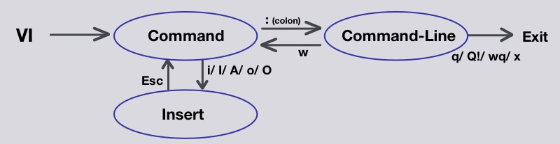

# 💛 Vi Editor | Linux Basics #2

VI/Vim editörü, Unix ve Linux sistemlerinde yaygın olarak kullanılan, güçlü ve esnek bir metin editörüdür. VI, iki ana modda çalışır: Komut Modu (Command Mode) ve Ekleme Modu (Insert Mode).

#### VI Editör Modları:

* **Komut Modu (Command Mode):** Bu modda, kullanıcı komutlar vererek metin üzerinde işlem yapabilir.
* **Ekleme Modu (Insert Mode):** Bu modda, kullanıcı doğrudan metin ekleyebilir.

<figure><figcaption></figcaption></figure>

<pre class="language-vim"><code class="lang-vim"><strong>### Temel Komutlar:
</strong>
1. Hareket Etme (Move Around):
   - h: Sol
   - j: Aşağı
   - k: Yukarı
   - l: Sağ

2. Silme (Delete):
   - x: İmleç altındaki karakteri siler.
   - dd: Bulunduğunuz satırı siler.
   - :5,10d: 5 ile 10 arasındaki satırları siler.

3. Kopyalama ve Yapıştırma (Copy &#x26; Paste):
   - yy: Satırı kopyalar.
   - p: Kopyalanmış içeriği yapıştırır.

4. Kaydırma (Scroll Up/Down):
   - CTRL + u: Yukarı kaydırır.
   - CTRL + d: Aşağı kaydırır.

5. Komutlar (Commands):
   - :: Komut girişi.
   - :w: Dosyayı kaydeder.
   - :q: VI editörden çıkar.
   - :wq: Dosyayı kaydedip çıkar.
   - :q!: Kaydetmeden çıkar.

6. Bulma (Find):
   - /kelime: Metinde kelime arar.
   - n: Bir sonraki eşleşmeye gider.

### Ek Komutlar:

1. Geri Alma ve Yeniden Yapma:
   - u: Son yapılan işlemi geri alır (undo).
   - CTRL + r: Geri alınan işlemi yeniden yapar (redo).

2. Metin Ekleme ve Değiştirme:
   - i: İmleçten önce metin ekler (insert).
   - a: İmleçten sonra metin ekler (append).
   - o: İmleç altına yeni satır açar ve ekleme moduna geçer.
   - c: Metni değiştirir (change).

3. Satırların Başına ve Sonuna Gitme:
   - 0: Satırın başına gider.
   - $: Satırın sonuna gider.

4. Kelime Kelime Hareket:
   - w: Sonraki kelimenin başına gider.
   - b: Önceki kelimenin başına gider.
   - e: Kelimenin sonuna gider.

5. Satıra Gitme:
   - G: Dosyanın son satırına gider.
   - gg: Dosyanın ilk satırına gider.
   - :n: n. satıra gider.

</code></pre>
