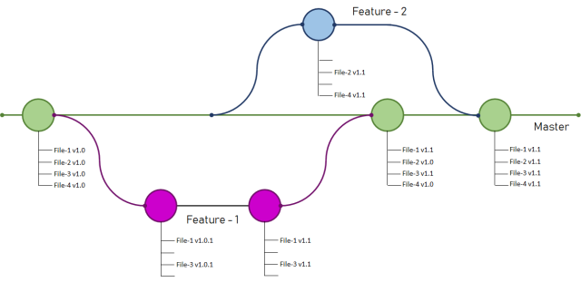

# 🌴 Branch

* Branch'ler projemize dallara ayırmamızı sağlar.

Misal, Projemize yeni bir özellik eklemek istiyoruz. Ama projenin yaşamaması, yeni özelliği bu projeyi etkilememesini istiyoruz. Ama bu özelliği de test etmek istiyoruz. Gibi durumlarda kullanabilir. Projemizin bütünlüğünü bozmadan değişiklikler yapmak istersek. Branch bu konuda bize yardımcı olacaktır.

git init komutunu verdiğimizde bizim için master adında branch oluşuyor. Eğer biz ayarlarımızda bir değişiklik yapmazsak, bütün geliştirmeyi master branch üzerinde yapıyoruz. Geliştirmeler farklı bir branch üzerinde yapılır, bir problem olmazsa master branch ile merge edilebilir (birleştirir)


Bir branch içerisinde, farklı branch 'ler oluşturulabilir.


<mark style="color:red;">Bir branch oluşturduğumuzda mevcut projemizin, en son halini bu branch 'e kopyalanır.</mark>

```
git branch -l # Var olan branch listesini gösterir.
git branch database # Database branch oluşturur.
git checkout -b web # Web branch yoksa oluşturur, mevcutsa o branch 'e geçer.
git checkout [branch adı] # Belirttiğimiz branch 'e geçeriz.
```


Üzerinde bulunduğumuz branch 'deki en son alınan commit 'e head denir.



