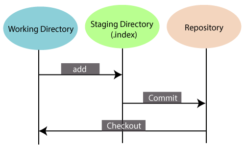

# 👉 Girizgah

* Dağıtık bir versiyon kontrol sistemidir.
* Açık kaynak kodlu ve ücretsiz.
* Hızlı kontrol sistemi.
* Versiyonlama, değişikliklerin takibini sağlayabildiğimiz bir yöntem.


Misal bir uygulamanın, 2.versiyonu 1.versiyonuna göre bazı değişikliklere sahip olabilir.


* Takım çalışması için kullanışlı.
* Dosyaların üzerinde yapılan değişiklikler görüntülenebilir.

#### Diğer Kavramlar

* Repository : Kod deposu, veri deposudur. Projelerimizin versiyon kontrolünü yapabilmek adına oluşturulmaktadır. Tüm dosyalarımızın üzerinde yapılan değişiklikleri görebileceğiz. Repo oluşturmak için "git init" komutunu kullanıyoruz.
* Working Directory : Çalışmakta olduğumuz dizindir. Hangi dizinde çalışılacaksa, repo oluşturulmalıdır.
* Staging Area : Güncelleme yaptığımız, dosyaların bulunduğu yer. Dosyalar üzerinde güncelleme yaptıktan sonra, working directory 'den Staging area 'ya taşıyoruz.
* Commit : Yapılan değişikliklerin tarafımızca onaylanması.

* Working Directory 'de çalıştığımız dosyaları güncelledikten sonra, staging arae 'ya alıyoruz. Buradan da repository 'e gönderiyoruz.

### Staging Area

GIT 'de değişikliklerin, kayıt altına alındığı alandır. Staging area, proje dosyalarımızda bir dizi değişikliği yeni bir versiyon olarak işaretlemeden önce kayıt altında tuttuğumuz veri tabanı olarak tanımlayabiliriz. GIT status ile proje dosyalarımızın durumunu görebiliriz. Git status ile üzerinde çalışılan repository 'nin,  O anki durumu görüntülenir. Üzerinde değişiklik yapılan dosyalar, yeni eklenmiş dosyalar ve commit komutu uygulanmamış konsol üzerinde listelenir. Git add ile değişiklik yapılan/yeni eklenen dosyaları eklersek dosyalar/dizinler staging area 'ya taşınacaktır.


git add .  > Bulunduğumuz dizindeki dosyaları tamamını staging area aktaracaktır.


### Git Commit

Git 'de eklediğimiz dosyaları kalıcı olarak git veri tabanına işlemeye commit denilmektedir. Proje 'de belli başlı işlemler yapıldıktan sonra dosyaları commit etmek gerekir. Yapılan değişiklikleri kimlerin tarafından yapıldığını anlamak için git config ile username ve mail adresini tanımlamak gerekmektedir. &#x20;


git commit -m \[message]&#x20;


### Git add

Git ile versiyon kontrolü altına aldığımız projemize, dosya eklediğimizde, dosya sildiğimizde veya var olan dosyanın içeriğini değiştirdiğimizde bu değişiklikler, git tarafından otomatik olarak kontrol - takip edilmez. Git 'in bu dosyaları takip etmesi için git add komutu ile bu dosyaları önce git 'e tanımlamamız gerekir.

* git config global : Geçerli olan kullanıcının, tüm projeler için genel yapılandırmalar. .gitconfig dosyası içerisinde saklanır.
* git config system : Bilgisayardaki tüm kullanıcılar, tüm repoların ayarlarının kontrol edilip, bulunduğu kısımdır.


