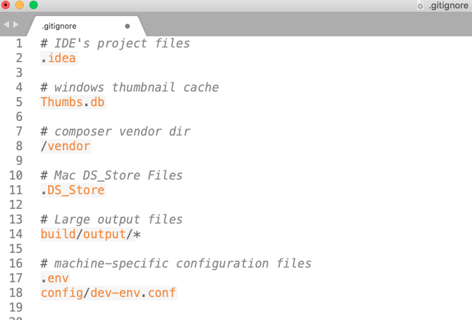

# 🛑 Gitignore

gitignore dosyası, git reposundan hariç tutulacak dosyaların listesinin bulunduğu repo ana dizinde  bulunan bir ayar dosyasıdır. Ana dizinde oluşturduğumuz .gitignore dosyasını git okuyup, belirten kriterleri es geçecektir. Her bir satır bir kural tanımlar. (# ile başlayan satırlar yorum satırlardır)

* [x] Repomuza tüm çalışma klasörlerimizi atmak istemediğimizde kullanırız.
* [x] Staged area 'ya aktarmak istemediğimiz dosyaları burada belirtebiliriz.
