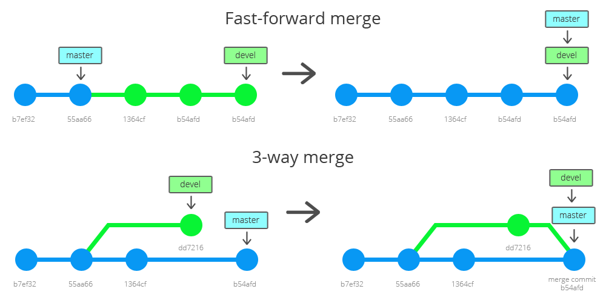

# 🤝 Merge

Branch 'imizi hangi branch ile birleştirmek istiyorsak, o branch 'e geçiyoruz. Örneğin, Web branch 'imizi master'i ile birleştirmek istiyorsak, master branch 'ine geçip,

```
master$> git merge web # Web kısmına, birleştirmek istediğimiz farklı bir branch 'ide yazabiliriz.
```

.png>)

```
git branch -d web # Web branch 'ini silmek istersek. Bu komutu kullanıyoruz.
```

* Head : Bulunduğumuz branch 'de en son commit 'i gösterir. Ve bu commit 'in hangi branch'lerde olduğunu gösterir.

### fast forward merge



Feature branch 'iniz master 'a merge olacağı anda, eğer master üzerinde bir değişiklik (commit) olmamışsa git varsayılan olarak master hattının son commit hash 'i olarak, feature branch'inin hash 'ini alır. Bu duruma fast forward merge denir. Bu işlem sonrasında, sanki değişiklikler master branch de yapılmış gibi history oluşur. Merge işlemi sırasında --no-ff parametresi verilirse merge işlemini daha anlaşılabilir history (log) tutar.

