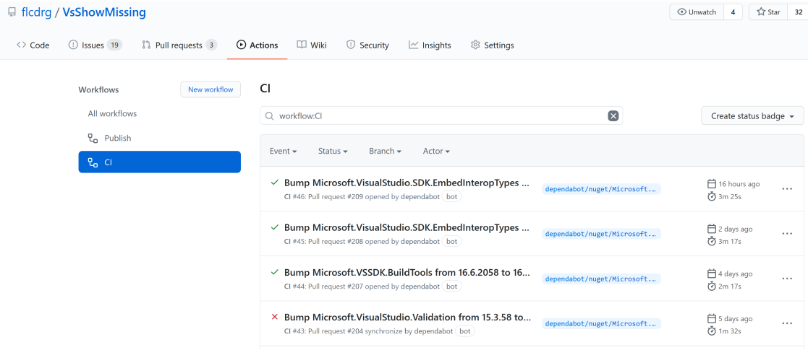

# Github Actions Nedir?

GitHub Actions, GitHub reposuna entegre edilmiş bir **CI/CD (Continuous Integration/Continuous Deployment)** pipeline çözümüdür. Yani kodunuzu test etmek, build, deploy gibi işlemleri otomatik hale getirmenize olanak sağlar.

#### **GitHub Actions ile Yapabilecekleriniz,**

* Test süreçlerini çalıştırma (ör. unit testler).
* Container image'ları oluşturma.
* Statik siteleri build etme.
* Kodunuzu sunuculara otomatik olarak deploy etme.
* Daha birçok otomasyon işlemi.

#### **YAML Dosyaları ve Workflow'lar**

GitHub Actions, `.github/workflows` dizininde bulunan **YAML dosyaları** aracılığıyla yönetilir. Her bir YAML dosyası, bir workflow'u temsil eder ve farklı olaylarla (trigger'lar) tetiklenebilir.

#### **GitHub Actions Templates**

GitHub, başlangıç yapmanı kolaylaştırmak için hazır şablonlar sunar. Örneğin:

* "Deploy Node.js to Azure Web App" gibi bir şablon seçip özelleştirerek, kolayca deployment işlemleri yapabilirsiniz.

#### **Ek Bilgi**

* Bir projede farklı triggerlar için birden fazla workflow tanımlayabilirsiniz (ör. test için ayrı, deploy için ayrı).
* GitHub'ın Actions MarketPlace'inden hazır "actions" indirebilir ve workflow'unuza ekleyebilirsiniz.

***

\
GitHub Actions çalıştırıldığında, tüm workflow'ların geçmişi **Actions sekmesi** altında görüntülenebilir. Bu geçmiş sayesinde:

<figure><figcaption></figcaption></figure>

* Workflow’un **başarı durumu** görülebilir:
  * Yeşil: Başarılı.
  * Kırmızı: Başarısız.
* Workflow'un **çalışma süresi** detaylı olarak görüntülenebilir, bu da performansı analiz etmede faydalıdır.

Geçmiş üzerinden, her workflow'un hangi branch veya commit ile çalıştırıldığı ve işlem sırasında oluşan hata veya log detayları incelenebilir. Bu, hata ayıklama (debugging) ve iyileştirme için oldukça kullanışlıdır.

***

#### **Event Triggers Nedir?**

* GitHub Actions'da, bir workflow’un tetiklenmesini sağlayan olaylara **event trigger** denir.
* **`on`** anahtar kelimesi, hangi olayın workflow'u çalıştıracağını belirtir.

#### **Örnek Trigger Olayları,**

1. **Pushes:** Repoya herhangi bir push yapıldığında action tetiklenir.
2. **Pull Requests:** Pull request açıldığında, güncellendiğinde veya merge edildiğinde çalışır.
3. **Issues:** Issue oluşturma, etiketleme gibi aktivitelerle tetiklenir.
4. **Releases:** Yeni bir release yayınlandığında workflow başlatılır.
5. **Scheduled Events:** Belirli zaman aralıklarında (cron formatında) çalıştırılır.
6. **Manual Triggers:** GitHub arayüzünden manuel olarak başlatılabilir.

Görseldeki örnek bir workflow:

<figure><figcaption></figcaption></figure>

* **Event Trigger:** `push` olayı tetiklendiğinde çalışır.
* **Runs-on:** Workflow, `ubuntu` ortamında çalıştırılır.
* **Steps:**
  1. Depoyu klonlamak için `actions/checkout@v2` kullanılır.
  2. Bir script çalıştırılır ve "This script runs on every push!" mesajı basılır.

