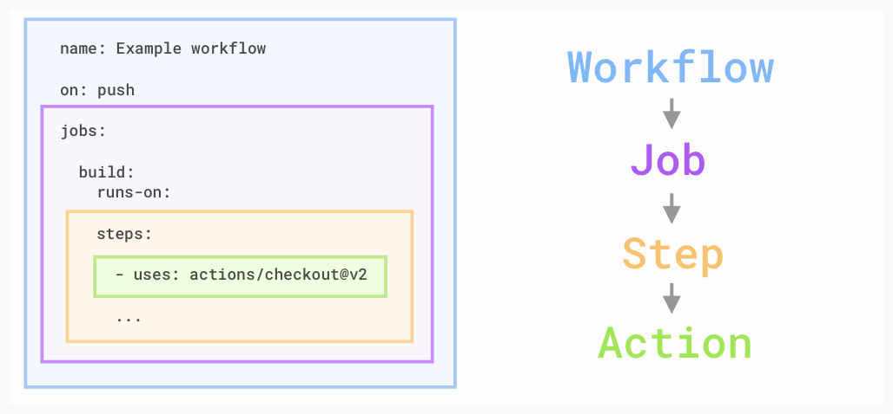

# Single and Multiple Events

<figure><figcaption></figcaption></figure>

GitHub Actions'ta, iş akışlarınızı (workflow) belirli olaylara (event) göre tetikleyebilirsiniz. Bu olaylar, kod push'ları, pull request'ler veya zamanlanmış görevler gibi çeşitli etkinlikler olabilir. İş akışlarınızı tek bir olayla veya birden fazla olayla tetiklemek mümkündür.

#### Single Event,

```yaml
name: CI on Push

on:
  push:
    branches:
      - main

jobs:
  build:
    runs-on: ubuntu-latest
    steps:
      - uses: actions/checkout@v2
      - name: Run a one-line script
        run: echo "Hello, world!"
```

**Ne Yapar?**

* Bu workflow, sadece **main** branch'ine **push** olayı gerçekleştiğinde çalışır.
* "Hello, world!" mesajını terminale yazdırır.

#### Multiple Event,

```yaml
name: CI on Multiple Events

on:
  push:
    branches:
      - main
  pull_request:
    branches:
      - main
  release:
    types:
      - published
      - created

jobs:
  build-and-test:
    runs-on: ubuntu-latest
    steps:
      - uses: actions/checkout@v2
      - name: Set up Python
        # ....

```

**Ne Yapar?**

* Bu workflow şu olaylarda çalışır:
  1. **Push:** main branch’ine bir değişiklik gönderildiğinde.
  2. **Pull Request:** main branch için bir pull request açıldığında.
  3. **Release:** Yeni bir release oluşturulduğunda ya da yayımlandığında (**published** ve **created** olayları).
* Yukarıdaki herhangi bir olay tetiklendiğinde `build-and-test` job'u çalışır.

#### **Multiple Event**:

* Eğer bir workflow içinde birden fazla olay (event) tanımlarsanız, bunlardan herhangi birinin gerçekleşmesi workflow'u tetiklemek için yeterlidir.
* Yani **push**, **pull\_request**, veya **release** olaylarından biri gerçekleştiğinde workflow çalıştırılır.

**Birden Fazla Olayın Aynı Anda Meydana Gelmesi:**

* Eğer birden fazla olay aynı anda meydana gelirse, her biri için ayrı bir **workflow run** oluşturulur.
* Örneğin:
  * Aynı anda hem bir **push** işlemi yapılırsa hem de bir **pull request** açılırsa, workflow iki kez çalıştırılır ve iki ayrı run oluşturulur.

