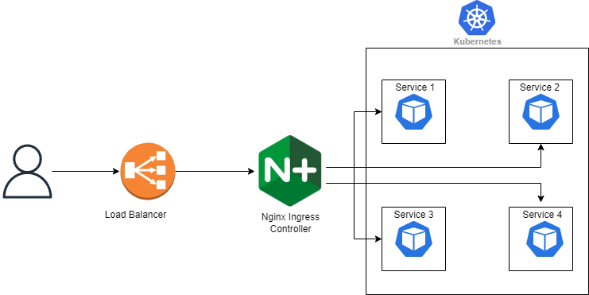

# Ingress Overview

Kubernetes'te uygulamalarınızı dış dünyaya açmayı öğrendiğinizde aklınıza muhtemelen ilk olarak `LoadBalancer` veya `NodePort` servis tipleri gelir. Ancak sisteminiz büyüdükçe her bir uygulama için ayrı bir LoadBalancer oluşturmak büyük bir mimari krize dönüşür.

Diyelim ki sisteminizde 10 farklı web (mikroservis) uygulamanız var. Eğer standart yöntemi kullanırsanız, bu 10 uygulamanın her biri için bulut sağlayıcınızdan (AWS, Google Cloud vb.) ayrı birer dış IP (LoadBalancer) satın almanız gerekir. Bu durum hem yönetimi imkansızlaştırır, hem faturalarınızı inanılmaz derecede şişirir, hem de bu 10 IP'nin her birine ayrı ayrı SSL sertifikası kurmanızı gerektirir.

İşte tam bu noktada, Kubernetes'in trafik yönlendirme şefi olan Ingress sahneye çıkar.

### Ingress Tam Olarak Nedir?

<figure><figcaption></figcaption></figure>

Ingress, LoadBalancer'ı tamamen hayatımızdan çıkarmaz; aksine onu akıllıca kullanmamızı sağlar. 10 farklı uygulama için 10 ayrı LoadBalancer kurmak yerine, sistemin en önüne sadece 1 adet LoadBalancer kurarsınız. Bu tek kapının hemen arkasına da "Ingress" adını verdiğimiz akıllı santrali (yönlendiriciyi) yerleştirirsiniz.

Dışarıdan gelen bütün trafik o tek IP'den içeri girer ve Ingress'e uğrar. Ingress, gelen isteğin üzerindeki adresi (domain veya URL) okur ve "Sen muhasebeye (A servisine) gideceksin, sen ise insan kaynaklarına (B servisine) gideceksin" diyerek trafiği içerideki doğru servislere dağıtır.

#### Service vs. Ingress Karşılaştırması

Peki standart Service'ler ile Ingress arasındaki temel farklar nelerdir?

| **Özellik**       | **Service (LoadBalancer)**                                                     | **Ingress**                                                                                       |
| ----------------- | ------------------------------------------------------------------------------ | ------------------------------------------------------------------------------------------------- |
| Kullanım Maliyeti | Her dışarı açılan uygulama için 1 adet yeni IP satın alır (Pahalıdır).         | Arkada kaç uygulama olursa olsun, her şeyi tek bir IP arkasında toplar (Ekonomiktir).             |
| Bağlantı Türü     | TCP/UDP seviyesinde çalışır. İçeriği okuyamaz, sadece trafiği iletir (Kördür). | HTTP ve HTTPS trafiğini okur, anlar ve ona göre karar verir (Akıllıdır).                          |
| Routing           | Yoktur. Tek bir IP, sadece bağlı olduğu tek bir servise gider.                 | Tek bir IP üzerinden domain (host) ve URL yoluna (path) göre farklı servislere yönlendirme yapar. |
| SSL/TLS Desteği   | Kendi başına şifre çözme yeteneği yoktur.                                      | SSL sertifikalarını doğrudan kendi üzerinde tek bir noktada çözebilir (TLS Termination).          |

***

### Ingress'in İki Temel Yeteneği

Ingress, o tek IP'den giren trafiği iki farklı mantığa göre içerideki servislere dağıtabilir:

#### 1. İsme Dayalı Yönlendirme (Name-Based Virtual Hosting)

Tek bir IP adresine gelen farklı domain isimlerini (host) okur ve ayırır.

* `katalog.bolatogluyapi.com` adresinden gelenleri -> Katalog Servisine
* `hesap.bolatogluyapi.com` adresinden gelenleri -> Fiyat Hesaplama Servisine yönlendirir.

#### 2. Yola Dayalı Yönlendirme (Path-Based Fan-Out)

Aynı domain adresi üzerinden, sadece sonundaki "slash (/)" yoluna bakarak trafiği ayırır.

* `bolatogluyapi.com/blog` -> Blog Servisine
* `bolatogluyapi.com/api` -> API Servisine yönlendirir.

***

### Önemli Bir Detay: Ingress Controller

`Ingress` objesinin kendisi aslında sadece bir kural dosyasından (YAML) ibarettir. Siz kuralları yazarsınız ama içeride bu kuralları uygulayacak fiziki bir trafik polisi (yönlendirici yazılım) yoksa hiçbir şey çalışmaz.

Bu yüzden Ingress kurallarınızın çalışabilmesi için Cluster'ınıza bir Ingress Controller kurmak zorundasınız. Nginx, Traefik veya HAProxy vb.

Web trafiğini yönetme konusunda yıllardır sektör standardı olan bu güçlü proxy yazılımları, Kubernetes ile doğrudan konuşabilecek şekilde özel olarak paketlenir ve Cluster'ınıza "Ingress Controller" rolüyle kurulurlar. O tek LoadBalancer'ın hemen arkasında durup, yazdığınız YAML kurallarını anında okuyan ve trafiği fiilen dağıtan motorlar bunlardır. _(Sektörde en çok tercih edileni NGINX Ingress Controller'dır)._


Sisteme NGINX Ingress Controller gibi bir motor kurduğunuzda, bu kurulum paketi aslında kendi içinde `type: LoadBalancer` olan bir servis barındırır.


### Örnek Bir Ingress YAML Dosyası İncelemesi

İşte yukarıda bahsettiğimiz "Yola Dayalı (Path-based)" yönlendirmenin YAML dünyasındaki karşılığı:

```yaml
apiVersion: networking.k8s.io/v1
kind: Ingress
metadata:
  name: ornek-ingress
spec:
  rules:
  - host: "bolatogluyapi.com"
    http:
      paths:
      # KURAL 1: EĞER URL "/api" İLE BİTİYORSA
      - path: /api
        pathType: Prefix
        backend:
          service:
            name: backend-api-service
            port:
              number: 80
      
      # KURAL 2: EĞER URL "/blog" İLE BİTİYORSA
      - path: /blog
        pathType: Prefix
        backend:
          service:
            name: blog-frontend-service
            port:
              number: 80
```

### Özetle Ingress Bize Ne Kazandırır?

1. Onlarca uygulama için onlarca dış IP satın almaktan kurtarır. Her şeyi tek IP arkasında birleştirir.
2. Her uygulamanın içine ayrı ayrı SSL sertifikası kurmakla uğraşmazsınız. Sertifikayı Ingress'e yüklersiniz.
3. Trafik yönlendirme kurallarını kodunuzun içinden çıkarıp, merkezi bir altyapı bileşenine bırakmış olursunuz.

