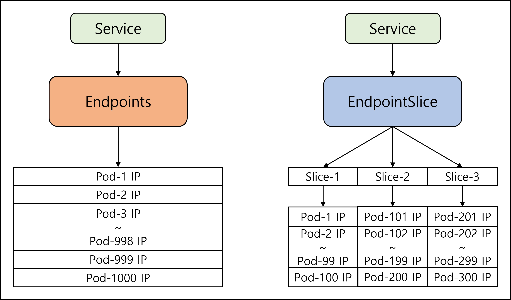

# Endpoints and Endpoint Slices

Kubernetes'te bir Service oluşturduğunuzda, bu servisin gelen trafiği doğru Pod'lara yönlendirdiğini biliyoruz. Ancak Service'in kendisi aslında oldukça "aptal" bir nesnedir; sadece sabit bir IP adresinden ibarettir. Hangi Pod'un nerede çalıştığını, IP'sinin ne olduğunu veya çöküp çökmediğini bilmez.

Peki trafiği nasıl bu kadar kusursuz yönlendiriyor? İşte Service nesnesinin beyni ve haritası olan Endpoints ve onun modern versiyonu Endpoint Slices burada devreye giriyor.

### 1. Endpoints (Klasik Telefon Rehberi)

<figure><figcaption></figcaption></figure>

Siz bir Service oluşturduğunuzda, Kubernetes arka planda sizin ruhunuz bile duymadan o servisle aynı isme sahip bir `Endpoints` nesnesi yaratır.

Bu nesneyi şirketin ana telefon rehberi olarak düşünebilirsiniz. Service'in `selector` etiketlerine uyan tüm Pod'ların güncel IP adresleri ve port numaraları bu rehbere yazılır. Bir Pod silindiğinde veya yeni bir Pod eklendiğinde, Kubernetes Control Plane bu rehberi anında günceller.

Sisteminizdeki bir servisin arka planda hangi Pod IP'lerine bağlandığını görmek için şu komutu kullanabilirsiniz:

```bash
kubectl get endpoints my-service -o yaml
```

Örnek Çıktı:

```bash
subsets:
- addresses:
  - ip: 10.244.1.172     # Trafiğin gideceği 1. Pod
    nodeName: worker-1
  - ip: 10.244.1.173     # Trafiğin gideceği 2. Pod
    nodeName: worker-2
  ports:
  - name: HTTP
    port: 80
    protocol: TCP
```

#### Klasik Endpoints'in Çöküşü

Küçük ve orta ölçekli sistemlerde bu tek parça rehber kusursuz çalışır. Ancak sisteminiz büyüdüğünde ve bir servisin arkasında binlerce Pod çalışmaya başladığında büyük bir mimari kriz ortaya çıkar.

* Sorun: Bir Endpoints nesnesi en fazla 1.000 adet IP adresi tutabilir.
* Darboğaz: Daha da kötüsü, bu nesne tek bir blok halindedir. Eğer arkadaki 1.000 Pod'dan sadece 1 tanesi bile silinip yeni IP alırsa, Kubernetes o devasa listenin tamamını baştan yazar ve ağdaki tüm Node'lara bu devasa dosyayı tekrar tekrar gönderir. Bu durum, büyük sistemlerde (Örn: Trendyol, Netflix gibi büyük Cluster'larda) Kubernetes'in beynini (etcd ve API Server) aşırı yorarak sistemi kilitlenme noktasına getirir.

***

### 2. Endpoint Slices (Yeni Nesil Parçalı Rehber)

<figure><figcaption></figcaption></figure>

Kubernetes mühendisleri bu darboğazı çözmek için v1.21 sürümüyle birlikte Endpoint Slices mimarisini standart hale getirdiler.

Nasıl Çalışır?

Tek ve devasa bir telefon rehberi tutmak yerine, rehberi küçük "klasörlere" böldüler. Varsayılan olarak her bir Endpoint Slice nesnesi içinde maksimum 100 adet Pod IP'si barındırır. Eğer 300 Pod'unuz varsa, Kubernetes tek bir dosya yerine 3 ayrı dilim (Slice) oluşturur.

```bash
kubectl get endpointslices my-service-uid -o yaml
```

Bu Mimari Bize Ne Kazandırdı?

* 1.000 IP sınırı ortadan kalktı. Artık tek bir servisin arkasında on binlerce Pod'u sorunsuz çalıştırabilirsiniz.
* Performans: 300 Pod'dan 1 tanesinin IP'si değiştiğinde, Kubernetes artık tüm listeyi güncellemek zorunda kalmaz. Sadece o IP'nin bulunduğu 100 kişilik ilgili dilimi (Slice) günceller. Bu, ağ trafiğinde ve işlemci yükünde muazzam bir tasarruf sağlar.

#### Ekstra Bir Süper Güç: Topoloji (Topology Aware Routing)

Endpoint Slices sadece listeyi bölmekle kalmaz, aynı zamanda Pod'ların coğrafi konumlarını da kaydeder. Peki Kubernetes fiziksel bir GPS'i veya haritası olmadan bir Pod'un nerede olduğunu ve nereye "yakın" olduğunu nasıl anlar? Müşteriden gelen bir isteğin nerede olduğunu nasıl tespit eder?

1\. Sistem "Yakınlığı" Nasıl Biliyor? (GPS Değil, Etiketler!) Dışarıdan gelen bir web isteğinin üzerinde "Ben İstanbul'dan geliyorum" yazmaz. Kubernetes'in yakınlık anlayışı, isteğin kendisine değil, isteği karşılayan Sunucu'nun (Node) üzerindeki etiketlere dayanır.

Kubernetes'te "yakınlık", sunuculara (Node'lara) yapıştırılan standart Bölge (Region) ve Alan (Zone) etiketlerinin eşleşmesi demektir. Senaryomuz şu olsun:

* Sunucu A: `zone: istanbul` _(Müşterinin isteğinin sisteme ilk girdiği sunucu veya Frontend uygulamasının çalıştığı sunucu)_
* Sunucu B: `zone: istanbul` _(Backend Pod-1 burada)_
* Sunucu C: `zone: ordu` _(Backend Pod-2 burada)_

2\. Trafik Yakındakine Nasıl Yönlendirilir? Bu zekice yönlendirmeyi biz manuel olarak kodlamıyoruz; her sunucunun içinde çalışan kube-proxy adında yönlendirici otomatik olarak yapıyor. Ancak sistemin bu inisiyatifi alabilmesi için Service YAML dosyamıza sadece ufak bir not (`service.kubernetes.io/topology-mode: Auto`) eklememiz yeterlidir.

Süreç şöyle işler:

1. Müşterinin isteği sisteme Sunucu A üzerinden giriş yapar.
2. Sunucu A'nın içindeki kube-proxy paketi eline alır ve kendi kendine şunu söyler: _"Benim bulunduğum sunucunun etiketi `zone: istanbul`. Bakalım Endpoint Slices rehberindeki Backend Pod'ları arasında da `zone: istanbul` etiketine sahip olan var mı?"_
3. Listede Sunucu B'deki Pod'u görür. İsteği ta Ordu'daki (Sunucu C) Pod'a göndermek yerine, kendiyle aynı etikete sahip olan, yani aynı veri merkezinde bulunan Sunucu B'ye teslim eder.

Bu Bize Ne Kazandırır? İsteği rastgele olarak uzak bir sunucuya gönderip ağ gecikmesi (latency) yaşamak yerine, trafiği aynı veri merkezi (zone) içinde tutarak sitenizi inanılmaz derecede hızlandırır. Ayrıca bulut sağlayıcıların (AWS, Google Cloud vb.) farklı veri merkezleri arasındaki veri transferi için kestiği o yüksek ağ faturalarını engeller.

***

### Özetle Farkları Nelerdir?

| **Özellik**        | **Endpoints (Eski/Klasik)**                                        | **Endpoint Slices (Yeni/Modern)**                                  |
| ------------------ | ------------------------------------------------------------------ | ------------------------------------------------------------------ |
| Kapasite Sınırı    | Maksimum 1.000 Pod IP'si tutabilir.                                | Sınır yoktur (Çoklu dilimler halinde çalışır).                     |
| Güncelleme Yükü    | Tek bir IP değişse bile tüm liste baştan yazılır ve ağa dağıtılır. | Sadece değişikliğin olduğu "dilim" (maks 100 IP) güncellenir.      |
| Akıllı Yönlendirme | Coğrafi konum (Topology) yeteneği yoktur.                          | Trafiği en yakındaki Node'a yönlendirecek "Topology Hints" içerir. |

Sonuç:

Siz YAML dosyalarınızda sadece bir `Service` yaratırsınız, ancak arkadaki bu muazzam trafik polisliğini ve haritalandırmayı `Endpoint Slices` sessizce halleder.

