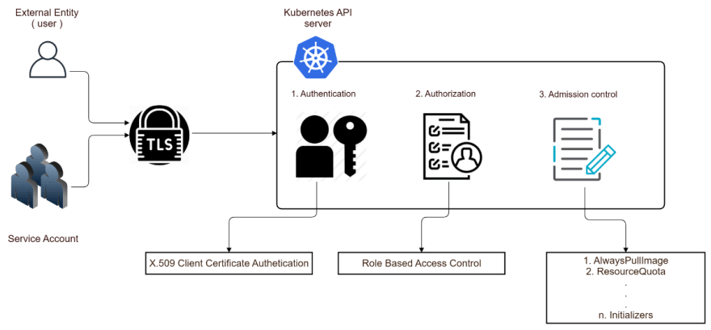

# 🔐 Authentication



Kubernetes kimlik doğrulama eklentileri arayıcılığıyla API isteklerinin kimliğini doğrulamak için, istemci sertifikaları, tarayıcı belirteçleri bir kimlik doğrulama proxy veya HTTP temel kimlik doğrulaması için kullanır.

API 'da bir kullanıcı objesi bulunmamasına rağmen, Cluster 'ın Certificate authority tarafından imzalanmış geçerli bir sertifika sunan herhangi bir kullanıcı (CA) kimliği doğrulanmış olarak kabul edilir. Bu yapılandırmada kubernetes sertifikanın konu kısmındaki ortak ad alanından, kullanıcı adını belirler. Misal, "/CN=bob"&#x20;

Oradan rol tabanlı erişim denetimi (RBAC) alt sistemi, kullanıcının bir kaynak üzerinde, belirli bir işlemi gerçekleştirme yetkisine sahip olup, olmadığını belirler.

Çoğu Enterprise uygulama 'da kullanıcı yönetiminin, uygulama içerisinden yönetildiğine şahit olmuşsunuzdur. Hemen hemen her platformun ayrı bir kullanıcı oluşturma ve yönetme bölümü bulunur. Sistem yönetimi ile uğraşan kişiler de, buradan yeni kullanıcılar oluşturabilir ve her yeni kullanıcı birer obje şeklinde oluşturulur.

Fakat bu iş, Kubernetes de böyle değildir. Kubernetes normal kullanıcı hesaplarının yaratıp, yönetebileceğimiz bir altyapı sunmaz. Yani Kubernetes üstünde gidip, ali,ayse,ahmet vb.. şeklinde kullanıcılar yaratamayız.

Pod gibi yada servis gibi oluşturabileceğimiz bir user objesi de bulunmaz. Kubernetes de kullanıcı oluşturma ve kimlik doğrulama işi, cluster dışında halledilecek şekilde tasarlanmıştır.&#x20;

Kubernetes X509 client certs-Static token file-OpenID connect tokens-webhook token- authentication proxy gibi altyapılardan birini yada birkaçını kullanarak, bu işin dışarıda halledilmesine imkan sağlar.&#x20;

Kubernetes kurulumunda, kube api server ayarlarında, bu altyapılardan hangilerini kullanacağımızı belirleriz ve bu kimlik doğrulama işini, bu altyapılara havale ederiz. Bunun yanında, her kubernetes cluster 'ında bir kök sertifika yetkilisi, yani Root Certificate authority altyapısı da bulunur.&#x20;

Bu Root Certificate authority tarafından imzalanan x509 client sertifika authentication için kullanılır. Kubernetes bu ve diğer altyapılar tarafından kimliği doğrulanmış kullanıcıların kubernetes ile görüşmesine imkan verir.

Fakat iş burada elbette bitmez, kimliğin doğrulanması bir kullanıcının cluster üstünde, her şeyi yapabilmesi-yapabileceği anlamına gelmez. Burada yetkilendirme yani, authorization kavramı devreye girer. İlerleyen yazılarda bahsedeceğiz.&#x20;

Az önce belirttiğim gibi, biz bu kimlik doğrulama altyapısının ne olacağını kubernetes kurulumunda belirlememiz gerekir. Fakat manuel bir kubernetes kurmak yerine, kubernetes dağıtımları yada Cloud servis sağlayıcıların sunduğu yönetilen kubernetes servisleri kullanıyorsanız, bu işlemler bizim adımıza otomatik olarak yapılır.

Örneğin, minikube varsayılan olarak, x509 client sertifikaları ile kimlik doğrulama yapacak şekilde ayarlanır. Biz minikube start dediğimiz zaman, admin yetkisine sahip bir kullanıcı olan minikube kullanıcısı için, sertifikalar hazırlanır ve kubectl config dosyamızın içerisine bu bilgiler girilir. Biz de kubectl command line ile kubernetes cluster 'mızda erişmek istediğimiz zaman, her seferinde bu sertifikalar ile kimliğimizi doğrulanmış olarak istek göndeririz.

Yada Azure üzerinde EKS kurduğumuz zaman, kurulumda seçenekleri belirleyerek, hem x509 client sertifikaları hem de, Azure active directory üzerinden authenticated olma imkanı sunuyor. Uzun lafın kısası, kubernetes kullanıcı oluşturma ve kullanıcı doğrulama işlemlerini, kendi üzerinde barındırmaz. Bunu dışarıda halledebileceğimiz seçenekler olarak sunar. Kendi üzerinde barındırmazdan kasıt şudur; biz gidip bir pod oluşturur gibi, bir servis objesi oluşturur gibi, veya herhangi bir obje oluşturur gibi kullanıcı oluşturamayız.

#### x509 Client sertifika oluşturma örneği;

Yeni bir firmada developer olarak işe başladık ve firmanın kubernetes clusterına bağlanmak istiyoruz. İlk olarak developer rolünü oynuyoruz. Ben ekibe yeni katılmış bir developerım ve Kubernetes cluster'a bağlanarak işlemler yapmak istiyorum.&#x20;

Kubernetes cluster'ı yöneten admine gittim ve bu isteğimi söyledim. O da bana, Kubernetes cluster'ın,  X509 Client sertifikları ile authenticated olacak şekilde çalıştığını söyledi. Ve eğer ben, bir private key ve CSR dosyası oluşturup, admine iletirsem, o Kubernetes Certificate authority kullanarak, bunu imzalayacak ve bana sertifika yaratabileceğini söyledi.

Şimdi bu Key ve CSR dosyamızı oluşturalım;

```bash
#Key ve CSR 'ı saklayacağımız dizini oluşturup, içerisine gidiyoruz.
mkdir auth-certs && cd auth-certs/

#KEY
openssl genrsa -out onrblt.key 2048
# Yukarıda oluşturduğumuz anahtarı kullanarak CSR oluşturmamız gerekiyor.
# CSR bizlerin Certificate authority(sertifika sağlayıcı)ya gönderip, bak bana bu özelliklerde bir dijital sertifika oluştur dememize imkan veren dosyalardır.
# Bu dosyayı oluşturup, ardından bunu kubernetes admine göndereceğiz, o da Kubernetes 'in Certificate authority ile bunu onaylayıp, imzalayarak, bizim sertifikamızı oluşturaracak.
# Ve bize bir sertifika gönderecek işte bizde bu sertifika ile cluster'a bağlanacağız.

#CSR
openssl req -new -key onrblt.key -out onrblt.csr -subj "/CN=onur@onurbolatoglu.com/O=DevTeam" 
# "-subj" opsiyonu ile bizler birnevi sertifika bilgilerini giriyoruz.
# Kubernetes de bu kısım önemli. Çünkü burada CN ile belirlediğimiz değer, kullanıcı adımız olacak. 
# "O" ile belirlediğimiz değer, bu kullanıcının hangi gruplara üye olacağını belirler.
```

\-subj : Daha önce söylediğimiz üzere, kubernetes kendi içerisinde bir kullanıcı objesi tutmaz, sizin hangi kullanıcı olduğunuzu x509 sertifikalarında, bu alanlardan algılar. Bu nedenle bizler hangi kullanıcı adına sahip olmak istiyorsak ve bu kullanıcıyı eklemek istediğimiz gruplar varsa, bunları CSR oluşturma aşamasında " -subj " parametresinde belirtiyoruz.

Yukarıdaki komutlarla hem CSR hem de key dosyasını oluşturduk ve artık developer olarak işimiz bitti. Bu oluşturduğumuz CSR dosyasını kubernetes admine göndereceğiz ve sonraki işleri Kubernetes admin halledecek.

#### Kubernetes Admin kısmına geçersek;

Temel olarak, developer'ın ilettiği CSR 'ı kullanarak bir sertifika üreteceğiz. CSR'ı kopyaladığımız dizine geçiyoruz, Bu noktada bir kubernetes objesi yaratacağız. " CertificateSigningRequest " adında bir obje oluşturacağız. Bu obje ile, Developer'ın bize verdiği CSR'ı kubernetes'e göndereceğiz ve kubernetes de bize sertifika oluşturacak.

```bash
cat <<EOF | kubectl apply -f -
apiVersion: certificates.k8s.io/v1
kind: CertificateSigningRequest
metadata:
  name: onrblt
spec:
  groups:
  - system:authenticated
  request: $(cat onrblt.csr | base64 | tr -d "\n")
  signerName: kubernetes.io/kube-apiserver-client
  usages:
  - client auth
EOF
```

```bash
kubectl get csr 
#Yukarıdaki komut ile oluşturduğumuz CSR'ı görüntüleyebiliriz.

kubectl certificate approve onrblt
#Yukarıdaki komut ile görüntülediğimiz CSR'ı kabul edelim ve sertifikayı oluşturalım.

kubectl get csr onrblt -o jsonpath='{.status.certificate}' | base64 -d >> onrblt.crt
#Yukarıdaki komut ile, oluşturduğumuz sertifikayı decode ederek "onrblt.crt" adındaki dosyaya yazdıralım ve developer arkadaşa bu dosyayı verebiliriz.
 
```

Biz bu sertifikayı kullanarak kubectl config'de context oluşturmalıyız.&#x20;

```bash
kubectl config set-credentials onur@onurbolatoglu.com --client-certificate=onrblt.crt --client-key=onrblt.key
#Yukarıdaki komut ile bir kubectl'de bir user ve sertifikalarını tanımlıyoruz.

kubectl config set-context onrblt-context --cluster=kubernetes --user=onur@onurbolatoglu.com
#Yukarıdaki komut ile bir kubectl context'i oluşturuyoruz. (Kullanıcı bilgilerini ve cluster bilgisini vererek)

kubectl config use-context onrblt-context
#Yukarıdaki komut ile mevcut context'i, az önceki oluşturduğumuz context ile değiştiriyoruz.
```

Böylelikle cluster'a yeni context (yeni kullanıcı) bilgileriyle bağlanabiliriz. Fakat bu bilgilerle uzak bir cluster'a bağlanacaksak,

```bash
kubectl config set-cluster kubernetes --server=https://10.90.0.170:6443  
#Yukarıdaki komut ile yeni bir cluster tanımlayıp, kubernetes ismini veriyoruz.

kubectl config set-cluster kubernetes --insecure-skip-tls-verify  
#Yukarıdaki komut ile olası TLS hatalarını görmezden gelmesini istiyoruz.

# Ardından onur@onurbolatoglu.com kullanıcısı ile, 10.90.0.170 üzerinde bulunan 
# kubernetes cluster'ımıza erişebiliriz. Yani artık çalıştırdığımız tüm komutlar 
# onur@onurbolatoglu.com kullanıcısı ile kubernetes takma isimli cluster'da
# çalıştırılmış olacaktır.
```


Yeni kullanıcı ile cluster'a bağlandığımızda hiç bir işlem yapamayız. Bunun için yetkilendirme yapılması gerekir. (RBAC)


Şu ana kadar yaptığımız işlemler, bir kullanıcının kimlik doğrulaması yapılarak kubernetes 'e bağlanmasını sağlamak ile alakalıydı. Kimliği desteklenen ve ayarlanan yöntemlerle doğrulanan her kullanıcı kubernetes cluster'a erişebilir. Fakat her kullanıcı varsayılan olarak sıfır yetkiyle gelir. Listeleme dahil hiçbir işlem yapamaz.  Kullanıcı authenticated oldu fakat, authorization 'ı kısıtlı. Bir sonraki yazıda buna değineceğiz.


