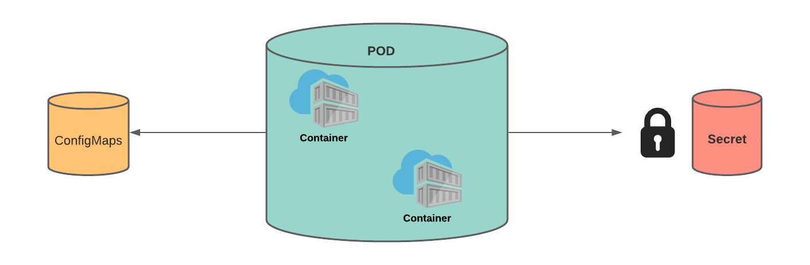

# 🌂 ConfigMap



ConfigMap, gizli olmayan verileri key/value eşlenikleri şeklinde depolamak için kullanılan bir API nesnesidir. Podlar, ConfigMap'i environment variable, komut satırı argümanları veya yapılandırma dosyaları olarak kullanabilirler.&#x20;

ConfigMap objeleri, secret objeleri ile birebir aynı işe yarar. Key/Value şeklinde veriler tutup, bunları podlara environment variable yada volume olarak aktarabiliriz. Kubelet ve yaml dosyalarıyla oluşturulur. Secret ile aynı şekilde oluşturulur.

ConfigMap de gizli olmayan, fakat yine de pod tanımından ayırmamız gereken konfigürasyon verileri tarzı bilgileri tutarız. Yani gizli olmasını istediğimiz veriyi, secret objesinde tutarız. Gizli olmasına gerek olmayan verileri "configmap" objesinde tutarız.


ConfigMap 'de veriler, base64 encode edilmiş şekilde saklanmaz.


Imperative olarak ConfigMap objelerinin oluşturulması,

```bash
kubectl create configmap "configmap_ismi" --from-literal="anahtar"="değer" --from-file="anahtar"="değerin_okunacagi_dosya" --from-file="değerin_okunacagi_dosya"

kubectl create configmap myconfigmap--from-literal=db_server=db.example.com --from-file=db_server=server.txt --from-file=config.json
```

ConfigMap objelerinin listelenmesi,

```bash
kubectl get configmap
```

ConfigMap objelerinin silinmesi,

```bash
kubectl delete configmap "configmap_ismi"

kubectl delete configmap my-configmap
```

Örnek, ConfigMap yaml dosyası.

```yaml
apiVersion: v1
kind: ConfigMap
metadata:
  name: myconfigmap
data:
  db_server: "db.example.com"
  database: "mydatabase"
  site.settings: |
    color=blue
    padding:25px
---
apiVersion: v1
kind: Pod
metadata:
  name: configmappod
spec:
  containers:
  - name: configmapcontainer
    image: ubuntu
    env:
      - name: DB_SERVER
        valueFrom:
          configMapKeyRef:
            name: myconfigmap
            key: db_server
      - name: DATABASE
        valueFrom:
          configMapKeyRef:
            name: myconfigmap
            key: database
    volumeMounts:
      - name: config-vol
        mountPath: "/config"
        readOnly: true
  volumes:
    - name: config-vol
      configMap:
        name: myconfigmap
```



