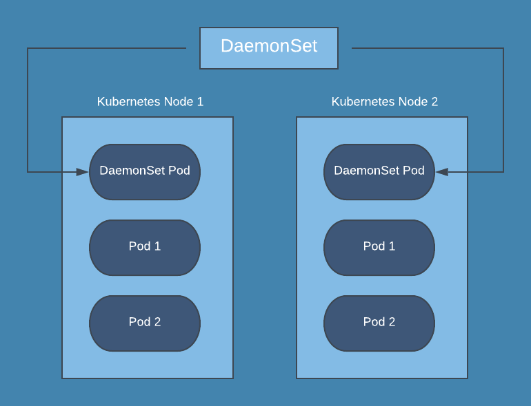

# 🔦 DaemonSet



Misal 20 worker node'dan oluşan bir kubernetes clusterımız mevcut,  bizim bu worker nodeların tamamında çalışması gereken bir uygulamamız var. Biz bu worker nodelarda oluşan logları merkezi bir log sunucusuna göndermek istiyoruz.

Her bir worker node da bir uygulama çalıştıracağız ve bu uygulama o worker node da oluşan logları toplayacak ve merkezi log sunucusuna gönderecek.

Tek, tek tüm worker loglara bağlanıp, bu uygulamayı buraya kurup ayarlayabiliriz. Ancak bu da fazlasıyla iş yükü çıkartacaktır. 2.seçenek olarak, bu uygulamayı bir container imajı haline getiririz, ardından gerekli ayarların olduğu 20 pod tanımı yaparız, her birine node affinity ekleyip ve bu podları ayrı ayrı worker nodelar üstünde çalışacak şekilde deploy ederiz. Ancak bu senaryoda da yeni worker nodelar eklediğinde tüm bu işlemleri tekrar etmemiz gerekecektir.

Burada bize çözüm için, DaemonSet yardımcı olmaktadır.

DaemonSet, tüm (veya bazı) node'ların bir podun bir kopyasını çalıştırmasını sağlar. Cluster'a yeni node eklendikçe yeni eklenen bu worker nodelara da bu podlar eklenir. Cluster'dan node kaldırıldığında/silindiğinde bu podlarda kaldırılır. Bir daemonset silindiğinde, oluşturduğu podlar da silinecektir.

DaemonSet, Deployment objesine benzer bir kubernetes objesidir. Bir daemonset objesi oluşturulduğumuz zaman DaemonSet sistemdeki tüm nodelar üstünde template altında belirttiğimiz pod tanımına göre bir pod oluşturulur.  Varsayılan olarak, her node üstünde bir pod oluşturulur. Fakat biz bunu değiştirerek sadece belirli tiplerdeki node'lar üstünde oluşturulmasını sağlayabiliriz.

DaemonSet, her node da çalışmasını istediğimiz Log toplama uygulamaları, Storage Provision uygulamaları gibi uygulamaları kolay bir şekilde deploy edilmesini sağlar. Bizlerin bu tarz uygulamaları ayağa kaldırmak için tek, tek tanım yapmamız yerine, Bir daemonset oluşturarak, uygulamaları deploy etmemiz bize şu avantajları sağlar;

\=> İş yükü hafifler ve iş çok basite indirgenir.\
\=> Her yeni eklenen node için tekrar, tekrar ayar yapmamıza gerek kalmayacak. Çünkü daemonset sistemde yeni bir node tespit ettiği zaman, o node içerisinde bir pod oluşturup, uygulamanın orada da çalışmasını otomatize eder.

DaemonSet tanımı Deployment Objesine çok benzer bunu yukarıda da belirtmiştik. DaemonSet oluştururken bir yaml dosyasında istediğimiz özellikleri gireriz. Burada Deployment 'dan önemli bir farkı Deployment objesinde bulunan rollout özelliklerinden faydalanamıyoruz.


```yaml
apiVersion: apps/v1
kind: DaemonSet
metadata:
  name: logdaemonset
  labels:
    app: fluentd-logging
spec:
  selector:
    matchLabels:
      name: fluentd-elasticsearch
  template:
    metadata:
      labels:
        name: fluentd-elasticsearch
    spec:
      tolerations:
      # this toleration is to have the daemonset runnable on master nodes
      # remove it if your masters can't run pods
      - key: node-role.kubernetes.io/master
        effect: NoSchedule
      containers:
      - name: fluentd-elasticsearch
        image: quay.io/fluentd_elasticsearch/fluentd:v2.5.2
        resources:
          limits:
            memory: 200Mi
          requests:
            cpu: 100m
            memory: 200Mi
        volumeMounts:
        - name: varlog
          mountPath: /var/log
        - name: varlibdockercontainers
          mountPath: /var/lib/docker/containers
          readOnly: true
      terminationGracePeriodSeconds: 30
      volumes:
      - name: varlog
        hostPath:
          path: /var/log
      - name: varlibdockercontainers
        hostPath:
          path: /var/lib/docker/containers
```


Yukarıdaki daemonset template yaml dosyasını kubernetes API'na gönderdiğimiz zaman, daemonset objesi oluşturulacak ve daemonset template altında gördüğümüz özelliklerde birer podu nodelar üzerinde çalıştırmaya başlayacak.&#x20;

İlk olarak deployment objesindeki gibi, daemonset 'de label selector tanımı mevcuttur ve daemonset oluşturacağı podları bu selector'e göre seçer. Bu nedenle, aynı label tanımının spec kısmında da olması gerekmektedir.

Bizler kendi kurduğumuz clusterlarda yada cloud servis sağlayıcılarda master nodelarda pod çalıştırmayız.  Master nodelarda "node-role.kubernetes.io/master:NoSchedule" şeklinde bir taint eklidir. Dolayısıyla bunu tolere edecek bir tanım ekli değilse, pod master node üzerinde schedule edilmez.

Biz bir DaemonSet oluşturuyoruz, Eğer biz DaemonSet 'i sadece worker nodelarda pod oluşturmasını istiyorsak, o zaman bir şey eklememize gerek yok. Ama bizim DaemonSet'in, master nodelarda da pod oluşturmasına da ihtiyaç duyuyorsak, o zaman bu tolerations tanımını bu yaml dosyasına eklememiz gerekmektedir.

Yaml dosyasında da gördüğünüz üzere, bu daemonset fluentD isimli imajdan podlar oluşturacak. Bu uygulama kubernetes dünyasında iyi bilinen log toplama aracıdır.&#x20;

Yaml dosyamızdan DaemonSet objesi oluşturacağız, DaemonSet yukarıdaki tanımlara göre tek, tek podları oluşturacak. Tolerations tanımımız olduğu için, master node'larda dahil, sistemdeki tüm node'larda bu podlar oluşturulacak.&#x20;


Fakat bazen biz, sadece bazı tip nodelarda pod oluşturan bir daemonset de oluşturmak isteyebiliriz. Örneğin, log uygulamamızın sadece production için oluşturulan node'larda çalışmasını, test podlarımızın koştuğu ve onlara ayrılmış node'larda çalışmamasını isteyebiliriz. Bu şekilde belirli node'larda kısıtlama yapmak istiyorsak, bu tanıma nodeselector veya node affinity yanında, taint ve tolerations tanımlarıda ekleyerek bunu sağlayabiliriz.

<mark style="color:red;">Varsayılan olarak DaemonSet, her node üzerinde istediğimiz POD'u oluşturacaktır.</mark>
