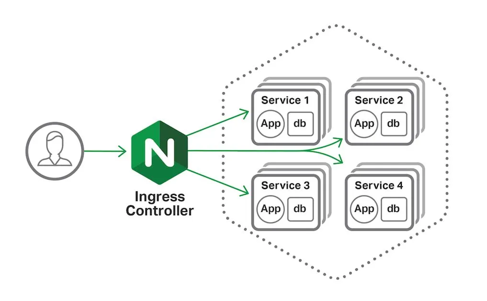

# 📈 Ingress

<figure><figcaption></figcaption></figure>

Service bölümünde, uygulamalarımızın dış dünyadan erişilebilmesi için, node port ve Load balancer tipinde servislere sahip olduğumuzu görmüş ve bunların detaylarını işlemiştik. Fakat bu yöntemlerin ikisi de OSI layer 'da yani IP layer' da çalıştıkları için bizlerin bazı sorunlarını çözmüyor.&#x20;

Bu bölümde öncelikle bu sorunları tek, tek tanımlayalım ardından da bu sorunların çözümü olan, Ingress controller ve ingress objelerini görelim. İlk olarak sorunu tanımlayalım;

Azure, Google, AWS gibi bir servis sağlayıcı üstünde yönetilen kubernetes hizmetlerinden, birini kullandığımızı varsayalım. Misal, Azure kubernetes service. Bu kubernetes cluster üstünde, bir uygulama deploy ettik ve uygulamayı da dış dünyadan erişilebilmesi için, Load balancer tipi bir servis ile expose ettik.

Load Balancer tipi bir service oluşturduğumuz zaman ne oluyordu?

Azure bizim için, bir load balancer yaratıp buna public bir IP atıyordu. Ve bu IP adresine gelen tüm istekleri bu servise yönlendiriyordu. Biz de bu IP adresi ile, bu servisin domaini DNS ile eşleştirerek kullanıcıların erişmesini sağlıyoruz.

Aynı kubernetes cluster da 2.bir uygulama deploy ettiğimizi ve aynı şekilde Load Balancer tipi bir servis ile dış dünyaya açtığımızı düşünün, aynı süreç işleyecek Azure bir Load Balancer daha yaratacak, bir tane daha public IP olacak. 3. bir servis yaratmak istersek, yine aynısı olacak. Bu süreç her yeni uygulama yayınlamak istediğimizde aynı şekilde devam edecek. Özetle 30 servisim varsa, 30 tane Load balancer olacak.&#x20;

Her bir load balancer için, ayrı ayrı para ödememiz gerekiyor. Bu ciddi problem. Her servis için ayrı bir servis oluşturursak, belirli bir zaman sonra işin içinden çıkamayız. Bu bizim ilk sorunumuz.

2\. sorunumuz ise, bizim micro servis mimarisinde bir uygulamamızın olduğunu düşünelim. Bu uygulama da şöyle çalışıyor; eğer kullanıcılar "www.example.com" şeklinde root path'e gelirlerse, "A" uygulamasına tarafından sayfa sunuluyor.&#x20;

Fakat kullanıcı "www.example.com/about" adresine gelirse, bu sayfa "B" uygulaması tarafından, sunuluyor.  Bu durumda, mevcut load balancer servisi ile ile bizim bu ortamı kurgulamamız imkansız çünkü, DNS'de www.example.com/about şeklinde path base olarak tanımlama yapamayız.  DNS 'de bu mümkün değil, bizim bir şekilde kullanıcı isteklerini bir yerde karşılayıp ve kullanıcının gitmek istediği URL anlayıp, buna göre arkada hangi servise gitmesi gerekiyorsa, ona yönlendirmem gerekiyor.

Uzun lafın kısası, bizim standart sadece IP ve port base yönlendirme yapan, L4 load balancer yerine, L7 de çalışan, application based load balancer'a ihtiyacımız var. Anlatıığım bu 2 sorun da, kubernetes dünyasında ingress controller ve ingress objeleri ile çözüyoruz.

Ingress controller, L7 application load balancer kavramının kubernetes spesifikasyonlarına göre çalışan ve kubernetes de deploy ederek kullanabildiğimiz türüdür. Nginx,Haproxy,Trafeik en bilinen ingress controller uygulamalarıdır.&#x20;

Özetle, hepsinin yaptığı iş aynıdır. Biz öncelikle bunlardan bir tanesini seçip ve yönergelerini takip ederek ingress controllerı kubernetes clusterımıza kuruyoruz. Bu kurulumu yaptıktan sonra, eğer cloud üstünde çalışıyorsak, bu ingress controller dış dünyaya bir load balancer servisi ile expose oluyor ve public bir IP adresine sahip oluyoruz. Bu noktadan itibaren, artık dış dünyadan kubernetes'e erişim sadece bu IP üstünden sağlanıyor. Sonrasında ise, bu ingress controller'ın, konfigürasyonunu yani, servislerimize dış dünyadan hangi URL üstünden, nasıl ulaşacak kısmını ise, Ingress objeleri dediğimiz objeler arayıcılığıyla belirliyoruz.

<figure><figcaption></figcaption></figure>

Ingress objeleri bizim, ingress controller'ı kubernetes objeleri arayıcılığıyla ayarlamamızı sağlıyor. Genellikle HTTP olarak üzere, bir clusterdaki servislere harici erişimi yöneten bir API nesnesidir.

Yük dengeleme, SSL sonlandırması ve path base routing özelliklerini destekler.

L7 application load balancer 'mız olan ingress controller 'a bağlanarak, "www.example.com" A uygulamasına ve "www.example.com/about" gelen istekleri B uygulamasına,  www.example2.com adresine gelen istekleri C uygulamasına yönlendir şeklinde o uygulamanın menülerine, özelliklerini kullanıp ayar yapmak yerine, tüm bu istekleri ingress objesi şeklinde oluşturuyoruz. Deploy ettiğimiz zaman, ingress controller bu objeyi okuyarak, gerekli düzenlemeyi otomatik olarak yapıyor.

Ingress controller bizlere, L7 application load balancer'ların sunduğu, SSL,Path based routing vb. bir çok özelliği kubernetes objeleri olarak deploy edebilmemize olanak sağlıyor.

Ingress için öncellikle, bir ıngress controller kurulması gerekiyor. Bir çok ıngress controller mevcut. Ama bunların genelde 2 tanesi öne çıkmış durumda,

1 => Nginx\
2 => Trafeik

Biz nginx ile devam edeceğiz, Nginx'i kubernetes cluster'a nasıl kurabiliriz?

Her ingress controller kurulumu farklıdır. Parametreleri kurulduğu yere göre, aldığı opsiyonlara göre değişebilir. O nedenle bu gibi kurulumların detaylarını ingress controller 'ın kendi dökümantasyonundan öğrenebilirsiniz.

Minikube için Nginx ingress controller kurulumu;



Uygulama;

```yaml
apiVersion: apps/v1
kind: Deployment
metadata:
  name: blueapp
  labels:
    app: blue
spec:
  replicas: 2
  selector:
    matchLabels:
      app: blue
  template:
    metadata:
      labels:
        app: blue
    spec:
      containers:
      - name: blueapp
        image: ozgurozturknet/k8s:blue
        ports:
        - containerPort: 80
        livenessProbe:
          httpGet:
            path: /healthcheck
            port: 80
          initialDelaySeconds: 5
          periodSeconds: 5
        readinessProbe:
          httpGet:
            path: /ready
            port: 80
          initialDelaySeconds: 5
          periodSeconds: 3
---
apiVersion: v1
kind: Service
metadata:
  name: bluesvc
spec:
  selector:
    app: blue
  ports:
    - protocol: TCP
      port: 80
      targetPort: 80
---
apiVersion: apps/v1
kind: Deployment
metadata:
  name: greenapp
  labels:
    app: green
spec:
  replicas: 2
  selector:
    matchLabels:
      app: green
  template:
    metadata:
      labels:
        app: green
    spec:
      containers:
      - name: greenapp
        image: ozgurozturknet/k8s:green
        ports:
        - containerPort: 80
        livenessProbe:
          httpGet:
            path: /healthcheck
            port: 80
          initialDelaySeconds: 5
          periodSeconds: 5
        readinessProbe:
          httpGet:
            path: /ready
            port: 80
          initialDelaySeconds: 5
          periodSeconds: 3
---
apiVersion: v1
kind: Service
metadata:
  name: greensvc
spec:
  selector:
    app: green
  ports:
    - protocol: TCP
      port: 80
      targetPort: 80
---
apiVersion: apps/v1
kind: Deployment
metadata:
  name: todoapp
  labels:
    app: todo
spec:
  replicas: 1
  selector:
    matchLabels:
      app: todo
  template:
    metadata:
      labels:
        app: todo
    spec:
      containers:
      - name: todoapp
        image: ozgurozturknet/samplewebapp:latest
        ports:
        - containerPort: 80
---
apiVersion: v1
kind: Service
metadata:
  name: todosvc
spec:
  selector:
    app: todo
  ports:
    - protocol: TCP
      port: 80
      targetPort: 80
```

Bu yaml dosyası içerisinde, 3 uygulama deploy ediyoruz. Bu 3 uygulamanın da cluster içerisinden erişilebilir olması için clusterIP tipinde 3 ayrı service objesi oluşturup, uygulamalara atıyoruz.

Bizim bu uygulamaları L7 APP LB üstünden expose etmemiz gerekecek, bunun için gerekli ilk şey ingress controller'dır. Bu ingress controller 'ı minikube kullanıyorsanız yukarıdaki bağlantıya giderek kurulumunu yapabilirsiniz. İngress controller kurulumundan sonra, ingress objeleri oluşturup işlemleri gerçekleştirebiliriz.

```yaml
apiVersion: networking.k8s.io/v1
kind: Ingress
metadata:
  name: appingress
  annotations:
    nginx.ingress.kubernetes.io/rewrite-target: /$1
spec:
  rules:
    - host: k8sfundamentals.com
      http:
        paths:
          - path: /blue
            pathType: Prefix
            backend:
              service:
                name: bluesvc
                port:
                  number: 80
          - path: /green
            pathType: Prefix
            backend:
              service:
                name: greensvc
                port:
                  number: 80
```

Ingress de aynen pod, service gibi bir kubernetes objesidir. Networking.k8s.io/v1 api da bulunuyor. tipi de ingress 'dir.  Bu objenin spec kısmında, kurallar belirleyerek servisleri ingress üstünden dış dünyaya açıyoruz. Bu örnekte k8sfundamentals.com domainine ait bir servis yayınladığımızı söylüyor ve altında 2 path belirtiyoruz. Eğer bu domaine /blue şeklinde bir istek gelirse, bunun blusvc servisinden cevap vermesini, /green pathine istek gelirse, greensvc servisinden cevap vermesini sağlıyoruz.

Annotations kısmı ise, cluster'a deploy ettiğimiz ingress controller üstünde, herhangi bir ayar yapmak isterseniz bunu hemen, hemen tüm ingress controller için annotations arayıcılığıyla yapıyoruz. Misal bu servis dış dünyaya HTTPS olarak açmak isteseydik kullanmak istediğimiz sertifika bilgilerini annotations arayıcılığıyla girecektik. vb. kullanabileceğimiz annotationslara kullandığımız ingress controller dökümantasyonundan ulaşabiliriz.

```yaml
apiVersion: networking.k8s.io/v1
kind: Ingress
metadata:
  name: todoingress
spec:
  rules:
    - host: todoapp.com
      http:
        paths:
          - path: /
            pathType: Prefix
            backend:
              service:
                name: todosvc
                port:
                  number: 80
```

Bu ingress dosyasında da, todoapp.com adresine gelen bütün istekleri todosvc isimli servise gönder diyoruz.

Biz bu ingress objelerini deploy ettiğimiz zaman, Kubernetes tüm bu bilgileri bizim ingress controller'ımıza gönderecek ve orada tüm veriler birleştirilip ilgili ingress controller üzerinde gerekli ayarlamalar yapılacak.

Ek not, eğer sistemde birden fazla ingress controller varsa, '--ingress-class=" argümanı ile kullanmak istediğiniz ingress controller 'ın "ingress-class" değerini öğrenip, bunu ingress objesi dosyasında özellikle belirtip, istediğiniz ingress controller'ı kullanabilirsiniz. Kaynak ve örnek;

<figure><figcaption></figcaption></figure>

```yaml
apiVersion: networking.k8s.io/v1
kind: Ingress
metadata:
  name: todoingresstestv1
  annotations:
    kubernetes.io/ingress.class: "k8s.io/internal-nginx"
spec:
  rules:
    - host: todoappv1.com
      http:
        paths:
          - path: /
            pathType: Prefix
            backend:
              service:
                name: todosvc
                port:
                  number: 80
```






