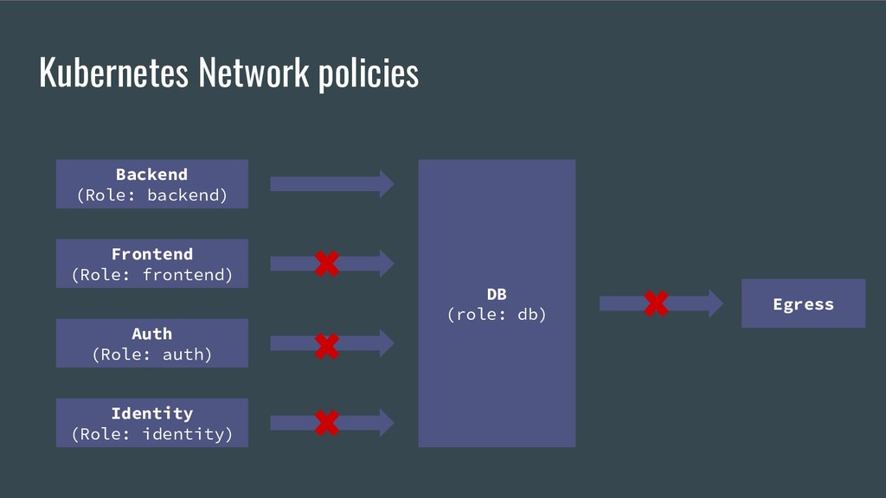

# 🌐 Network Policy

Bölüm öncesi notlar;\



> Kubernetes cluster altında, her podun uniq kendine ait bir IP adresi bulunmaktadır.

> Podlar birbirleri aralarında "nat" olmadan, haberleşebilirler.

> Podlar üzerinde barındığı "worker node'un" erişebildiği her hedefe erişebilir.
>
> Kubernetes cluster'ı altına koyduğumuz, bütün podlar varsayılan olarak, diğer bütün podlar ile haberleşebiliyorlar. IP olarak herhangi bir kısıtlama yok. Podları namespace olarak ayırabiliriz, fiziksel sunucu olarak ayırabiliriz(worker node olarak) fakat gene de varsayılan olarak podlar birbirlerine iletişim kurabilirler. Herhangi bir kısıtlama yok.
>
> Dış dünyadan da, ingress veya LB, NodePort gibi komponentler ile dış dünyadan erişim sağlanabiliyor.&#x20;


Bazı durumlarda, biz bunları kısıtlamak isteyebiliriz. Misal, frontend podu, sadece backend podu ile haberleşebilsin. Frontend podu başka podlar ile konuşamasın veya başka podlardan frontend poduna istek gönderilemesin gibi ayarlamalar yapmamız gerekiyor.

<figure><figcaption></figcaption></figure>

Network policy objesi, bu problemleri ortadan kaldırmak için, bize yardımcı olacak bir kubernetes objesidir. Yani podun başka bir pod ile konuşabilmesi veya başka birinin dışarıdan bu poda erişebilmesi gibi varsayılan durumu, biz "network policy'ler" ile değiştirebiliyoruz. Şöyle örneklendirebiliriz; Bu pod sadece "x" namespace'indeki "y" poduna erişebilsin. Bu pod sadece "z" IP aralığındaki IPlere erişebilsin. Bu poda sadece "abc=def" labelina sahip, podlar erişebilsin gibi kurallar ekleyebiliyoruz. Bu kuralları "network policy" objeleri sayesinde oluşturabiliyoruz.

Network policy olmadan, herhangi bir network policy yaratmadıysak, varsayılan olarak;\
\=> Her pod, diğer podlar ile konuşabilir.\
\=> Her pod, dış dünya ile konuşabilir. (Eğer üzerinde bulunduğu worker node konuşabiliyorsa)\
\=> Herkes dış dünyadan, ingress,Load Balancer,NodePort ile açtıysak, bu podlara dışarıdan erişebilirler. Varsayılan olarak kubernetes'in davranışı budur. Biz bu davranışı değiştirmek istersek yani kısıtlamak istersek, Network policy'lere başvuruyoruz. Varsayılan olarak bir kısıtlama söz konusu değil.

Örnek policy yaml dosyası;

```yaml
apiVersion: networking.k8s.io/v1
kind: NetworkPolicy
metadata:
  name: networkpolicy-example
  namespace: ns-a
spec:
  podSelector:
    matchLabels:
      team: a
  policyTypes:
  - Ingress
  - Egress
  ingress:
  - from:
    - ipBlock:
        cidr: 10.11.0.0/16
        except:
        - 10.11.1.0/24
    - namespaceSelector:
        matchLabels:
          team: b
    - podSelector:
        matchLabels:
          app: frontend
    ports:
    - protocol: TCP
      port: 80
  egress:
  - to:
    - ipBlock:
        cidr: 1.1.1.1/32
    ports:
    - protocol: TCP
      port: 80
```

Bu dosya da, bir network policy tanımlıyoruz ve network policy objemize bir isim veriyoruz. Spec kısmında ise, biz bu network policy objesi ile ilgili ayarları tanımlıyoruz.

Biz bir network policy yaratırız, daha sonrada bu network policy'nin hangi podlar üzerinde etkili olacağını "podSelector" ile seçeriz. Yani ilk olarak network policy'de tanımlamamız gereken, podSelector ayarıdır. Bu selector ayarı sayesinde biz bu oluşturduğumuz network policy'nin, hangi podlar üzerinde etkili olacağını belirtiriz. Hangi podlara bu network policy objesinin atanacağı "podSelector" anahtarı ile belirleriz.

Yukarıdaki örnekte, "ns-a" isimli namespace üzerinde, bir tane network policy oluşturuyoruz. Bu network policy de, bu namespace de bulunan "team=a" isimli label'a sahip olan, bütün podlara atamak istiyoruz. Dolayısıyla biz bu network policy'i, yarattığımız anda bu namespace içerisinde, bu labela(team=a) sahip olan bir pod var ise, bu podu bulacak ve bu network policy'i atayacak.

Network policy içerisinde, policy type belirlemeliyiz. 2 adet policy type mevcut. Bunlar;

1:Ingress, içeriye doğru gelen trafik anlamına gelir. Yani bizim yukarıda podSelector ile seçtiğimiz podlara doğru gelen trafik ile ilgili ayarlar Ingress de yapılır.

2:Egress, yukarıda podSelector ile seçtiğimiz podlardan dış dünyaya gidecek trafik ile ilgilidir.

2 tip policy seçebiliyoruz. ingress ve egress. Yukarıdaki örnekte iki policy type 'da seçtik. Ama sadece ingress veya sadece egress 'de seçebiliriz.

Ingress içeriye gelen trafik, egress dışarıya doğru giden trafik içindir.&#x20;

Daha sonra ingress tanımını yapıyoruz. Bunun için "ingress" şeklinde bir anahtar açıyoruz. Ardından bunun altında, "from" parametresini giriyoruz. Yani nereden biz bu ingress üzerinde izinler oluşturacağız. Bizim burada kullanabileceğimiz 3 parametre mevcut. Örnekte 3 ünüde kullandık fakat hepsini birlikte kullanmak zorunda değiliz.

```yaml
    - ipBlock:
        cidr: 10.11.0.0/16
        except:
        - 10.11.1.0/24
```

İlk tanımda, bizim bu ingress trafiğine hangi IP blokları üzerinden izin vermek istediğimizi belirlediğimiz IPBlock tanımı. yukarıdaki örnekte biz şunu diyoruz. Oluşturduğumuz network policy'nin atandığı podlara bu IP adresi üzerinden(IP bloğu üzerinden) gelen ingress trafiğine port 80 üzerinden izin ver. Yani bu policy oluşturduğumuz zaman,  pod selector ile seçtiğimiz podlara, 10.11.0.0/16 subneti üzerinden 80 portu ile gelinirse, bu trafik bu podlara erişebilecek. Gördüğünüz gibi IP block (cidr) kısmında, IP tanımları yapabiliyoruz. "except" parametresi ile, bu bloğun tamamına izin ver, ama şuna izin verme gibi ayarlar yapmak istersek except ile bunu belirtebiliriz. Yani. 10.11.0.0/16 subnetine izin verirken, 10.11.1.0/24 subnetini dahil etmiyoruz. Böylelikle, 10.11.1.0/24 subnetine izin vermiyoruz. 10.11.1.0/24 haricinde tüm bloklar (10.11.0.0/16 içerisinde bulunan) 80 portu üzerinden, podSelector ile seçtiğimiz podlara erişebilecek. Yani bu seçeneğimizin adı "ipBlock"dur.

```yaml
    - namespaceSelector:
        matchLabels:
          team: b
```

2\. kullanacağımız tanım şekli, namespace üzerindeki labellar üzerinden tanımlayabildiğimiz "Namespace Selector"dür. Yani burada şunu diyoruz; bu oluşturduğumuz network policy'e, git podSelector ile seçtiğimiz podlara ata ve bu podlara "team=b" isimli labela sahip, namespace'deki bütün podlar 80 portu üzerinden erişebilsin.

Yani, "namespaceSelector" ile namespace üzerindeki labellara göre, namespaceleri seçiyoruz. Yani biz network policy'nin atanacağı podlara, namespace  b'den, namespace c'den, namespace d'den, herhangi bir podun erişmesini istiyorsak, tek tek oradaki podları belirtmek, oradaki podların IP adreslerini belirtmek yerine şunu diyebiliriz; Git team=b isimli labela sahip, namespaceleri bul, bu namespaceler içerisinde, bütün podlara bizim network policy'i atadığımız podların veya podun 80 portuna erişebilsin. Şeklinde belirtebiliyoruz. Bunu da 2.seçeneğimiz olan, namespaceSelector ile yapabiliyoruz.


```yaml
- podSelector:
        matchLabels:
          app: frontend
```

3.seçeneğimiz pod selector, bu sefer de spesifik olarak pod seçebiliriz. Yani diyebiliriz ki; app:frontend  labelına sahip,  pod(lar) bu network policy'nin atandığı pod(lar)a 80 portu üzerinden erişebilsin diyebiliyoruz.

Hem ingress, hem egress'de kullanabileceğimiz tanım şekilleri, bu şekilde 3 adettir. Yani biz podSelector ile pod seçeriz, namespaceSelector ile namespace seçeriz. Ya da, IPblock ile erişebilecek IP bloklarını seçeriz.

```yaml
   ports:
    - protocol: TCP
      port: 80
```

Örnekte, ingress 'de "from" tanımı altında, nerelerden erişilebileceğini seçtik ve daha sonra ports kısmında hangi portların açık olacağını seçiyoruz. Dilersek ports kısmında, endport tanımı girersek port aralığı da verebiliyoruz.

Kısacası, ingress anahtarı ile gelen trafiği kısıtlamak için "from" anahtarı kısmında IPblock-namespaceSelector ve podSelector ile, gerekli select işlemlerini yaparak, kime izin vereceğimizi belirtiyoruz. Ardından port kısmında, hangi portlar üzerinden trafik geleceğini belirtiyoruz.

```yaml
egress:
  - to:
    - ipBlock:
        cidr: 1.1.1.1/32
    ports:
    - protocol: TCP
      port: 80
```

Engress kısmında da, yine aynı mantık, yine yukarıda belirttiğim 3 seçeneği de kullanabiliriz. Fakat bu sefer podların dış dünyaya, yani dışa gönderdikleri trafiği kısıtlıyoruz.&#x20;

Bu örnekte, egress olarak network policy'nin atandığı podlardan sadece 1.1.1.1/32 IP adresine 80 portundan erişilebilsin, bunun dışında hiç bir yere erişim izni olmasın şeklinde bir policy oluşturmuş oluyoruz.

Network policy'ler bu şekilde oluşturuluyor. Bu örnekleri kendi ihtiyaçlarımıza göre belirtebiliriz.

Birden fazla policy, bir poda atanabilir. Bir poda yada podlara, birden fazla network policy atanmış ise, bu policylerde oluşturulmuş ingress ve egress kurallarının birleşimi şeklinde atanır. Yani her oluşturulan rule, onun üzerine eklenerek atanır.

```yaml
egress:
  - to:
    - ipBlock:
        cidr: 1.1.1.1/32
    ports:
    - protocol: TCP
      port: 80
```

Network policy kısmında, belirlediğimiz kurallar izin vermek mantığındadır. Yani yukarıdaki örnekte diyoruz ki, 1.1.1.1'e izin ver. Bunun dışında buraya yazılmayan bütün egress trafiği kapatılır.

```yaml
    - ipBlock:
        cidr: 10.11.0.0/16
        except:
        - 10.11.1.0/24
    - namespaceSelector:
        matchLabels:
          team: b
    - podSelector:
        matchLabels:
          app: frontend
    ports:
    - protocol: TCP
      port: 80
```

Aynı şekilde, ingress'de de diyoruz ki, bu IP bloğuna, bu namespace'e, bu poda izin ver. Bunun dışındaki bütün trafiği kapat. Varsayılan olarak network policy atanmamış pod veya podlar, her yerden ve her yere erişilebilir ve erişir. Pod'a network policy atandığı anda, sadece yazılan kurallarda yazılı source ve destination'lar geçerli olur.



