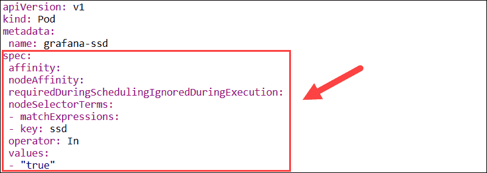

# 🖥 Node Affinity



Node Affinity kavramsal olarak node selector'a benzer ve nodelara atanan etiketlere göre podumuzun hangi node üstünde schedule edilmeye uygun olduğunu kısıtlamamıza olanak tanır.

Podlarımızın, uygun worker nodelar üzerinde oluşturulması için, imkan sunan pod opsiyonlarımızdandır. Node Selector ile çok benzerdir. Aynı şekilde pod tanımına ekleriz. Podumuzun scheduler edileceği node üstünde pod tanımında belirttiğimiz label'in olmasını bekleriz.

Affinity tanımı, pod tanımı içerisinde "affinity" parametresi altında eklenmektedir. Bu parametre altında kullanabileceğimiz 2 seçenek mevcuttur.&#x20;

* requiredDuringSchedulingIgnoredDuringExecution
* preferredDuringSchedulingIgnoredDuringExecution

```yaml
apiVersion: v1
kind: Pod
metadata:
  name: nodeaffinitypod1
spec:
  containers:
  - name: nodeaffinity1
    image: ubuntu
  affinity:
    nodeAffinity:
      requiredDuringSchedulingIgnoredDuringExecution:
        nodeSelectorTerms:
        - matchExpressions:
          - key: app
            operator: In #In, NotIn, Exists, DoesNotExist
            values:
            - blue
---
apiVersion: v1
kind: Pod
metadata:
  name: nodeaffinitypod2
spec:
  containers:
  - name: nodeaffinity2
    image: ubuntu
  affinity:
    nodeAffinity:
      preferredDuringSchedulingIgnoredDuringExecution:
      - weight: 1
        preference:
          matchExpressions:
          - key: app
            operator: In
            values:
            - blue
      - weight: 2
        preference:
          matchExpressions:
          - key: app
            operator: In
            values:
            - red
---
apiVersion: v1
kind: Pod
metadata:
  name: nodeaffinitypod3
spec:
  containers:
  - name: nodeaffinity3
    image: alpine
  affinity:
    nodeAffinity:
      requiredDuringSchedulingIgnoredDuringExecution:
        nodeSelectorTerms:
        - matchExpressions:
          - key: app
            operator: Exists #In, NotIn, Exists, DoesNotExist
```

1. pod tanımında bulunan, requiredDuringSchedulingIgnoredDuringExecution seçeneği, şu demektir. Bu podu oluştururken, mutlaka alta yaptığım eşleşmeye uygun node bul ve bu podu orada oluştur. Uygun bir node bulamazsan, pod oluşturulmasın ve "pending" status da, uygun node bulana kadar beklesin. \
   \
   Bu pod tanımını kubernetes API server'a gönderirsem, şu olacak. Kubernetes tüm worker nodelarda, app=blue şeklinde bir label arayacak. Eğer bu labelin olduğu uygun bir worker node görürse bu podu orada schedule edecek. Tanım required olduğu için, Eğer bu labela sahip bir worker node bulamazsa, schedule edilmeyecek. Pod "pending" de bekleyecek. \
   \
   Kısacası required mutlaka sağlanması gereken eşleşme varsa, onu belirttiğimiz parametredir.&#x20;

Burada operator olarak kullanabileceğimiz birkaç seçenek daha mevcuttur. Bu seçenekler aslında node selector'dan ayrışmasını sağlıyor.\
\
app in blue tanımı yaptığımızda, app anahtarına blue değerinin atanma şartı oluşturuyoruz. Yani pod  app=blue labela sahip, worker node bulursa schedule edilecek.\
\
Fakat burada, "in" yerine "notin" deseydik, Bu sefer pod, üstünde app=blue labeli <mark style="color:red;">tanımlanmamış</mark> bir worker node üstünde oluşturulacaktır.

operator kısmına, "exists" tanımı girseydik, ve değeri silseydik. şu olacaktı; bu podu oluşturmak için, üstünde "app" anahtarı tanımlanmış herhangi bir worker node bul demek olacaktı. Yani value(değeri) kısmı önemli değil.  sadece "app" anahtarı olması yeterli.

DoesNotExists seçeneği ise, tam tersidir.  Üstünde "app" abahtarı olmayan bir worker node bul ve orada çalıştır.

requiredDuringSchedulingIgnoredDuringExecution seçeneğinde, şart sağlanmazsa pod oluşturulmaz.

2\. Pod tanımında bulunan, preferredDuringSchedulingIgnoredDuringExecution seçeneği şu manaya gelir; Buradaki tanıma bak, bu podu, bu tanıma uygun node üstünde oluştur.  Fakat bu tanıma uygun bir node bulamazsanda "pending" olarak bekletme, başka bir node bul ve bu podu orada oluştur. \
\
Preferred tanımında gördüğünüz üzere, "weight"  de girebiliyoruz.  Weight 1 ile 100 arasında bir değer verebiliyoruz.  Ve birden fazla tanım girildiyse, onların hangisinin daha önce değerlendirileceğine bakıyor. Örneğimizde 2 tanım girili durumda, 1. tanımdaki weight :1 seçili, 2.tanımda weight:2 seçili. 2, 1'den daha büyük olduğu için, daha önceliklidir. Biz bu podu oluşturduğumuzda şu olacak;\
\
Scheduler tüm nodelara bakacak ve, app=blue ve app=red labellarına sahip nodeları listeleyecek. Bunlardan app=red weight değeri daha yüksek olduğu için, Eğer bu etikete sahip node varsa, pod buada oluşturulacak. Eğer bu worker node üstünde yer yoksa, veya label yoksa bu seferde app=blue olan node seçilecek. Eğer bu node da yer yoksa veya bu labellere sahip hiçbir node bulamazsa, <mark style="color:red;">uygun olan herhangi bir worker node üstünde, pod oluşturulacak.</mark>&#x20;

Uzun lafın kısası, required olarak girildiyse tanım, mutlaka bu şart yerine getirilmelidir. Fakat preferred olaran girildiyse, bu şartı karşılamayı dener fakat karşılayamazsa, yine de schedule eder.

IgnoredDuringExecution kısmı şu demektir; Biz bir pod oluşturduk, pod buradaki tanıma göre bir worker node buldu ve orada schedule oldu. Ve çalışmaya başladı. Fakat aradan zaman geçti ve biz bu çalıştığı worker nodedan podun node seçiminde kullandığı labeli sildik. Eğer Affinity altında IgnoredDuringExecution seçeneği seçiliyse, pod bir kere schedule edildikten sonra, çalışmaya devam edecek anlamına gelir. Zaten hali hazırda kubernetes de bunun için farklı bir alternatif yok. Yani RequireDuringExecution veya PreferredDuringExecution tanımları yok. Belki ileride bu özellikleri de görebiliriz.

Özetle,

1. pod, app=blue labelini şart koşuyor. Bu labela sahip node yoksa veya label var ama pod için yer yoksa, pod oluşturulmaz. \
   \
   requiredDuringSchedulingIgnoredDuringExecution seçeneğini çok fazla kullanmayı tercih etmeyiz ki, misal SSDli nodelarda pod çalıştırmak için nodelara disk=ssd labeli ekledik. Ancak bir zaman sonra, bu nodelar dolacaktır ve yeni pod schedule etmek için yer kalmayacaktır. Bu durumda podumuz oluşturulmayacaktır.  (En azından bir süre). Uygun node bulana kadar "pendig" status da bekleyecektir. Yer olmasa bile, podumuzun farklı bir node da(misal disk=ssd labelina sahip olmayan) oluşturulmasını isteyebiliriz ki servisimiz, uygulamamız çalışabilsin. Bu nedenle preferred tanımı daha kullanışlı gözüküyor.

\-----------------------------------------------------------------------------------------------------

1. POD app=blue labeli olmasını şart koşuyor.
2. POD app=blue veya app=red labellerinin olmasını istiyor ancak şart koşmuyor.
3. POD app adında, bir anahtar(label) olacak ama değerinin ne olduğu ile ilgilenmiyor. Sadece "app" adında label olup, olmadığına dikkat ediyor.
