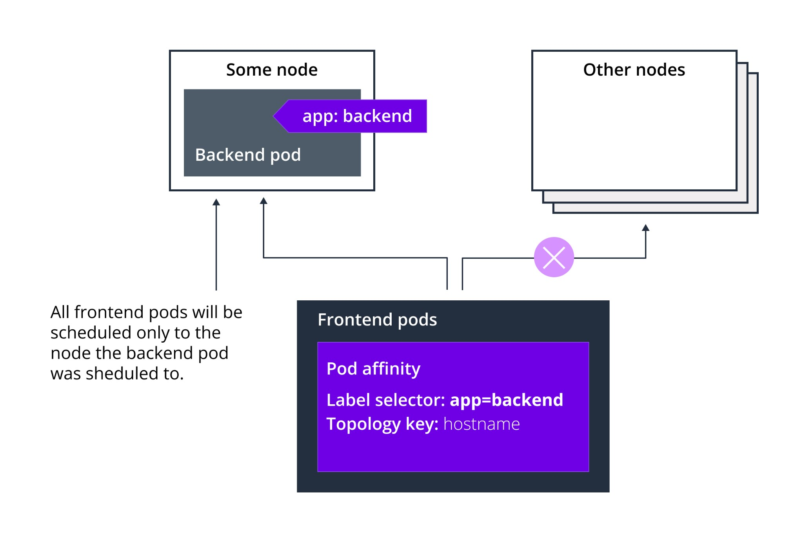

# 🔌 Pod Affinity



Bazı durumlarda, bizler oluşturduğumuz podun schedule edileceği node üstünde çalışan başka podların olmasını veya olmamasını isteyebiliriz.&#x20;

Misal, Azure üstünde koşan kubernetes clusterımız var. Bu kubernete clusterın 4 worker node var. Ve bu 4 worker node da, aynı region içerisinde bulunan 2 farklı availability zone üzerinde dağıtılmıştır.&#x20;

Yani worker node 1 ve worker node 2 availability zone 1 de, worker node 3 ve worker node 4 de availability zone 2 de barınmaktadır.

Farzedelim ki biz frontent , cache ve veritabanından oluşan bir uygulama deploy edeceğiz. İlk olarak veritabanımızı oluşturacak pod tanımını hazırladık ve ve kubernetes api gönderdik ve kubernetes scheduler işini yaptı ve podu çalıştıracağı uygun bir node buldu. Ve varsayalım ki bu node ise, worker node 1, sonrasında frontend uygulamasını deploy ettik ve onu da worker node 3 de schedule etti. Son olarak da, cache podumuzu deploy ettik ve bu pod da son olarak worker node 4 de çalışmaya başladı.

Bu senaryo da bir kaç sıkıntı var,

İlk olarak, frontend podumuz ve veritabanı podumuz ayrı ayrı availability zonelar üzerinde schedule edildiler. Tahmin edebileceğiniz üzere frontend podumuz sürekli olarak veritabanı ile görüşüyor. Sürekli ona veri yazıyor ve ondan veri okuyor. Hemen hemen tüm cloud servis sağlayıcılar 2 availability zone arasında veri transferine ücrete tabi tutulur. Yani biz 2 podu da aynı availability zone üzerinde bulunan worker nodelarda koştursaydık, aynı availability zone üzerinde durdukları için aralarındaki veri transferine para ödemeyecekken, şimdi ayrı availability zone da durdukları için para ödemek zorunda kalacağız. Bunun olmasını engellemek için, node affinity yazarak, podları aynı yere toplayabiliriz. Ama bu seferde her şeyi manuel olarak ayarlamak gerekecek. Fakat bunun yerine şöyle bir şey yapabilseydik, sanırım işleri otomatik olarak kubernetes hallederdi. Eğer ben pod tanımına, bak bu podu oluşturacağın node'u seçerken git veritabanı poduna bak ve o pod hangi  availability zone da oluşturulduysa, bu podu da orada oluştur gibi bir tanım ekleyebilseydim bu sorunu çözebilirdik.

Diğer bir istediğimiz bir durumda şu olabilirdi;

Misal frontend ve cache podları ayrı worker node üzerinde oluşturulmuş. Bunları da keşke aynı worker node üzerinde çalıştırabilseydim. Sonuçta cache ve frontend arasında ne kadar az latency olursa, uygulamam o kadar performanslı çalışır.

Bunun kolay yolu da şu olurdu, cache pod tanımında şunu diyebilseydik, git frontend pod'a bak, o hangi node üstünde oluşturulduysa, bu pod da orada oluşturulsun.&#x20;

Bize tüm bunları sağlayan, Kubernetes özelliği mevcut.

**Pod Affinity podumuzun hangi worker node üzerinde oluşturulmaya uygun olduğunu nodelardaki etiketlere göre değil, hali hazırda node da çalışmakta olan podlardaki etiketlere göre sınırlamamıza olanak tanır.**

Bizlerin bir pod tanımına ekleyerek, o podun oluşturulacağı node seçimini ve o node üzerinde çalışan veya çalışmayan podların varlığına göre yapabilme imkanı veren özelliğe Pod Affinity diyoruz. Nasıl ki, node affinity de bir podun oluşturulacağı node ve o node da bulunan veya bulunmayan labellara göre seçebiliyorsak, Pod Affinity de ise, bunu ilgili node üzerinde çalışan pod olup, olmadığına göre seçebiliyoruz.&#x20;


Bizler daha önceden worker nodelarımıza çeşitli labellar eklemeyi gördük ve ekledik. Fakat nodelar üzerinde önceden de tanımlanmış(default gelen) bir çok label mevcuttur.

Her kubernetes node da,

<mark style="color:orange;">1 -</mark> <mark style="color:red;">kubernetes.io/arch</mark> <mark style="color:orange;">=> İlgili node x64 veya ARM tabanlı bir işlemciye sahip olduğunu belirtir. Değer olarak Amd64 veya ARM değerlerini alabilir.</mark>\
\ <mark style="color:orange;">2 -</mark> <mark style="color:red;">kubernetes.io/hostname</mark> <mark style="color:orange;">=> İlgili node'un, hostname değerini alır.</mark>

<mark style="color:orange;">3 -</mark> <mark style="color:red;">kubernetes.io/os</mark> <mark style="color:orange;">=> İlgili node'un işletim sistemi bilgilerini alır (Linux,Windows)</mark>

Labelları bulunur.

<mark style="color:purple;">Bunun yanında, cloud servis sağlayıcılarının yönetilen Kubernetes hizmetindeki nodelarda ilgili node'un hangi region da bulunduğunu belirten (</mark> <mark style="color:yellow;">topology.kubernetes.io/region</mark> <mark style="color:purple;">) ve hangi availability zone da bulunduğu belirten, (</mark> <mark style="color:yellow;">topology.kubernetes.io/zone</mark> <mark style="color:purple;">) anahtarları ile belirtilir.</mark>&#x20;


Örnek bir Pod Affinity tanımı içeren YAML dosyası içeriği,

```yaml
apiVersion: v1
kind: Pod
metadata:
  name: frontendpod
  labels:
    app: frontend
    deployment: test
spec:
  containers:
  - name: nginx
    image: nginx:latest
    ports:
    - containerPort: 80
---
apiVersion: v1
kind: Pod
metadata:
  name: cachepod
spec:
  affinity:
    podAffinity:
      requiredDuringSchedulingIgnoredDuringExecution:
      - labelSelector:
          matchExpressions:
          - key: app
            operator: In
            values:
            - frontend
        topologyKey: kubernetes.io/hostname
      preferredDuringSchedulingIgnoredDuringExecution:
      - weight: 1
        podAffinityTerm:
          labelSelector:
            matchExpressions:
            - key: color
              operator: In
              values:
              - blue
          topologyKey: kubernetes.io/hostname
    podAntiAffinity:
      preferredDuringSchedulingIgnoredDuringExecution:
      - weight: 100
        podAffinityTerm:
          labelSelector:
            matchExpressions:
            - key: deployment
              operator: In
              values:
              - prod
          topologyKey: topology.kubernetes.io/zone
  containers:
  - name: cachecontainer
    image: redis:6-alpine
```

2\. Pod tanını inceleyelim, Pod affinity tanımlarıda aynen node affinity tanımları gibi requiredDuringScheduling ve preferredDuringScheduling olarak hard ve soft gereksinimlere sahip olabilirler. Node affinity tanımlara oldukça benzer. Tek bir fark vardır. Pod affinity tanımlarıonda topologyKey adında bir daha gireriz. İlk tanımda requiredDuringSecheduling seçeneği girili, yani mecbur kılınmış. Bu tanımda diyoruz ki, schedule edileceği worker node üzerinde app=frontend labelina sahip bir pod olmalı. Yani bu podu bu şartı sağlayan host üstünde schedule et. topologyKey kısmında bunu belirtiyoruz. Burada hostname anahatarını seçersek, aynı hostname yani aynı worker node üzerinde bu pod çalıştırılacak.&#x20;

Misal, diyelim ki hostname yerine "zone" anahtarını seçtik. Bu seferde aynı worker node olmasına gerek yok olmayacaktı. Buraya topology.kubernetes.io/zone yazsaydık, bu podu app=frontend labelli bir podun çalıştığı availability zone daki herhangi bir worker node üzerinde çalıştır. Manasına gelecekti.


Görüldüğü gibi node affinity de çalışacağı worker nodedaki labellara göre seçiyorduk. Pod affinitty de ise, hangi podlarla birlikte çalışacağını seçiyoruz.

Pod Affinity'nin Node Affinity göre bir farkı da anti-affinity tanımlarının ayrı yapılmasıdır. node anti affinity kısmını not-in ile halledebiliyorduk. Fakat pod anti affinity kısmını özel olarak tanımlamamız gerekiyor. Bunu da podAntiAffinity anahtarı ile yapıyoruz.

Örnekte bulunan antiAffinity kısmını  inceleyecek olursak,\
Bu podu deployment=prod tanımına sahip olan bir pod ile, aynı zone da schedule etme diyoruz.

Bu YAML dosyasını deploy edersek şu olur;

* Öncelikle frontend pod adındaki pod schedule edilecek. Gördüğünüz gibi app=frontend labeli eklemişiz. Bu da bizim frontend podumuzu temsil ediyor.
* Sonrasında ise, 2.podumuz olan, cachepod isimli podumuz deploy ederken, kubernetes pod affinity kurallarına bakacak, İlk kural olan RequireDuring kısmından bahsedersek, burada şunu diyoruz, Bu pod mutlaka app=frontend labelina sahip bir pod ile aynı node üzerinde çalıştırılsın. Eğer bu şekilde birden fazla node varsa, git color=blue labelina sahip bir podun çalıştığı worker node varsa, onu seç. Ve mümkünse bu seçtiğin worker node buludunduğu zone içerisinde deployment=prod labelina sahip bir pod bulunmasın.
