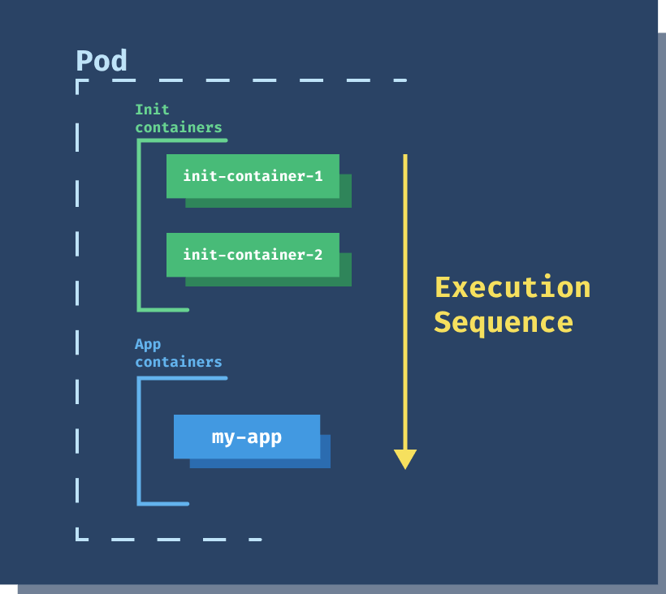

# ❤ Pod

* Pod'lar kubernetes de oluşturabileceğimiz ve yönetebileceğimiz en küçük birimlerdir.
* Pod'lar bir veya daha fazla container barındırabilir. Ama çoğu durumda pod tek container barındırır.
* Her pod'un eşsiz bir ID'si bulunur.
* Her pod eşsiz bir IP adresine sahiptir.
* Aynı pod içerisindeki containerlar,  aynı node üstünde çalıştırılır ve bu containerlar birbirleriyle localhost üzerinden haberleşebilirler.

```
# Pod oluşturma
kubectl run firstpod --image nginx --restart never

# Pod hakkında bilgi almak için
kubectl describe pods firstpod

# Pod loglarına bakmak için, dilersek -f parametresi ile logları canlı izleyebiliriz.
kubectl logs firstpod 

# Pod içerisinde komut çalıştırmak
kubectl exec firstpod -- ls

# Pod içerisine bağlanmak
kubectl exec -it firstpod -- /bin/sh

# Pod silmek
kubectl delete pods firstpod
```


Bir image registry belirtmezsek, kubernetes default olarak docker image registry kullanır.


* Oluşturacağımız pod 'ları yml dosyasında belirtip, pod 'dan istediğimiz özellikleri ve gereksinimlerimizi yml dosyasında belirtip, o dosyadan pod oluştururuz.

#### YML içerisinde bulunması zorunlu olan parametreler,

* api version
* kind
* metadata

**Kind, Oluşturmak istediğimiz objenin ne objesi olduğunu tanımladığımız yerdir. \[pod,service,deployment, vb] Örneğin, pod objesinin API versiyonunu öğrenmek için, "kubectl explain pods" yazıp, versiyon bilgisine ulaşabiliriz.**

**Metadata, Obje ile ilgili uniq bilgileri tanımladığımız alan. Birden çok alt başlık olabilir, name,label vb.**

**Spec, Oluşturmak istediğimiz objenin özelliklerini belirtiriz. Örneğin, container,service objelerinin özellikleri vb. Her obje tipine göre burada tanımlayacağımız bilgiler değişir.**

```
kubectl apply -f pods1.yml
# Komutu ile yml dosyasını kubernetes 'e bildirerek bu yml içerisinde belirttiklerimizi
oluşturmasını isteyebiliriz.

kubectl edit pods firstpod
# Komutu ile pod ayarlarını güncelleyebiliriz.
```

* Pod yaratılırken pod'umuz "pending" kısmında kalıyorsa, kube scheduler servisi pod'umuz için uygun bir node bulamamış olabilir.
* Cluster 'da bulunan tüm node'larda "kubelet" adında bir servis çalışır. Görevi bulunduğu node 'a atanmış görevleri tespit edip, yeni yaratılmış görev,pod vb varsa, bunu tespit edip hemen işlemlere başlar.
* İlk olarak pod tanımında girilmiş container'lara bakar, bu container'ların oluşturulacağı imajları sisteme indirmeye başlar. Eğer bir şekilde bu imajları indiremezse "err image pull" ardından, "image pull backoff" aşamasına geçer.
* Eğer böyle bir hata görürseniz, pod 'un imajı repository'den çekemediği ve bunu tekrar tekrar denediği anlamına gelir.
* Eğer imaj da sorun yoksa, kubelet servisi o node 'da bulunan container engine ile haberleşir ve ilgili container'ın oluşturulmasını sağlar. Container çalışmaya başladığında, pod running duruma geçer. Bu nokta da pod oluşturulmuş olur.

Restart Policy,

Always :  Hangi durum da container kapatılırsa kapatılsın. Kubelet bu container'ı yeniden başlatır.\
Never   :  Hiç bir durum da yeniden başlatılmaz.\
On-failure : Hata kaynaklı kapanırsa, yeniden başlatılır.

Pod 'un altında bulunan container'lar çalışmaya devam ettikçe pod running olarak devam eder. Pod işini bitirip kapandığında restart policy never durum da ise, pod yaşam döngüsü succeded olarak yaşam döngüsünü tamamlar.

Eğer Restart policy never veya on-failure olarak ayarlıysa, container'lardan biri hata verip kapanırsa, bu sefer pod 'un status kısmı failed (error) olarak işaretlenir ve yaşam döngüsünü böyle tamamlar.

Restart policy always olarak seçiliyse, container'lar hatadan dolayı da kapansa, normal bir şekilde de kapansa yeniden başlatılır. Dolayısıyla pod succeded  veya failed durumuna geçmez. Bunun yerine pod 'un içerisinde bulunan container'lar  tekrar başlatılır ve running state devam eder.




Kubernetes pod'un sürekli yeniden başlatma işini belirli bir sıklıkla yapıyorsa, bazı şeylerin ters gittiğine kanaat getirir ve pod'u "CrashLoopBackOFF" durumuna sokar.&#x20;

Crash Loop BackOff : Pod sürekli fail duruma düşüp veya farklı sebeplerden dolayı yeniden başlatılırsa, bu duruma geçer. Bu duruma geçen container aralıklarla kontrol edilir ve her geçen süre boyunca yeniden başlatma aralıkları uzar. Eğer container tekrar çökmezse running duruma geçer. Eğer halen çalışmayı bırakırsa 5 DK aralıklarla pod 'un içerisinde bulunan container yeniden başlatılmayı dener.

### SideCar Container (Çoklu container pod)

```yaml
apiVersion: v1
kind: Pod
metadata:
  name: mc1
spec:
  volumes:
  - name: html
    emptyDir: {}
  containers:
  - name: 1st
    image: nginx
    volumeMounts:
    - name: html
      mountPath: /usr/share/nginx/html
  - name: 2nd
    image: debian
    volumeMounts:
    - name: html
      mountPath: /html
    command: ["/bin/sh", "-c"]
    args:
      - while true; do
          date >> /html/index.html;
          sleep 1;
        done
```

Kubernetes ana uygulamaya (container) bağlı ve onunla network seviyesinde izolasyon olmadan, ve gerektiği durumda aynı depolama alt yapısını kullanabilecek uygulamaları (container)ları pod içerisinde 2.container olarak çalıştırma imkanı sağlıyor.

Birlikte scale edilmesi gereken, birbirleriyle network ve storage seviyesinde erişmesi gereken container'ları(uygulamalar) aynı pod içerisinde ayrı ayrı container'lar olarak çalıştırabiliyoruz.

Aynı pod içerisinde, tanımlanmış tüm container'lar aynı worker node üzerinde oluşturulur.

Container'lar, ayrı birer ünitedir. Fakat pod'un lifecyle içerisinde yönetilir. Yani pod oluşturulunca 2 container birden oluşturulur. Pod silinince, 2 container birden silinir.

Aynı pod içerisinde bulunan container'lar arasında network lifecyle bulunmaz. Yani aynı pod içerisinde çalışan  A ve B container'ları birbirlerine localhost üzerinden ulaşabilir. Bunlar network bakımından sanki aynı sunucu üzerinde çalışan proccess'ler gibidir.

Tek bir volume yaratılarak, her 2 container'a mount edebiliriz. Böylelikle aynı dosyalar üzerinde çalışılabilir.&#x20;

Sidecar container'lar aynı IP adresine sahip olurlar.

```
# Multi Container pod kullanarak oluşturduğumuz container'lardan birinin shell'ine
bağlanmak
kubectl exec -it mc1 -c 2nd -- /bin/sh
Tek bir container olsaydı, -c ile container ismi vermemize gerek olmazdı.

# Pod içerisinde bulunan 1st container'ın loglarını inceliyoruz.
kubectl logs -f mc1 -c 1st

# Kubectl'i çalıştırdığımız sunucunun 8080'ine gelen istekleri, kubernetes
cluter içerisindeki mc1 isimli pod'un 80 portuna yönlendir diyoruz.
kubectl port-forward pod/mc1 8080:80 --address='0.0.0.0'

```

### Init Container (Multi Container)

Aynı pod içerisinde birden fazla container tanımlamak için kullanılır. Asıl uygulama container başlatılmadan önce ilk olarak init container çalışır.

İnit container yapması gereken işleri tamamlar ve kapanır.

Uygulama container, init container kapatıldıktan sonra çalışmaya başlar. Inıt container işlemleri tamamlamadan uygulama container başlamaz. Ana uygulama başlamadan önce çalışıp, eksik paketler vb varsa init container'ı bu nedenle kullanabiliriz.&#x20;

Uygulama çalışmadan önce, tamamlamamız gereken şeyler varsa, bunları tamamlamadan esas uygulamayı çalıştırmak mantıklı değilse kullanılır.&#x20;

Misal, uygulamamızın bağımlı olduğu, başka bir uygulama veya servis var. Eğer bu ayakta veya hazır değilken uygulamayı başlatırsak uygulamada sıkıntı çıkıyor. Bu durumda pod tanımına bir init container ekler ve bu init container'ın, bu servisi gözlemesi için ayar yaparız. Inıt container içerisinde, bir uygulama çalıştırılır ve bu servisten okey alana kadar bu init container çalışır. ve Okey aldıktan sonra da kapanacak şekilde ayar yapabiliriz. Bu sayede pod oluşturulduğu ilk zaman ilk olarak init container çalışır ve diğer servisi beklemeye başlar. Diğer servis hazır olduğu anda, uygulama kapanır ve init container da kapanır. init container kapatıldığı anda, esas uygulamamızın çalıştığı container ayağa kalkar. Böylece servis hazır olana kadar, uygulamamız beklemiş olur.



Misal, ana uygulamamızın ihtiyacı olan bazı config dosyalarının, son güncel halini ana uygulama başlamadan sisteme çekilmesi gerekiyor. Bu durumda, bu çekme işini de init container ile halleder ve esas uygulama başlamadan bunları sisteme indirebiliriz. vb.

```yaml
apiVersion: v1
kind: Pod
metadata:
  name: website
spec:
  initContainers:
    - name: clone-repo
      image: alpine/git
      command:
        - git
        - clone
        - --progress
        - https://github.com/peterj/simple-http-page.git
        - /usr/share/nginx/html
      volumeMounts:
        - name: web
          mountPath: '/usr/share/nginx/html'
  containers:
    - name: nginx
      image: nginx
      ports:
        - name: http
          containerPort: 80
      volumeMounts:
        - name: web
          mountPath: '/usr/share/nginx/html'
  volumes:
    - name: web
      emptyDir: {}

```
