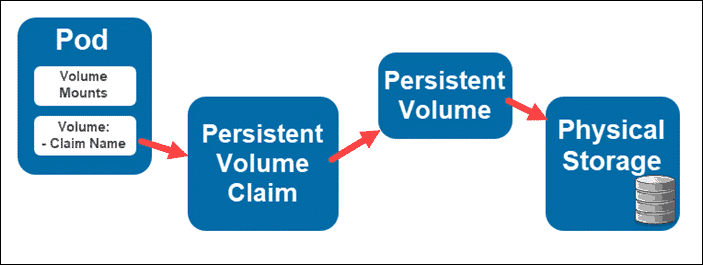

# 🧀 PV/PVC



Ephemeral volume bölümünde, podun yaşam süresi boyunca saklamak ve yeni container oluşturulduğunda kaybetmemek istediğimiz dosyaları tutmak için "emptydir" ve "hostpath" tipinde volumelerin nasıl oluşturulduğunu görmüştük.

Bu yazıda, podun yaşam süresinden bağımsız şekilde oluşturabileceğimiz volumeleri yani persistent volumeleri inceleyeceğiz.

Sorun nedir?

İlk olarak 3 node'lu bir cluster'mız olduğunu düşünelim. 3 node'lu cluster üzerinde mySQL bir veritabanı çalıştırmak istiyoruz. Bunun için tek replika oluşturacak deployment tasarladık. Deployment içerisinde de mysql container'ın veritabanı dosyalarını tutacağı "emptyDir" tipinde bir volume oluşturmak için bir tanım girdik. Bu volume'u container'a mount edecek tanımlarıda ekledikten sonra, Deployment objemizi oluşturduk. mySQL container'dan oluşan podumuz uygun bir worker node üzerinde oluşturuldu ve çalışmaya başladı. Bu nokta da eğer container'da bir sıkıntı olursa, kubelet yeni bir container oluşturacak ve biz volume tanımını da eklediğimiz için sıkıntı çıkmadan çalışmaya devam edecek.

Ancak şöyle bir senaryo düşünelim;

Bu podun çalıştığı worker node da sıkıntı çıktı ve worker node devre dışı kaldı. Podumuz deployment objesinin bir parçası olduğu için, Kubernetes bu durumu düzeltmek için çalışmaya başlayacak ve uygun olan worker node'lardan bir tanesi üzerinde yeni pod yaratılacak. Fakat bu durum ephemeral volume kısmında da belirttiğimiz uygulama için sıkıntı yaratmıyorken, bu sefer mySQL veritabanımız için problem oluşturuyor. Çünkü veritabanı üzerinde geçici, yeniden kolayca üretebileceğimiz dosyaları değil, uzun süre barındırmak zorunda olduğumuz verileri tutuyor.

Pod'a ne olursa olsun, bu verileri kaybetmememiz gerekiyor. Pod'u oluşturduk, mySQL container çalıştı ve verileri "emptyDir" tipindeki volume'e yazmaya başladı. Bu volume fiziksel olarak o container'ın çalıştığı worker node üzerinde duruyor. Artık o worker node'a erişim gittiği için, Dolayısıyla pod başka bir worker node üstünde yeniden oluşturulduğunda, bu dosyalara erişilemeyecek. Ve bu mySQL için fazlasıyla kötü bir senaryodur.

Bunun için tek bir çözüm var, bizim bu volume'leri cluster dışında duran, fakat tüm worker node'lar tarafından ulaşılabilen bir yerde oluşturabiliyor olmamız lazım.

Eğer bunu başarabilirsek, pod hangi node üzerine taşınırsa taşınsın, aynı volume tekrar bağlayarak veri devamlılığı sağlayabiliriz. Bu tarz cluster dışında tutulan çeşitli türde depolama ünitelerinin üzerinde, oluşturabildiğimiz ve pod yaşam süresinden bağımsız ve daha uzun süre saklamamız gereken verileri saklamamıza imkan veren volume'ler mevcut. Biz bunlara Persistent Volume diyoruz.

Persistent Volume nasıl oluşturuyoruz?

Bunun için öncelikle, bir kaç ayar yapmamız gerekiyor. İlk olarak volume oluşturmak istediğimiz depolama birimi ile cluster'mızın konuşabiliyor olması gerekiyor.&#x20;

Bunun içinde cluster üstünde, bu depolama biriminin volume driver'larının yüklenmesi gerekiyor. Kubernetes, NFS-ISCSI gibi unıversal protokollere ait driver'ların yanında, AzureDisk-AzureFile-AWS EBS-Google PD-CEPHFS gibi bir çok bulut servis sağlayıcının özel storage çözümlerine ait driver'ları bünyesinde barındırıyor.

Yani Kubernetes, varsayılan olarak bu tiplerdeki depolama çözümleri ile konuşabiliyor durumdadır. Fakat depolama çözümleri sadece bunlarla sınırlı değildir. Kubernetes bunların yanında farklı depolama çözümleri ile de konuşabilecek yetenekleri, Container Storage Interface (CSI) adlı bir arayüz ile sağlıyor.&#x20;

CSI, isteğe bağlı blok ve dosya depolama sistemlerini Kubernetes gibi Container Orchestration'lar üzerindeki Container iş yüklerine maruz bırakmak için bir standart olarak geliştirmiştir. CSI'ın benimsemesiyle kubernetes volume katmanı genişletilebilir hale geldi. 3. taraf depolama sağlayıcıları, CSI kullanarak çekirdek kubernetes koduna dokunmak zorunda kalmadan Kubernetes'de yeni depolama sistemlerini açığa çıkaran eklentiler yazabilme imkanına kavuştu.

CSI, Kubernetes'in storage altyapısının nasıl ayarlanması gerektiğini belirten bir standarttır. Depolama çözümü üretenler, bu standart'a uygun driver'lar yazarak Kubernetes'in kendi alt yapılarıyla da konuşabilmelerine imkan sağlayabiliyorlar.

Yani özetlersek, bağlanacağımız depolama birimi volume driver kısmında saydıklarımızdan ise, (NFS,Azure,EBS) vb. bunlarla ilgili driver'lar hali hazırda Kubernetes üzerinde mevcut. Ancak bunlardan biri değilse, misal NetAPP firmasının sağladığı depolama cihazını kullanıyorsam da, bu sefer o firmanın(NetAPP misal) bize sağlayacağı CSI driver'nın sisteme yüklememiz gerekecektir.

İlk adım bu şekilde. Öncelikle cluster ile depolama alt yapısını birbirine bağlıyoruz ve bu işi halledip, Kubernetes cluster ile depolama birimini konuşabilecek hale getirdikten sonra, bizler gidip bu depolama birimi üzerinde Kubernetes Cluster'mız altında kullanmak için, depolama birimleri yaratıyoruz. Sonrasında da bu depolama birimini karşılığını Kubernetes Cluster'mız altında, persistent volume isimli bir obje olarak oluşturuyoruz.

Örnekle, Kubernetes Cluster'mızın erişebildiği NFS tabanlı bir depolama çözümümüz olduğunu varsayalım. Kubernetes altında, NFS driver'ları bulunduğu için, ek bir driver yüklememize gerek kalmadan bu 2 ortam birbirleri ile görüşebilir durumda. Sırada ise, bu depolama ünitesi üzerinde, bizlerin erişip kullanabileceği, depolama birimleri oluşturmakta. Bizler gidip NFS cihazımıza bağlanıyor ve örneğin "tmp" adında bir paylaşım yaratıyoruz. Bu işi de hallettikten sonra, sıra geldi bunun Kubernetes tarafında karşılığını yaratmaya. İşte bu nokta da oluşturacağımız objenin adı "Persistent Volume"dir.


Yukarıda gördüğünüz gibi apiVersion: 1 olan, tipi de Persistent Volume olacak şekilde bir obje yaratıyoruz. Spec kısmı bağlanacağımız depolama ünitesine bağlanırken, kullanılacak driver'a göre değişebilir.&#x20;

Burada driver'a göre değişmeyen 3 seçenek mevcut.

Capacity => Bu parametre bize ne kadarlık bir volume yaratmak istediğimizi belirtiyor. Yukarıdaki örnekte 5GB boyutunda bir volume oluşturduğumuz belirtilmiş.

AccessMode => Bu volume'ın aynı anda birden fazla, pod'a bağlandığı zaman, ne şekilde bir davranış sergileyeceğini seçiyoruz. Burada da seçenekler 3'e ayrılıyor.\
&#x20;   1- ReadWriteOnce=> Bu volume aynı anda sadece tek bir pod'a bağlanabilir ve bağlanan pod hem     yazabilir hem de okuyabilir.\
&#x20;   2- ReadOnlyMany => Bu volume aynı anda birden fazla poda bağlanabilir. Fakat podlar sadece bu volume de daha önceden bu volume eklenmiş dosyalar mevcut ise onları okuyabilirler. Dosya yazamazlar ve oluşturamazlar.\
&#x20;   3- ReadWriteMany => Volume aynı anda birden fazla pod'a bağlanarak, hem yazabilir hem okuyabilir.

Burada kullandığımız seçenekler, depolama ünitemizin ve driver'ların yeteneklerine göre değişebilir.

Örneğin, Azure üzerinde AzureDisk kullanılırsa sadece "ReadWriteOnce" desteklenirken, AzureFile tipi bir storage ve driver kullanılırsa, bu sefer yukarıda bahsettiğim 3 seçeneğe de desteği mevcuttur.

PersistentVolumeReclaimPolicy => Burada bizler pod tarafından işi bitip, kullanılmayı bıraktıktan sonra, bu volume'e nasıl davranacağını belirtiyoruz. Burada, retain-recycle-delete seçenekleri mevcuttur.

Retain seçeneği seçildiği durumda, bu persistent volume kullanıldıktan sonra olduğu gibi kalıyor ve bizler buradaki dosyaları manuel olarak kurtarıp, başka bir yere taşıma imkanına kavuşuyoruz.

Recycle seçeneğini seçtiğimiz durumda, bu sefer volume ile işimiz bittiğinde volume silinmiyor, fakat içindeki tüm dosyalar siliniyor. Bizler tekrar boş bir volume elde ederek başka işlerimizde kullanabiliyoruz.

Delete seçeneğini seçtiğimiz durumda, volume ile işimiz bittiğinde volume tamamen siliniyor.

Yukarıdaki örneği ele alırsak, NFS tabanlı erişim sağlayan 172.17.0.2 IP adresi üstünden erişilebilen bir depolama ünitesi üstündeki "TMP" isimli paylaşımı kullanacak. 5GB boyutunda, sadece tek bir pod'a bağlanabilecek ve bu pod tarafından, hem dosya yazmak hem de okumak için kullanılabilen pod'un, işi bittiği zaman içerisindeki dosyaların silineceği app=mySQL labeline sahip bir persistent volume oluşturuyoruz.

Bizler bir volume'ü direkt olarak bir pod ile eşleştirme imkanına sahip değiliz. Biz bir persistent volume'ü bir pod'a bağlamak için öncelikle Persistent Volume Claim tipinde bir obje daha yaratmamız gerekmektedir.

Persistent volume claim, bizlerin sistemde bulunan persistent volume'ler arasında işimize uygun olan bir tanesini seçmemize yani bunu kullanmak adına talep etmemize imkan veren objelerdir.


Yukarıda gördüğünüz üzere, yine V1 api da bulunan, PersistentVolumeClaim tipinde bir obje yaratılıyor. Spec kısmı Persistent volume'e çok benziyor. Burada da, ne  kadarlık bir volume talep ettiğimizi, hangi mode ile bağlanmak istediğimizi belirtiyoruz. <mark style="color:red;">Son olarak "selector" kısmında, bu persistent volume claim ile persistent volume'ü label üstünden eşleştiriyoruz.</mark>

Persistent volume claim (volume talebi) app:mysql etiketine sahip, persistent volume tarafından sağlansın diyoruz.


Kubernetes neden depolama birimi oluşturma ve bunu talep etme işini 2 farklı obje üzerinden hallediyor?

Bunu şöyle düşünelim, bir developer olarak kullandığım kubernetes cluster'ı biz yönetmiyor olabiliriz. Bizim işimiz olmayabilir ve bu işe bakan ayrı bir ekip olabilir. Dolayısıyla oradaki işlemleri bizim bilmemiz mümkün olmayabilir.&#x20;

A firmasında NFS tabanlı bir depolama ünitesi kullanıyorken, B firmasında ISCSI tabanlı bir depolama ünitesi kullanılabilir. Bu ikisi için "Persistent volume" ayarları değişik olabilir. An önce persistent volume'den bahsederken de belirtmiştik. "Spec" altındaki ayarlar depolama ünitelerine göre değişebilir. Dolayısıyla bu volume oluşturma işini Developer ekibine verirsek, her cihaz için ayrı ayrı ayar yapmayı bilmesi gerekir. Bu da bir hayli zorlayıcı olacaktır.

Kubernetes bu sıkıntıyı volume oluşturma ve oluşturulan volume'ü talep etme işini ayırarak çözmüştür. Persistent volume'ler, kubernetes cluster'ı yöneten ve depolama ünitelerine de erişimi olan sistem yöneticileri veya cluster adminler tarafından oluşturulur.

Bu ekip, ortama uygun depolama ürünlerinde gerekli ayarlamaları yapar, kullanılabilecek volume'leri oluşturur, ardından developer ekibi, kendi podlarında kullanmak adına uygun özelliklerde "persistent volume claim" yaratır. Bu claim'i, ne çeşiit bir depolama çözümü ile karşıladığımız developer ekibinin bilmesine gerek olan bir bilgi değildir.

Developer ekibi talebi oluşturur, bu talep kimi yerlerde NFS depolama üniteleri ile, kimi yerlerde ISCSI ile çözüm sağlanır.&#x20;

Persistent Volume Claim oluşturulur, cluster da ki mevcut "persistent volume"lerden uygun olan bu talebi karşılar. Bu sayede depolama alt yapısının ayarlanması ve talep edilmesi 2 farklı ekip tarafından halledilebilir.

Ayrıca talep ve oluşturma adımları ayrıldığı için, tek bir talep yani "Persistent volume claim" tanımı bir çok cluster da kullanılabilir hale gelir ki, bu da uygulama taşınabilirliğini sağlar.

Elimizde artık persistent volume yani (pv) bir de persistent volume claim (pvc) mevcut. Gelelim bunu pod'a bağlamaya,


Pod tanımında bizler kullanmak istediğimiz volume'ü talep eden, persistent volume claim ile bir bağ kurarız. Pod tanımlarında, "spec" parametresi altında yeni bir volume oluşturur ve bunun hedefini oluşturduğumuz "persistent volume claim" olarak belirleriz. Sonrasında da bunu pod altında gerekli pathe mount ederiz. Bu pod oluşturulduğu anda bu talep devreye girer ve bu talebi karşılayan Persistent volume" objesindeki tanıma göre, bu podun oluşturulacağı worker node üzerinde ayarlamalar yapılır.

Storage cihazına bağlanılır, arkada driver yapması gerekenleri yapar, sonucunda da bu pod, içerisindeki container'ın ilgili pathine depolama cihazı üstünde duran, bu volume bağlanır.

Bu noktada itibaren, bu pathe yazılan dosyalar aslında bu volume'e yazılır. Eğer bu pod bulunduğu worker node üstünden bir şekilde silinir, başka bir worker node'a taşınırsa, bu sefer aynı işlemler, taşındığı worker node üzerinde gerçekleştirilir. Ve yeni pod, bu volume'e bağlanır. Bu sayede podun yaşam süresinden daha uzun süre boyunca veri saklayabileceğimiz, alt yapıya kavuşmuş oluruz.



```yaml
apiVersion: v1
kind: PersistentVolume
metadata:
   name: mysqlpv
   labels:
     app: mysql
spec:
  capacity:
    storage: 5Gi
  accessModes:
    - ReadWriteOnce
  persistentVolumeReclaimPolicy: Recycle
  nfs:
    path: /
    server: 10.255.255.10
```



Persistent volume cluster'dan bağlanabileceğimiz, bir depolama ünitesindeki paylaşımlara veya diskleri kubernetes podlarına mount edebilmemize imkan sağlıyor.


pv.yaml => Yukarıdaki örnekte, mysqlpv adında bir persistent volume oluşturuyoruz. Burada bir de label atıyoruz. Label kısmı önemli, çünkü persistent volume claim bu volume'ü bu label'a göre seçecek. 5G alan talep ediyoruz. Volume tipi olarak ReadWriteOnce seçiyoruz. En altta NFS sunucu IP adresi ve paylaşımın pathini belirtiyoruz. Buradaki ayarlar bağlanacağımız depolama ünitesine göre, kullanılacak driver'a göre değişir.


Persistent volume talep eden, persistent volume claim oluşturmak gerekiyor. Böylelikle ilgili podlara bu volume'ü bağlayabiliriz.



```yaml
apiVersion: v1
kind: PersistentVolumeClaim
metadata:
  name: mysqlclaim
spec:
  accessModes:
    - ReadWriteOnce
  volumeMode: Filesystem
  resources:
    requests:
      storage: 5Gi
  storageClassName: ""
  selector:
    matchLabels:
      app: mysql
```


pvc.yaml => mysqlclaim adında bir persistent volume claim oluşturuyoruz. Burada belirttiğimiz access moduda persistent volume tanımı ile aynı olmak zorundadır. Storage kısmında talep edilen alan mevcuttur. "selector" kısmı ile "matchLabels" kullanılarak "app:mysql" labeline sahip persistent volume seçiyoruz. Hangi "Persistent Volume"ü talep ettiğimizi burada belirtiyoruz(Label-Selector).


```yaml
apiVersion: v1
kind: Secret
metadata:
  name: mysqlsecret
type: Opaque
stringData:
  password: P@ssw0rd!
---
apiVersion: apps/v1
kind: Deployment
metadata:
  name: mysqldeployment
  labels:
    app: mysql
spec:
  replicas: 1
  selector:
    matchLabels:
      app: mysql
  strategy:
    type: Recreate
  template:
    metadata:
      labels:
        app: mysql
    spec:
      containers:
        - name: mysql
          image: mysql
          ports:
            - containerPort: 3306
          volumeMounts:
            - mountPath: "/var/lib/mysql"
              name: mysqlvolume
          env:
            - name: MYSQL_ROOT_PASSWORD
              valueFrom:
                secretKeyRef:
                  name: mysqlsecret
                  key: password
      volumes:
        - name: mysqlvolume
          persistentVolumeClaim:
            claimName: mysqlclaim
```


deploy.yaml => (Pod tanımı ve volume'ü pod'a mount etmek) "mysqlvolume" adında volume tanımlıyoruz. Bu volume'de "mysqlclaim" isimli "persistent volume claim"den sağlanmasını talep ediyoruz. Ardından, "volumeMounts" parametresi ile pod'un "/var/lib/mysql" pathine mount ediyoruz.
