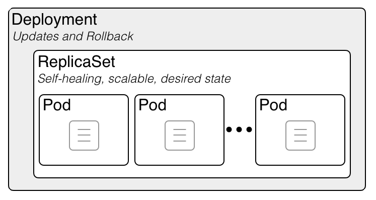

# 🔁 ReplicaSet

Bir ReplicaSet 'in amacı, herhangi bir zaman da, çalışan kararlı bir replica pod setini sürdürmektir. Bu nedenle, belirli sayıda özdeş pod 'un, kullanabilirliğini garanti etmek için kullanılır.&#x20;



Kubernetes 'de belirtilen, template 'deki bilgilere göre X sayıda pod oluşturan, sonrasında mevcut durum ile, istenilen durum arasında fark oluşursa bunu çözen, bu gibi işleri halleden obje Deployment değildir.

ReplicaSet adında bir obje daha mevcuttur. Bu işlerin tamamını ReplicaSet objesi yapar. Biz bir Deployment objesi oluşturduğumuz zaman, bu deployment template altında belirlediğimiz özelliklerde, ReplicaSet objesi oluşturulur. Pod 'lar bu ReplicaSet objesi tarafınan oluşturulur.

Kubernetes ilk çıktığı zaman, replica controller adında bir obje tipi vardı (halen var, aktif olarak yoğun kullanılmasa da) Replication controller birden fazla sayıda aynı tip 'de Pod oluşturmak için kullanılıyordu. Fakat deploy ettiği pod 'lar ile ilgili değişiklik yapmak istediğimiz zaman bazı sıkıntılar çıkarıyordu. Bu sıkıntıları çözmek için, şöyle bir yola gidildi, Replica Controller 'ın sağladığı özellikler  Deployment ve ReplicaSet adında 2 objeye ayrıldı.&#x20;

ReplicaSet objesinin temel görevi, belirlediğimiz özelliklere göre, belirlediğimiz sayıda pod oluşturmak ve bunu desired state 'de kalmasını sağlamak.


Deployment objesi, ReplicaSet 'in bir üst seviye objesi olarak dizayn edilmiştir. Ve pod tanımında bir güncelleme yaparsak, Bu güncellemenin, belirlediğimiz kurallara bağlı kalarak ve sırayla uygulanmasını sağlamak gibi düzenli, kesintisiz geçiş yapma imkanı sağlar.

Özetle biz bir deployment objesi oluşturduğumuz zaman, Bu deployment objesi, kendi yönettiği bir ReplicaSet objesi oluşturur ve bu ReplicaSet objesi de pod 'ları yaratır ve yönetir.

Biz deployment objesi tanımında bir değişiklik yaparsak, misal imaj güncellemesi gibi.. Bu yeni tanımla yeni bir ReplicaSet objesi daha yaratılır. İlk yaratılan ReplicaSet objesi yavaş, yavaş kendi oluşturduğu pod 'ları silmeye başlar. Yeni ReplicaSet 'de, yeni pod 'ları oluşturmaya başlar.

Silme, oluşturma vb işlemlerin hangi sırayla olacağını ve ne şekilde olacağını biz belirleyebiliriz. Bu bize bir kesinti olmadan, uygulama güncelleme ve yeni versiyon geçiş yapma imkanı sağlar.&#x20;

Deployment objesi içerisinde tanımladığımız pod 'ları, ReplicaSet yaratır ve yönetir.

* Deployment objesi, pod güncellemeri, imaj güncellemelerini kolayca yapılmasına imkan sağlar. Bu nedenle biz direkt ReplicaSet oluşturmayız, onun yerine daha çok özellik sağlayan Deployment objesinden faydalanırız.
* ReplicaSet objesini manuel olarak kendimiz oluşturursak, bu tarz güncellemeri (imaj vb) manuel olarak yapmamız gerekir. Bu yüzden Deployment objesini oluştururuz, Deployment objesi ReplicaSet objesini oluşturur, ReplicaSet 'de pod 'ları yaratır.
* Bir değişiklik yaptığımız zaman, deployment objesi tüm otomasyonu bizim adımıza sağlar.
* Fakat dilersek biz ReplicaSet objesini kendimiz de oluşturabiliriz. ReplicaSet ve Deployment objesi oluştururken kullandığımız YAML dosyası içeriği bire bir aynıdır. kind kısmında sadece obje isimleri değişiktir.

Tekrarlamak gerekirse, ReplicaSet bize rollout, undo, vb özellikleri sunmadığı için, Deployment objesini kullanmak bir hayli mantıklı bir seçenektir. Deployment objesi oluşturduğumuz zaman zaten kendisi ReplicaSet 'i otomatik olarak oluşturacaktır.

ReplicaSet objesi oluştururken kullandığımız dosyada misal bir imaj güncellemesi/değişikliği yaparsak ve tekrardan yaml dosyasını apply edersek, bir değişiklik olmayacaktır. ReplicaSet bu tarz değişiklikleri mevcut pod 'lara uygulamaz. Ancak yeni bir pod yaratılacaksa o zaman bu pod 'ları güncel imaj 'dan yaratır. Bu nedenle direkt ReplicaSet yaratmıyor Deployment objesi kullanıyoruz.


Örnek bir ReplicaSet oluşturmak için kullanılan YML içeriği;

```yaml
apiVersion: apps/v1
kind: ReplicaSet
metadata:
  name: web
  labels:
	env: dev
	role: web
spec:
  replicas: 4
  selector:
	matchLabels:
  	  role: web
  template:
	metadata:
  	  labels:
    	    role: web
	spec:
  	  containers:
  	  - name: nginx
    	    image: nginx

```
