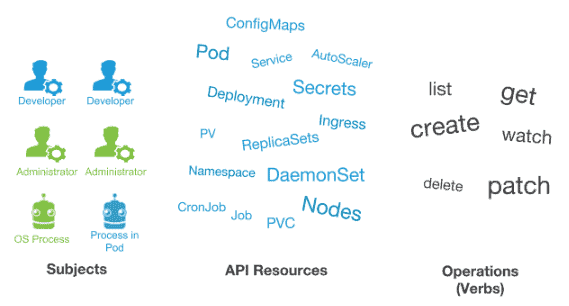

# 📏 Role-based access control (RBAC)



Bir önceki bölümde, Kubernetes authentication altyapısının nasıl olduğunu ve x509 client sertifikaları oluşturup, kimlik doğrulamanın nasıl olacağını gördük. En son Developer'a sertifika oluşturup ilettikten sonra kubernetes ile konuşturmayı başarmıştık. Fakat Developer herhangi bir işlem yapamamıştı. Çünkü kimlik doğrulama, tek başına yeterli değil. Kubernetes de kullanıcılar varsayılan olarak sıfır yetki ile gelir. Yapabilecekleri işlemler için yetkilendirme gereklidir.

Authentication : Söylediğimiz kişinin doğruluğunun onaylanması ve doğrulanması işlemidir. Fakat kimliğin doğrulanmış olması her istediğimizi yapabileceğimiz anlamına gelmez. Örneğin kartlı giriş sistemlerinde, elimde kart varsa bunu sisteme okutarak orada çalışan birisi olduğumu yani kimliğimi doğrularım. Ama bu doğrulama tek başına bize her kapıyı açabilme imkanı vermez. Bunun yanında, hangi kapılardan geçebileceğimi, nerelere ulaşabileceğimiz de belirlenmiştir.  Misal çalıştığım bölümden geçebilirken, farklı bir bölüme giremeyebilirim. işte buna da yetkilendirme denir.

Authentication : Kimlik doğrulama.

Authorization : Yetki kontrolü.

Kubernetes yetkilendirme işlemlerini "RBAC" metoduna göre gerçekleştirir. RBAC yetki ve rollerin tanımlanması ve bu tanımlanmış yetki ve rollerin kimliğini doğrulanmış şekilde objelere atanması prensibine göre tanımlanır.

RBAC kuruluşunuzdaki bireysel kullanıcıların, rollerine dayalı olarak, bilgisayar veya ağ kaynaklarına erişimi düzenleme yöntemidir. RBAC yetkilendirmesi, yetkilendirme kararlarını, yönlendirmek için rbac.authorization.k8s.io API grubunu kullanır ve kubernetes API arayıcılığıyla ilkeleri dinamik olarak yapılandırmamıza imkan tanır.

RBAC mekanizması, role,rolebinding,clusterRole,ClusterRolebinding objeleri ile çalışır. Yapılabilecek işlemler, yani yetkiler role veya clusterRole objeleri olarak tanımlanır. Daha sonra RoleBinding ve ClusterRolebinding objeleri arayıcılığıyla bu roller servis hesapları, kullanıcılar yada gruplara bind edilir. Yani bağlanır.

Kullanıcılarda bağlı bulundukları rollerde belirlenen yetkilere kavuşurlar. Örneğin, ben default namespaces de pod objesi okuyup, listeleyebilecek yetkiler belirlediğim role yaratırım, daha sonra Rolebinding yaratarak bu rolü örneğin, bir önceki bölümde oluşturduğumuz onur@onurbolatoglu.com kullanıcına bind edebiliriz (bağlarız).

Bu noktadan itibaren bu kullanıcı, default isimli namespaces altındaki podları görüntüleyebilir. Eğer bind ettiğimiz tek role bu ise, kullanıcı sadece bir işlem(atadığımız işlemi) yapabilir. Örneğin başka bir namespaces de yer alan podları görüntüleyemez. Veya servis objesi oluşturamaz vb. Kullanıcılar sadece bind edildikleri rollerdeki tanımlanan yetkilere sahip olur.

Örnek role.yaml dosyası içeriği;

```yaml
apiVersion: rbac.authorization.k8s.io/v1
kind: Role
metadata:
  namespace: default
  name: pod-reader
rules:
- apiGroups: [""] # "" indicates the core API group
  resources: ["pods"] # "services", "endpoints", "pods", "pods/log" etc.
  verbs: ["get", "watch", "list"] # "get", "list", "watch", "post", "put", "create", "update", "patch", "delete"
```

Role,Rolebinding,clusterRole,ClusterRolebinding şu ana kadar gördüğümüz diğer kubernetes objeleri gibi, birer kubernetes objesidir. Bu 4 obje de rbac.authorization.k8s.io/v1 API da bulunur. Tüm objeler gibi oluşturulurken, APIversion,Kind-Metadata kısımlarına sahiptirler.&#x20;

Tanımlar ise, "rules" parametresi altında yapılır. Rules altında bu role atanan yetkiler belirlenir. Bu örnekte tek bir rule oluşturulmuş ancak istersek birden fazla rule oluşturabiliriz. Her rule da 3 ana başlık belirleriz.

İlk olarak, bu kural hangi API grubundaki objeler ile ilgiliyse, bunu APIGroups kısmında belirtiriz. Burası boş bırakılırsa, core api grubundaki, objelerle ilgili olduğunu yani, V1 api'daki objeler ile ilgili yetkilendirme yaptığımızı belirtiriz.

2\. olarak belirlediğimiz argüman "Resources"dir. Bu tanım,  hangi kubernetes kaynakları ile ilgili olacağını belirtiriz. Bu örnekte biz, core API da bulunan, pods objesi ile ilgili bir kural yazdığımızı söylüyoruz. Buraya birden fazla obje eklenebilir. Bunun yanında bu objelerin sub objelerini de, örneğin pods objesinin sub objesi olan, logs objesi şeklinde sub obje de ekleyebiliriz.

Kuralda tanımladığımız 3. argüman "verbs" altında belirlediğimiz  yetkilerdir. Burada http request metotları şeklinde yapılabilecekler belirlenir.

Özetle, yukarıdaki yetkilendirmede Core API'da bulunan pod objesini okuyabilecek bir yetki tanımlıyoruz. Bu role de bu metadata altında namespace "default" olarak gözüküyor. Role ve ClusterRole arasında fark budur.

ClusterRole yaml dosyası içeriği;

```yaml
apiVersion: rbac.authorization.k8s.io/v1
kind: ClusterRole
metadata:
  name: secret-reader
rules:
- apiGroups: [""]
  resources: ["secrets"]
  verbs: ["get", "watch", "list"]
```

Gördüğümüz gibi, role objesi ile neredeyse aynı. 2 farkı mevcut, Obje tipi clusterRole 2.farkı ise, namespace tanımı girilmemiş olmasıdır.&#x20;

Role objesi belirlediğimiz namespace için geçerli olan, namespace çapında yetki vermek için kullanılır. ClusterRole objesi ise, tüm cluster çapında geçerli olacak yetkilendirme için kullanılır.&#x20;

Yani, namespace bazında yetkilendirme istiyorsak, "role" objesini. Tüm cluster da geçerli olacak bir yetkilendirme istiyorsak, "ClusterRole" objesini kullanabiliriz.

Bir namespace bağlı olmayan objeler için, clusterRole objesini kullanmak mantıklı bir seçenek olacaktır.&#x20;

Yetkileri belirlediğimiz objeleri bunlar, "Role" ve "ClusterRole". Ama sadece yetki belirlemek yetmiyor. Bunları kullanıcılara bağlamamız (bind) gerekiyor. İşte burada devreye, RoleBinding ve ClusterRolebinding giriyor. Role objesini bir kullanıcıya bağlamak için Rolebinding objesini kullanabiliriz. ClusterRole objesini ise, bir kullanıcıya bağlamak için ClusterRoleBinding objesini kullanabiliriz.

Örnek roleBinding yaml dosyası içeriği;

```yaml
apiVersion: rbac.authorization.k8s.io/v1
kind: RoleBinding
metadata:
  name: read-pods
  namespace: default
subjects:
- kind: User
  name: onur@onurbolatoglu.com # "name" is case sensitive
  apiGroup: rbac.authorization.k8s.io
roleRef:
  kind: Role #this must be Role or ClusterRole
  name: pod-reader # this must match the name of the Role or ClusterRole you wish to bind to
  apiGroup: rbac.authorization.k8s.io
```

Rolebinding de bir kubernetes objesi ve role ile aynı api'da duruyor.&#x20;

Subjects kısmı ise, esas tanımı yaptığımız yer oluyor. subjects kısmında ilk olarak bu roleBinding'in kime bind edileceğini belirliyoruz. Bu örnekte, bir önceki yazımda oluşturduğum kullanıcı olan "onur@onurbolatoglu.com" kullanıcısına bağlamak istediğimizi belirtiyoruz.

Neyi bağlamak istediğimizi "roleRef" parametresi ile belirtiyoruz. Bu örnekte pod-reader isimli rolü bağlamak istediğimizi belirtiyoruz. &#x20;

Öncelikle role.yaml dosyamızı deploy edeceğiz ve role yaratılmış olacak. Ardından da bu RoleBinding yaml dosyası arayıcılığıyla Rolebinding objesi yaratacağız. Bu sayede, pod-reader isimli role onur@onurbolatoglu.com isimli kullanıcıyla bind edilecek. Bu noktadan itibaren, bu kullanıcı rolde belirlediğimiz yetkileri kullanabilecek.&#x20;

clusterRolebinding yaml dosyası içeriği;

```yaml
apiVersion: rbac.authorization.k8s.io/v1
kind: ClusterRoleBinding
metadata:
  name: read-secrets-global
subjects:
- kind: Group
  name: DevTeam # Name is case sensitive
  apiGroup: rbac.authorization.k8s.io
roleRef:
  kind: ClusterRole
  name: secret-reader
  apiGroup: rbac.authorization.k8s.io
```

Gördüğünüz üzere, roleBinding ile hemen hemen aynıdır. Sadece role yerine ClusterRole bağlıyoruz ve namespace tanımlamıyoruz. Bu örnekte, bu Cluster rolünü, kullanıcıya değil, gruba bind ediyoruz(bağlıyoruz).  Bu sayede bu ClusterRole objesinden bir kullanıcı değil, DevTeam grubuna bağlı olan tüm kullanıcılara yetki verecek.&#x20;

KubeAPI server ile görüşen bir çok komponent mevcuttur. Bu komponentleri API ile görüşebilmesi için Kubernetes tarafından default olarak gelen, ClusterRole ve ClusterRolebinding objeleri mevcuttur.

Bunların dışında admin,cluster-admin,edit,view adına 4 cluster role daha mevcuttur. Bunlar bizim işimizi kolaylaştırmak adına kubernetes tarafından oluşturulup, default olarak gelmektedir.

Eğer biz, bir kullanıcıyı cluster seviyesinde admin yetkileri ile yetkilendirmek istiyorsak, o kullanıcıya kubernetes'in bize sunduğu "cluster-admin" ClusterRole 'nü bind edebiliriz.

Sadece belirli bir namespace altında tüm yetkileri bir kullanıcıya vermek istersek, bu seferde "admin" ClusterRole 'nü bind edebiliriz. Bunun için ClusterRole objesini, ClusterRolebinding ile değilde, Rolebinding objesi ile kullanıp sadece namespace seviyesinde de atama yapabiliyoruz.

Edit: tüm kaynakları düzenleme yetkisi.\
View: tüm kaynakları düzenleme yetkisi.

Bu roller çok genel olduğu için, Kubernetes tarafından önceden tasarlanmıştır.


