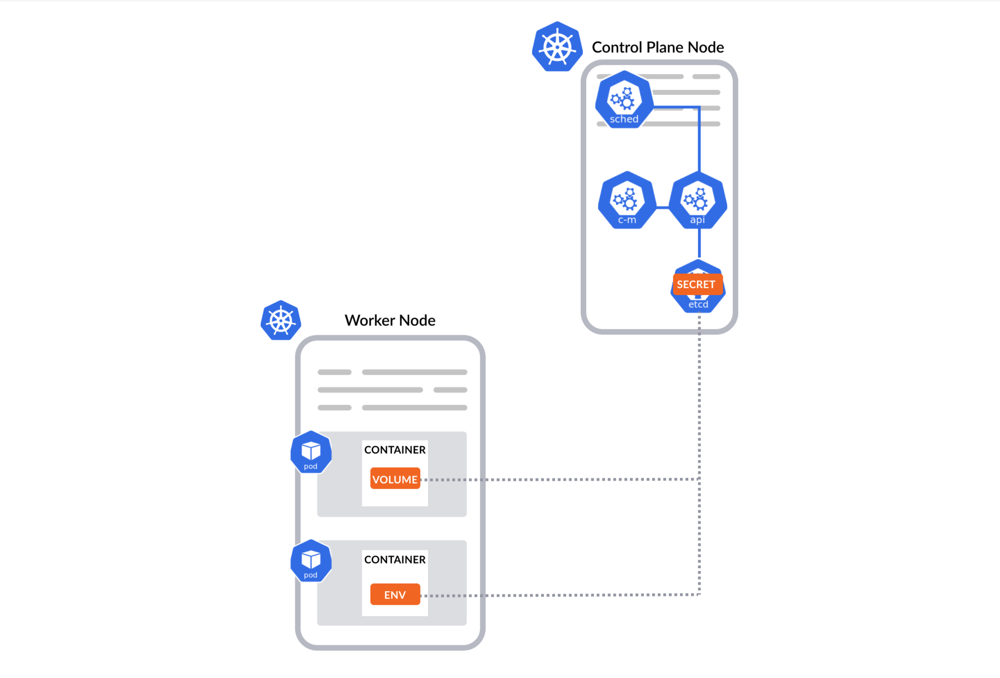

# 🔑 Secrets



environment variables konusunda, hassas bilgileri imaja direkt eklemenin doğru olmayacağından bahsetmiştik. Bunları, environment variables olarak pod tanımları içerisine ekliyorduk. Fakat bu senaryoda da imaj içerisine hassas bilgileri eklemedik ancak pod tanımında kullanacağımız yaml dosyası içerisine eklemiş olduk. Bu yaml dosyasına erişebilen herkes, bu bilgilere de erişebiliyor. İlk sıkıntımız bu. 2.problemimiz, bizler bu tarz hassas bilgileri, uygulamanın kodundan ayırdık fakat, bu seferde pod tanımımıza ekledik. Bu verilerin değişmesi gerektiği zaman, misal bir şifrenin güncellenmesi gerektiğinde, bizim bu yeni şifre bilgisini pod tanımı üzerinde yani yaml dosyamızda güncellememiz gerekiyor. Bu da yaml dosyalarının generic olmasını engelliyor.&#x20;

Ayrıca bu hassas bilgilerin yönetimi ile, deploy edilen uygulamanın yönetimi, ayrı ekiplerde olabilir. Bu 2 işi birleştirdiğimiz zaman, bu ayrımı sağlayamıyoruz.

Bu sorunu çözmek için, en mantıklı yöntem bu hassas bilgileri, uygulama deploy ettiğim pod tanımlarından ayırmam ve ayrı yönetebilmemdir. Kubernetes de, secret objesi tam olarak bu işi yapıyor.

Kubernetes secret, parolalar, Oauth Token ve SSH anahtarı gibi hassas bilgileri, depolamamıza ve yönetmemize olanak sağlar. Gizli bilgileri bir secret içinde saklamak, onu bir pod tanımına veya container imajına direkt olarak eklemekten daha güvenli ve esnektir.

Secretler pod ve Deployment gibi bir kubernetes objesidir. Hassas bilgileri secret objelerinde saklar ve sonra bunları çeşitli yöntemlerle pod'un içerisine ekleyebiliriz.

Secretler, aynen pod ve diğer objeler gibi yaratılıp, yönetilir. Yani hem yaml dosyasıyla, hem de kubectl arayıcılığıyla imperative olarak secret objesi oluşturabiliriz.

Örnek bir secret yaml içeriği;

```yaml
apiVersion: v1
kind: Secret
metadata:
  name: mysecret
type: Opaque
stringData:
  db_server: db.example.com
  db_username: admin
  db_password: P@ssw0rd!
```

ApiVersion:v1 ve kind kısmı secret olmalıdır. Metadata kısmında "name" parametresi ile bu secrete isim vermeliyiz.&#x20;


Oluşturulan secret ve bu secreti atayacağımız pod aynı namespace içerisinde olmalıdır. Yani biz bu secreti "default" namespace altında oluşturuyorsak, bu secreti atayacağımız pod da, default namespace altında olmalıdır.


Secret yaml dosyamızda type kısmını opaque olarak girdik. Ve bunun gibi 8 tane daha secret type mevcuttur. (basic auth, TLS vb..)

Secret objeleri, kullanıcı adı vb, TLS sertifikaları ya da SSH anahtarı gibi hassas verileri saklamamıza yarar, Biz opaque tipinde bir secret oluşturursak, tüm bu belirttiğim veri tiplerini, hiçbir sıkıntı olmadan saklayabiliriz.&#x20;

Secret oluşturduğumuz yaml dosyası içerisinde, ekleyeceğimiz hassas bilgileri "stringData" parametresi içerisine yazıyoruz.


stringData yerine, sadece "Data" parametresi kullanılan yerler ve kişiler olabilir. aralarındaki fark, stringData olduğu gibi, plaintext olarak yazılır. "Data" ise, hassas bilginin base64 encode edilmiş hali olarak yazılır.



"kubectl get secrets" komutunu çalıştırdığımızda "data" kısmında yazan sayı, bizim girdiğimiz hassas veri miktarıdır.


Kubectl kullanarak secret oluşturma;

```bash
kubectl create secret generic "secret_ismi" --from-literal="anahtar"="değer" --from-file="anahtar"="değerin_okunacagi_dosya" --from-file="değerin_okunacagi_dosya"

kubectl create secret generic mysecret --from-literal=db_server=db.example.com --from-file=db_server=server.txt --from-file=config.js

kubectl create secre generic mysecret2 --from-literal=db_server=db.example.com --from-literal=db_username=admin --from-literal=db_password=password1
```

\--from-literal yerine --from-file kullanarak, hassas bilgileri shellden yazmak yerine, dosyadan okumasını söyleyebiliriz.

Secretları Pod tanımlarına eklemek için 2 seçeneğimiz mevcuttur. Bu değerleri poda volume arayıcılığıyla ekleyebilir ya da Environment variable olarak aktarırız.

```yaml
apiVersion: v1
kind: Pod
metadata:
  name: secretpodvolume
spec:
  containers:
  - name: secretcontainer
    image: ubuntu
    volumeMounts:
    - name: secret-vol
      mountPath: /secret
  volumes:
  - name: secret-vol
    secret:
      secretName: mysecret3
---
apiVersion: v1
kind: Pod
metadata:
  name: secretpodenv
spec:
  containers:
  - name: secretcontainer
    image: alpine
    env:
      - name: username
        valueFrom:
          secretKeyRef:
            name: mysecret3
            key: db_username
      - name: password
        valueFrom:
          secretKeyRef:
            name: mysecret3
            key: db_password
      - name: server
        valueFrom:
          secretKeyRef:
            name: mysecret3
            key: db_server
---
apiVersion: v1
kind: Pod
metadata:
  name: secretpodenvall
spec:
  containers:
  - name: secretcontainer
    image: ubuntu
    envFrom:
    - secretRef:
        name: mysecret3
```

Yukarıdaki yaml örneğinde secretlerin podlara tanımlanması ile ilgili 3 örnek mevcuttur.

1 - secretpodvolume  pod tanımında volume kullanılarak hassas bilgiler pod a aktarılmıştır. Özetle, secret-vol isimli bir volume yaratıyoruz. İsim herhangi bir şey olabilir. Daha sonra bu volume emptyDir ve ya Hostpath olarak değil, bu sefer secret den oluşturuyoruz. Diyoruz ki, bu volume mysecret3 isimli secret den oluşturulsun. Sonrasında bu volume Containerda bir dizine mount ediyorum. Bu pod oluşturulduğu zaman, Kubernetes secret içerisinde bulunan tüm keyleri birer dosya olarak, bu mount ettiğimiz pathe koyacak. Bu dosyaların içeriğini de, bu keylere atadığımız değerler olacak. Dolayısıyla artık uygulamamıza, misal veri tabanına mı bağlanmak istiyorsun? Kullanıcı adını  /secret/db\_username dosyasından bakarak öğrenebilirsin.

2 - secretpodenv pod tanımında Environment variable kullanarak, hassas bilgiler poda değişken olarak atanmıştır. Bu örnekte, bir username adında, env variable tanımlıyoruz ve bunun value kısmını, mysecret3 isimli secret içerisinde tanımladığım db\_username anahtarının değeri olarak alıyorum. Diğer değişkenleri de bu şekilde mysecret3 içerisinde tanımladığım keylerden okuyarak yeni bir değişkene atıyorum.

3 - secretpodenvall pod tanımında da Environment Variable kullanıyoruz ancak, bütün değerleri tek tek okuyup, yeni bir değişkene atamak yerine, git mysecret3 içeriğine bak ve mysecret3 içerisinde bulunan tüm değerleri env. variable olarak pod'a atamasını söylüyoruz.

Oluşturduğumuz secretlar, etcd de şifrelenmemiş olarak saklanmaktadır. Cloud servis sağlayıcılarında yani yönetilen kubernetes hizmetlerinde bu tür veriler şifrelenmiştir. Ancak kendi kurup, yönettiğimiz kubernetes clusterı için bu durum söz konusu değildir. Kendi oluşturduğumuz secretları şifrelenmiş bir şekilde etcd tutmak için, encrypted secret data and rest dökümanı takip edilerek, secret'ları şifreleyebilirsiniz.



Secret objelerinin silinmesi,

```bash
kubectl delete secret "secret_ismi"

Ör: kubectl delete secret my-secret
```

Secret objelerinin listelenmesi,

```bash
kubectl get secret
```
